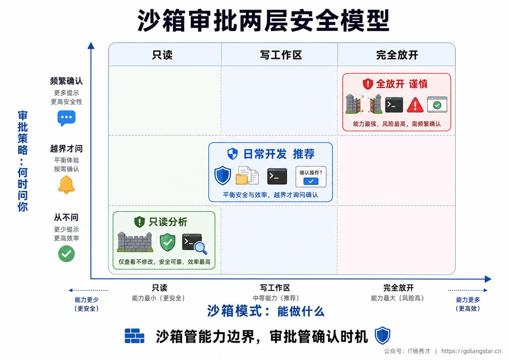
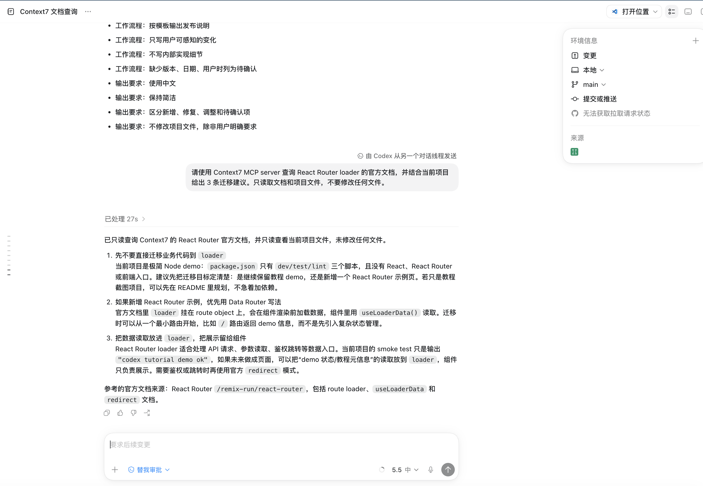
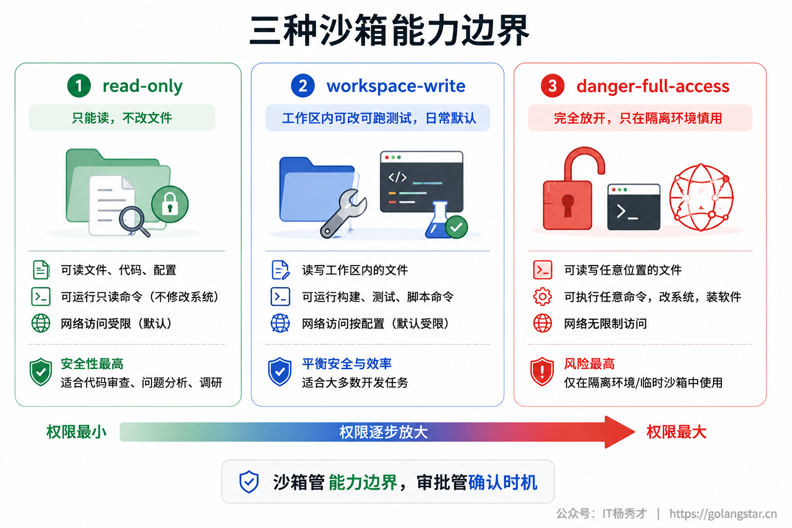
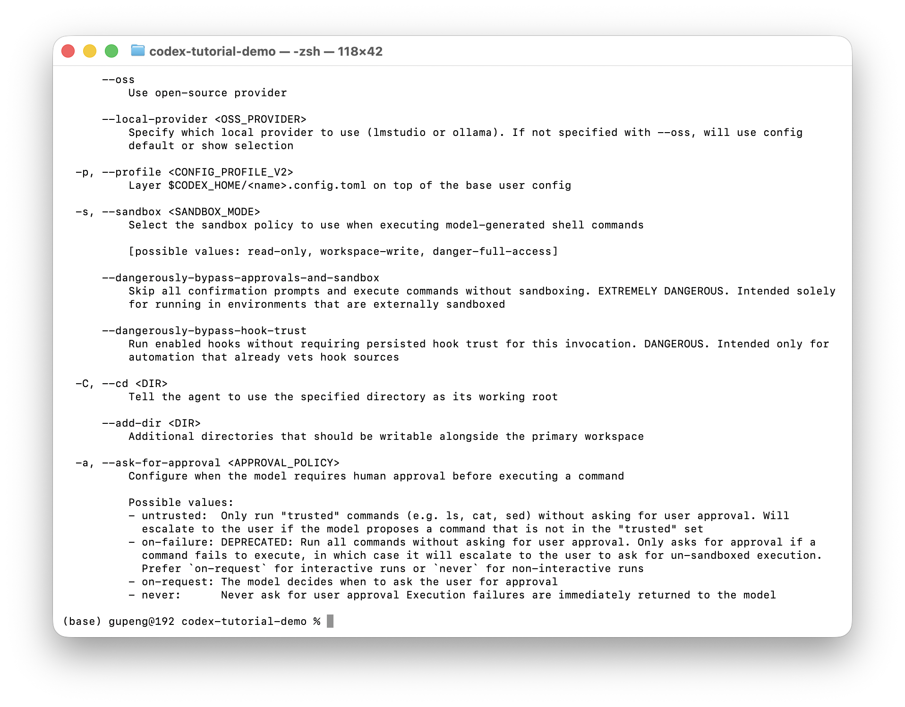
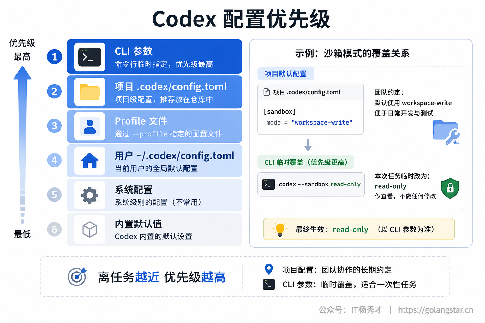
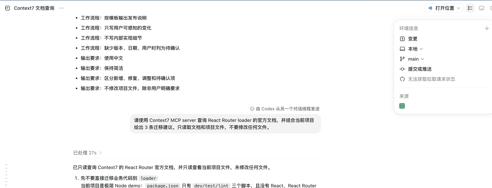
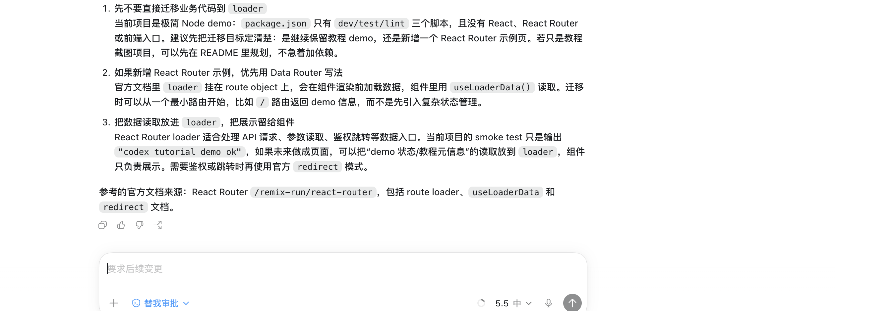

让 Codex 自主改代码，最怕的不是它慢一点，而是两个问题没想清楚：它到底能动到哪里，遇到风险会不会先问你；简单任务和复杂任务，应该用什么模型和推理强度。

这篇就讲这两组旋钮。第一组是安全旋钮：沙箱、审批、网络、权限 Profile、Auto-review。第二组是算力旋钮：模型、reasoning effort、成本和速度。把这两组东西分开看，Codex 就不再是一个让人心里没底的黑盒，而是一套可以按任务风险调挡位的工程工具。

## **1. 两层边界**

Codex 的安全控制不是一个总开关，而是两层边界。

第一层叫 **sandbox mode**，也就是沙箱模式。它决定 Codex 技术上能做什么：能不能写文件，能不能写工作区外的目录，能不能联网，能不能执行某些系统命令。

第二层叫 **approval policy**，也就是审批策略。它决定 Codex 什么时候停下来问你：每个有副作用的动作都问，还是只在越过沙箱边界时问，还是完全不问。

这两层是独立的。你可以把沙箱收得很紧，让它只读代码；也可以允许它写工作区，但一旦要联网或改工作区外的文件就必须审批。理解这件事很关键：**沙箱管能不能做，审批管做之前要不要问。**



在 Codex App 里，这两个入口会出现在输入框附近。蓝色的「替我审批」是审批入口，用来控制越权操作由谁确认；右侧的「5.5 中」是模型和推理强度入口，用来控制这次任务的算力挡位。



这个位置很重要，因为它提醒你：权限和模型不是一次性安装时才配置的东西，而是每次任务都可以按风险和难度调整的工作参数。

## **2. 沙箱模式**

Codex 常见沙箱模式有三种，放手程度从低到高。

| 沙箱模式 | 适合场景 | 你该怎么理解 |
|---|---|---|
| `read-only` | 代码解释、方案设计、审查 Diff | 只能看，不能改，最稳 |
| `workspace-write` | 日常改代码、跑测试、整理文档 | 能在工作区内动手，默认最常用 |
| `danger-full-access` | 外部环境已经隔离的自动化任务 | 去掉边界，风险最高 |

`read-only` 适合让 Codex 先读代码、解释架构、做 Review、给迁移方案。它碰不了文件，天然适合你还不确定要不要让它动手的阶段。

`workspace-write` 是日常主力。它可以读文件、改工作区内的文件、执行常规本地命令。默认情况下，它仍然会保护一些敏感边界，比如 `.git`、`.agents`、`.codex` 这类路径可能保持只读；要写工作区外的目录，通常也需要额外授权。

`danger-full-access` 不是普通开发的默认模式。它意味着去掉文件系统和网络边界，Codex 生成的命令可以获得非常大的执行空间。只有当外层环境已经足够隔离，比如一次性容器、临时虚拟机、可丢弃的实验目录，才考虑使用。



CLI 里可以直接通过参数指定沙箱。`codex --help` 的输出里能看到 `--profile`、`--sandbox`、`--ask-for-approval` 这些入口，也能看到 `read-only`、`workspace-write`、`danger-full-access` 三种沙箱值。



日常最常用的命令长这样：

```bash
codex --sandbox workspace-write --ask-for-approval on-request
```

只想让它读代码分析，可以这样：

```bash
codex --sandbox read-only --ask-for-approval on-request
```

完全放开要格外谨慎。即使真的需要，也尽量放在可丢弃环境里：

```bash
codex --sandbox danger-full-access --ask-for-approval never
```

最后这个组合不是推荐默认，而是风险提示：它既不问你，又没有沙箱边界。没有外层隔离时，别把它当成省事开关。

## **3. 审批策略**

审批策略决定 Codex 什么时候停下来问你。当前最该记住的是三种。

| 审批策略 | 行为 | 适合场景 |
|---|---|---|
| `untrusted` | 只允许一小部分可信读操作自动执行，其余要问 | 新项目、陌生仓库、高风险命令多 |
| `on-request` | 沙箱内自主执行，越界或高风险时问 | 日常开发默认 |
| `never` | 从不弹审批，失败直接返回给模型 | 非交互自动化，需要靠沙箱兜底 |

`untrusted` 很保守，适合你第一次把 Codex 放到一个陌生项目里。它会让很多有副作用的动作都先停下来，优点是安全，缺点是打断多。

`on-request` 是最均衡的选择。Codex 能在沙箱允许的范围内连贯工作，一旦需要越过边界，比如写工作区外文件、访问网络、执行需要更高权限的命令，就会向你申请。

`never` 适合脚本化和批处理。它的核心不是更安全，而是不打断。只要用了 `never`，就要更依赖沙箱、权限 Profile、临时工作区、容器这些外层边界。

你在 CLI 帮助里可能还会看到 `on-failure`，但它已经是旧的兼容项。交互式任务优先用 `on-request`，非交互任务才考虑 `never`。

## **4. 网络权限**

网络权限要单独拿出来讲，因为它经常被误解。

Codex 本地 App、CLI、IDE 默认通常不会让 agent 随便联网。`workspace-write` 主要解决的是本地文件和命令执行边界，不等于自动拥有网络访问。需要开启网络时，可以在配置里显式设置：

```toml
[sandbox_workspace_write]
network_access = true
```

但我不建议一上来就全开。更稳的做法是：能离线就离线，需要拉依赖就只给包源，需要访问接口就只给指定域名。Codex 的网络策略可以按 allowlist 和 deny 规则控制，原则是 **先允许必要域名，再明确拒绝不该碰的地方**。如果 `allow` 和 `deny` 冲突，按更保守的拒绝处理。

还要区分两类网络：

第一类是命令运行时的网络，比如 `npm install`、`go mod download`、`curl`。这受沙箱网络配置影响。

第二类是模型侧的 web search。配置项可能是 `web_search = "cached"`、`web_search = "live"` 或 `web_search = "disabled"`。`cached` 更像使用缓存资料，`live` 才是真正联网搜索。允许 live search 会带来更强的信息获取能力，也会带来 prompt injection 和外部网页污染上下文的风险。

我的建议是：本地日常编码保持默认保守；只有任务确实依赖最新外部信息或依赖安装时，才临时放开必要网络。

## **5. 配置 Profile**

真正用顺之后，你不会每次都手动敲一长串参数，而是把常用组合写进配置。

Codex 的配置主要来自这些地方，优先级从高到低大致是：CLI 参数和 `--config` 覆盖、项目 `.codex/config.toml`、选中的 Profile、用户级 `~/.codex/config.toml`、系统配置、内置默认值。

一个项目级配置可以这样写：

```toml
model = "gpt-5.5"
model_reasoning_effort = "medium"
approval_policy = "on-request"
sandbox_mode = "workspace-write"
web_search = "cached"

[sandbox_workspace_write]
network_access = false
```

项目级 `.codex/config.toml` 只会在可信项目里生效，而且不适合放认证、供应商、遥测这类全局配置。它更适合表达「这个仓库希望 Codex 怎么干活」：默认模型、默认审批、默认沙箱、默认搜索策略。



改完权限、模型和配置后，还要顺手确认这次任务的执行位置。「本地」代表任务在当前机器的项目里执行，「main」代表当前分支，「提交或推送」代表后续 Git 交付动作。读图时只抓这三个点：它们决定了 Codex 的执行边界和交付位置。



Profile 适合保存一套可复用的工作姿态。现在推荐把 Profile 写成独立文件，例如：

```toml
# ~/.codex/deep-review.config.toml
model = "gpt-5.5"
model_reasoning_effort = "xhigh"
approval_policy = "on-request"
sandbox_mode = "read-only"
web_search = "cached"
```

使用时：

```bash
codex --profile deep-review
```

这样你可以准备几套常用 Profile：

| Profile | 推荐配置 | 用途 |
|---|---|---|
| `daily-dev` | `workspace-write` + `on-request` + `medium` | 日常改代码 |
| `deep-review` | `read-only` + `on-request` + `xhigh` | 深度审查和方案设计 |
| `fast-fix` | `workspace-write` + `on-request` + `low` | 小修小补 |
| `batch-safe` | `workspace-write` + `never` + 收紧网络 | 非交互批处理 |

权限边界更复杂时，可以用 permission profile 明确写文件系统和网络规则，比如允许写工作区，但拒绝 `.env`：

```toml
default_permissions = "project-edit"

[permissions.project-edit.filesystem]
":minimal" = "read"

[permissions.project-edit.filesystem.":workspace_roots"]
"." = "write"
"**/*.env" = "deny"

[permissions.project-edit.network]
enabled = false
```

这个写法比一句 `danger-full-access` 更啰嗦，但更像工程化配置：你清楚地告诉 Codex 哪些地方能碰，哪些地方不能碰。

## **6. Auto-review**

Auto-review 不是让 Codex 自动拥有更大权限，而是把「人工审批」的一部分交给一个额外的审核代理判断。

正常情况下，Codex 在沙箱边界外要问你。开启 Auto-review 后，某些原本要你点确认的请求，会先交给 reviewer 代理判断：这个请求是不是合理，是不是在当前任务范围内，是不是可能泄露密钥或破坏环境。通过就继续，拒绝就让主 agent 换一条更安全的路径，或者再来问你。

典型配置是：

```toml
approval_policy = "on-request"
approvals_reviewer = "auto_review"
sandbox_mode = "workspace-write"
```

要注意三点。

第一，Auto-review 只作用在原本会触发审批的地方。沙箱内已经允许的常规动作，不会每次都找 reviewer。

第二，它不会扩大沙箱边界。写不了的目录还是写不了，没开的网络还是没开。它只是把「是否批准越界请求」这一步自动化了一部分。

第三，它不是绝对安全保证。真正高风险的动作，比如持久化降低安全配置、访问敏感凭证、向不可信目的地发送私密数据、不可逆破坏性操作，仍然应该保持谨慎。不要因为有 Auto-review 就把沙箱也全部拆掉。

我更推荐把 Auto-review 用在「你信任项目，但不想每次都被打断」的场景，比如本地日常开发、机械修复、测试补全。对陌生仓库或敏感仓库，先用 `read-only` 或 `untrusted` 看清楚再说。

## **7. 模型选择**

截至当前 Codex 手册，官方推荐多数任务优先使用 `gpt-5.5`。它适合复杂编码、长期上下文、工具调用、计算机使用、研究和多步骤工程任务。

轻量任务可以考虑 `gpt-5.4-mini`。它更适合速度和成本敏感的工作，例如小范围修改、简单解释、批量子任务、子代理拆分。它不是为了替代强模型处理所有难题，而是帮你把大量低难度任务跑得更轻。

`gpt-5.3-codex-spark` 是偏实时迭代的研究预览模型，面向 ChatGPT Pro 等可用环境。它适合近实时编码体验，但是否能用取决于账号、入口和当时的产品开放状态。

如果你还在配置里看到 `gpt-5.2`、`gpt-5.3-codex` 这类旧模型名，应该检查并更新。当前手册已经把它们列为通过 ChatGPT 登录时不再推荐继续依赖的旧配置。


App 里模型入口就在输入框右侧。「5.5 中」可以理解为模型是 5.5，推理强度是中等。日常开发保持中档就够用，遇到复杂审查、跨文件重构、疑难 bug，再把推理强度调高。



本地 CLI 可以用 `-m` 或 `--model` 临时切模型：

```bash
codex -m gpt-5.5
codex -m gpt-5.4-mini
```

也可以写进配置：

```toml
model = "gpt-5.5"
```

需要特别注意的是，Codex Cloud 任务当前不一定支持你像本地一样随时改默认模型。Cloud 更偏任务托管，模型选择以产品当时开放的能力为准；本地 App、CLI、IDE 的模型切换空间通常更明确。

## **8. 推理强度**

reasoning effort 是另一个成本旋钮。它控制模型在回答前愿意投入多少推理预算。

常见档位可以按这个方式理解：

| 推理强度 | 适合任务 | 代价 |
|---|---|---|
| `minimal` | 极简单问答、格式调整 | 最快，思考最少 |
| `low` | 小修复、简单解释、低风险批量任务 | 快，便宜 |
| `medium` | 日常开发默认 | 均衡 |
| `high` | 棘手 bug、跨文件改造、复杂设计 | 更慢，更贵 |
| `xhigh` | 深度 Review、架构推演、高价值难题 | 最慢，最贵 |

并不是越高越好。高推理强度适合难题，但拿来做格式调整、改文案、补一个简单参数，就是浪费。低推理强度适合快活，但拿来做架构迁移、并发 bug、权限绕过分析，就容易想浅。

我常用的策略是「先中档，再按反馈升降」。日常任务先用 `medium`，如果它明显卡住、反复漏边界，再升到 `high` 或 `xhigh`；如果只是小修小补，就降到 `low`。不要把模型选择当信仰，应该当资源调度。

配置示例：

```toml
model = "gpt-5.5"
model_reasoning_effort = "high"
```

CLI 里也可以用临时覆盖：

```bash
codex --config model_reasoning_effort='"high"'
```

## **9. 实战组合**

把安全和算力放在一起，才是实际工作中的选择。

**日常开发** 用 `gpt-5.5` + `medium` + `workspace-write` + `on-request`。这是最均衡的一档：能改代码、能跑测试、越界会问。

**只读审查** 用 `gpt-5.5` + `high` 或 `xhigh` + `read-only` + `on-request`。它可以深度思考，但不能改文件，适合安全审查、架构评审、PR 风险分析。

**快速小修** 用 `gpt-5.4-mini` 或 `gpt-5.5` + `low` + `workspace-write` + `on-request`。它适合改拼写、补注释、修简单测试、机械重命名。

**批量自动化** 用低到中等推理强度 + `workspace-write` + `never`，但要收紧网络和写入范围。这里的重点不是让它什么都能干，而是让它在一个小范围内连续干完。

**高风险仓库** 用 `read-only` 或 `untrusted` 起步。先让 Codex 读代码、列计划、解释风险，再决定是否放开写权限。

可以把这些组合沉淀成 Profile，而不是每次靠记忆：

```bash
codex --profile daily-dev
codex --profile deep-review
codex --profile fast-fix
```

这一层沉淀起来之后，Codex 就从「我每次都要小心翼翼盯着它」变成「我按任务选择一个工作姿态」。

## **10. 常见问题**

**Q：日常默认到底该怎么设？**

用 `workspace-write` + `on-request` + `gpt-5.5` + `medium`。这组配置足够顺手，也保留关键边界。

**Q：审批设成 never 会不会更高效？**

会减少打断，但不一定更安全。`never` 必须配合收紧沙箱、限制网络、使用可丢弃环境。不要把它和 `danger-full-access` 当日常默认组合。

**Q：我应该长期打开网络吗？**

不建议。能离线完成就离线；确实需要联网时，用 allowlist 开必要域名。命令网络和 web search 也要分开看。

**Q：Auto-review 能不能替代我审批？**

它能减少一部分审批负担，但不会扩大权限，也不是绝对安全保证。敏感仓库和破坏性操作仍然要人来把关。

**Q：模型越强推理越高是不是越好？**

不是。复杂任务用强模型和高推理，简单任务用低推理或轻量模型。真正的高手不是永远开最大档，而是会按任务价值分配资源。

## **11. 小结**

Codex 的权限控制可以浓缩成一句话：**沙箱决定它能做什么，审批决定它什么时候问你。** 日常开发优先 `workspace-write` + `on-request`，陌生仓库从 `read-only` 或 `untrusted` 开始，自动化任务用 `never` 时必须靠沙箱和 Profile 兜底。

模型和推理强度则是成本控制。多数任务优先 `gpt-5.5`，简单任务考虑 `gpt-5.4-mini`，实时预览能力看具体入口是否支持；推理强度从 `low`、`medium` 到 `high`、`xhigh`，按任务难度和价值调，而不是一律拉满。

把这两组旋钮组合起来，你就能给 Codex 设出不同工作姿态：日常开发、只读审查、快速小修、批量自动化、高风险分析。到这一步，Codex 才真正从一个会写代码的聊天助手，变成一个可以被工程化管理的 AI 编程代理。

<div style="background-color: #f0f9eb; padding: 10px 15px; border-radius: 4px; border-left: 5px solid #67c23a; margin: 20px 0; color:rgb(64, 147, 255);">

<h2><span style="color: #006400;"><strong>关注秀才公众号：</strong></span><span style="color: red;"><strong>IT杨秀才</strong></span><span style="color: #006400;"><strong>，回复：</strong></span><span style="color: red;"><strong>面试</strong></span></h2>

<div style="text-align: center;"><span style="color: #006400; font-size: 28px;"><strong>领取后端/AI面试题库PDF</strong></span></div>


<div style="text-align: center; margin-top: 22px; padding-top: 20px; border-top: 1px solid #c2e7b0;">
<div style="color: #006400; font-size: 20px; font-weight: bold;">🔥 配套实战项目，拆得开、跑得起、能写进简历</div>
<div style="color: red; font-size: 16px; font-weight: bold; margin-top: 8px;">多 Agent 编排 + RAG 混合检索 · 31 篇深度教程 + 50+ 面试题</div>
<a href="/projects/dev-support.html" style="display: inline-block; margin-top: 14px; background: #ff7a18; color: #fff; font-size: 18px; font-weight: bold; padding: 10px 28px; border-radius: 24px; text-decoration: none;">点击查看 DevSupport AI 实战项目 →</a>
</div>
</div>
