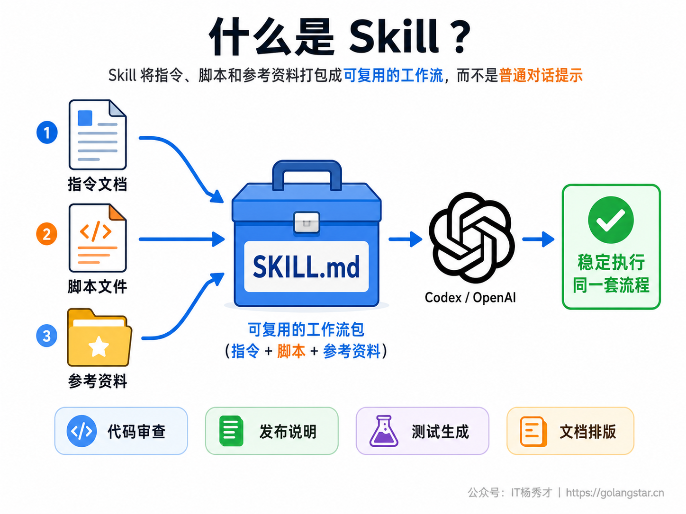
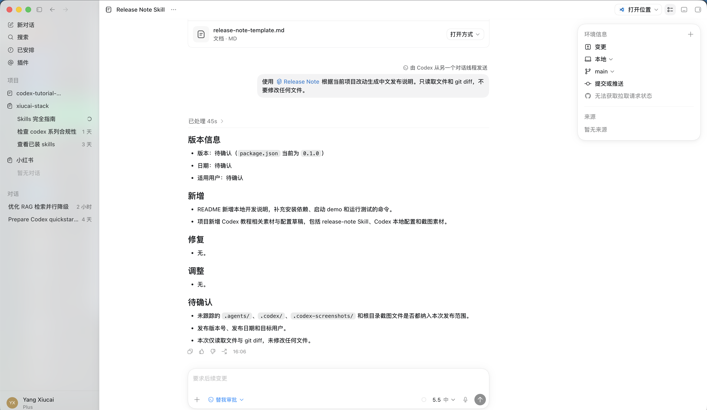
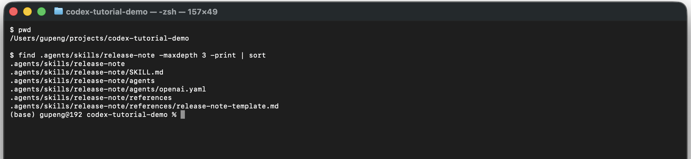
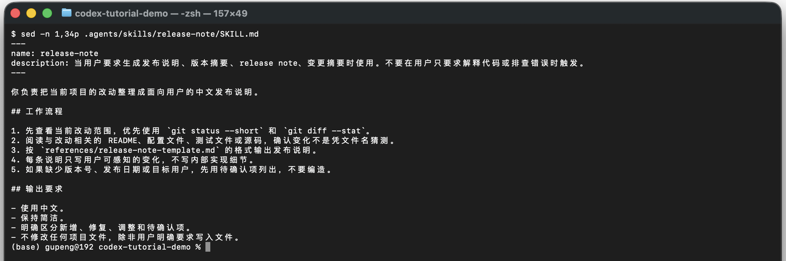
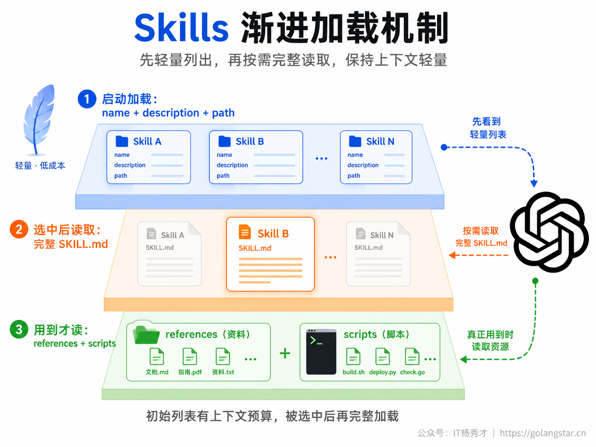
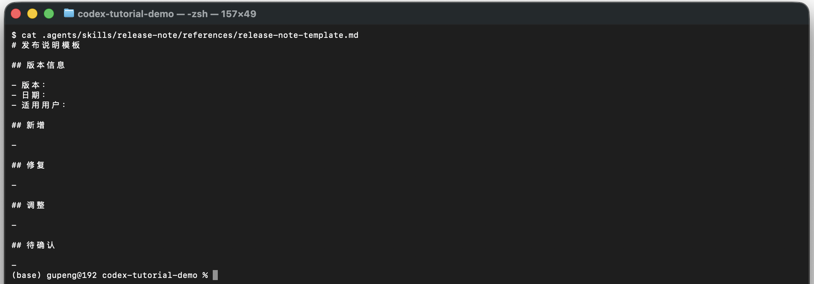
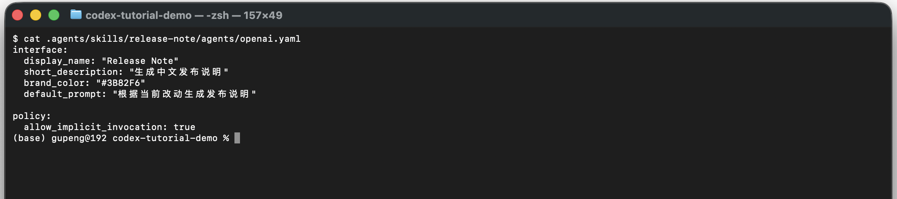
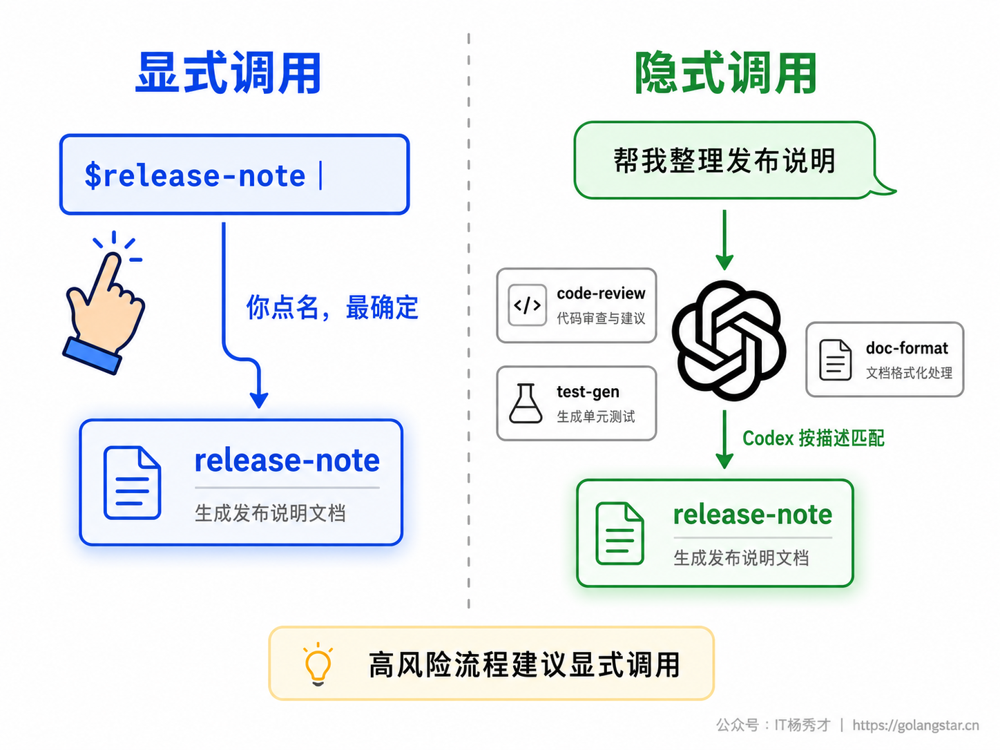
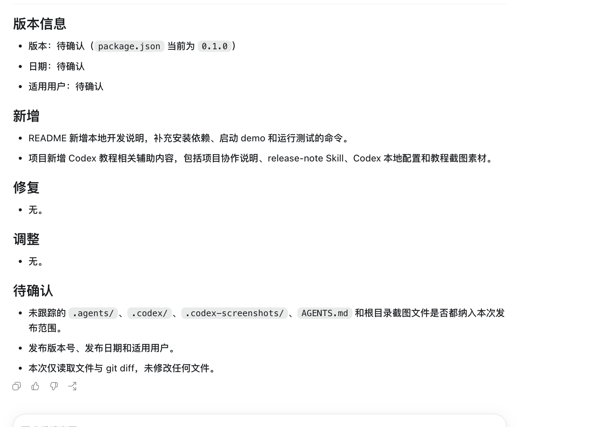

用 Codex 做项目，很多要求会反复出现：按团队格式写发布说明、按固定清单做代码审查、把改动整理成 PR 描述、按公司模板生成接口文档。每次都把同一段长 Prompt 粘进对话里，效率低，也容易漏细节。Skills 解决的就是这类问题：把一套可复用工作流封装成项目里的标准能力，让 Codex 在合适的时候加载并照着执行。

这篇只讲 Codex 的 Skills。它不是文件树，也不是一个编辑器面板，而是一套放在文件系统里的工作流包。你可以在 Codex App、CLI、IDE Extension 里使用它，也可以把项目级 Skill 提交到 Git，让团队成员打开同一个项目时共享同一套流程。

## **1. Skills定位**

官方文档对 Skill 的定义很明确：Skill 用来扩展 Codex 的任务能力，它可以打包指令、资源和可选脚本，让 Codex 更稳定地执行一套专门流程。它基于 Agent Skills 开放标准，核心文件是 `SKILL.md`。

Skill 最适合沉淀重复流程，而不是替代所有 Prompt。一次性的要求，直接在对话里说清楚就可以；会反复使用、需要团队共享、需要配套模板或脚本、希望 Codex 能自动判断何时使用的流程，应该封装成 Skill。



同一个 Skill 在不同入口里的使用方式略有差异。App 更适合在图形界面里看项目、管理入口和互动任务；CLI 更适合键盘流和自动化；IDE Extension 更适合结合编辑器当前文件上下文。官方手册明确写到，Skills 在 Codex CLI、IDE Extension 和 Codex App 中都可用。

## **2. App入口**

Codex App 当前中文界面里，左侧入口显示为 `插件`，项目区显示当前打开的项目。这里不是代码编辑器，所以不要期待左侧出现项目文件树，也不要把中间区域理解成编辑区。它是 Codex 的管理和会话界面，项目文件的真实读写仍然发生在当前项目目录里。



这个界面有三个关键点。左侧 `插件` 是管理入口，项目区显示当前项目，线程顶部显示的是当前会话标题而不是文件路径。项目级 Skill 能否出现在 UI 里，取决于当前项目扫描、版本能力和刷新状态；但 Codex 对 Skill 的真实发现规则，以文件系统位置和手册说明为准。

对小白来说，先记住一个操作顺序就够了：你在项目里创建 `.agents/skills/<skill-name>/SKILL.md`，然后在 Codex 里用 `$skill-name` 显式调用，或者让 Codex 根据 `description` 自动匹配。App 只是入口之一，不是唯一入口。

## **3. 目录结构**

Skill 本质上是一个目录。这个目录里必须有 `SKILL.md`，还可以放 `scripts/`、`references/`、`assets/`、`agents/openai.yaml` 等配套文件。官方要求最小结构只包含 `SKILL.md`，且这个文件必须包含 `name` 和 `description`。

下面用一个项目级 `release-note` Skill 贯穿流程。它的作用是把项目改动整理成中文发布说明。



这个目录结构能对应官方手册里的三个层次：

```text
.agents/skills/release-note/
├── SKILL.md
├── references/
│   └── release-note-template.md
└── agents/
    └── openai.yaml
```

`SKILL.md` 是入口；`references/` 放模板或长参考资料；`agents/openai.yaml` 是 Codex App 可读取的可选 metadata，用来配置显示名、简介、品牌色、默认 Prompt 和调用策略。

Codex 会从多个位置扫描 Skills：

| 作用域 | 路径 | 适合场景 |
|---|---|---|
| 项目当前目录 | `$CWD/.agents/skills` | 某个工作目录专用流程 |
| 项目父目录 | `$CWD/../.agents/skills` | 仓库里某个模块共享流程 |
| 仓库根目录 | `$REPO_ROOT/.agents/skills` | 整个项目团队共享流程 |
| 用户级 | `$HOME/.agents/skills` | 你个人所有项目通用流程 |
| 管理员级 | `/etc/codex/skills` | 机器或容器统一预装流程 |
| 系统级 | OpenAI bundled | Codex 内置技能 |

项目级 Skill 可以提交到 Git，适合团队规范；用户级 Skill 不要默认提交，适合个人习惯。两个 Skill 如果同名，Codex 不会自动合并，它们都可能出现在选择器里，所以团队里要避免随便复用同一个 `name`。

## **4. 核心文件**

`SKILL.md` 上半部分是 YAML frontmatter，下半部分是 Markdown 指令。`name` 决定调用名，`description` 决定 Codex 什么时候能识别它。下面是这个 Skill 的核心文件。



完整文件大致如下：

```markdown
---
name: release-note
description: 当用户要求生成发布说明、版本摘要、release note、变更摘要时使用。不要在用户只要求解释代码或排查错误时触发。
---

你负责把当前项目的改动整理成面向用户的中文发布说明。

## 工作流程

1. 先查看当前改动范围，优先使用 `git status --short` 和 `git diff --stat`。
2. 阅读与改动相关的 README、配置文件、测试文件或源码，确认变化不是凭文件名猜测。
3. 按 `references/release-note-template.md` 的格式输出发布说明。
4. 每条说明只写用户可感知的变化，不写内部实现细节。
5. 如果缺少版本号、发布日期或目标用户，先用待确认项列出，不要编造。
```

`description` 要写得具体。不要只写 `生成发布说明`，这对自动匹配太弱。更好的写法是把使用场景、触发词和边界都写进去：当用户要求生成发布说明、版本摘要、release note、变更摘要时使用；不要在解释代码或排查错误时触发。

这句描述有三个作用。第一，人看列表时能快速判断这个 Skill 是干什么的。第二，Codex 做隐式匹配时有足够语义线索。第三，当技能很多、初始列表需要压缩时，关键触发词仍然靠前，不容易被截断。

## **5. 渐进加载**

Skills 能装很多而不明显挤占上下文，靠的是 progressive disclosure，也就是渐进加载。Codex 启动时只把每个 Skill 的 `name`、`description` 和路径放进上下文；只有当它决定使用某个 Skill 时，才读取完整 `SKILL.md`；参考资料和脚本则是用到才读。

官方手册还给了一个硬限制：初始 Skills 列表最多使用模型上下文窗口的 2%，如果上下文窗口未知，则最多 8000 字符。技能太多时，Codex 会优先缩短描述，仍然太多时会省略部分 Skill 并显示提醒。这个限制只影响初始列表，不影响被选中的 Skill 读取完整内容。



这也是为什么 Skill 里可以放长文档。不要把所有资料都塞进 `SKILL.md`，否则每次触发都会加载很重。更好的结构是：`SKILL.md` 写流程、判断标准和读取指令，长模板放 `references/`，确定要输出时再让 Codex 读取。

## **6. 配套资源**

`references/` 适合放模板、规范、示例、检查清单。这个目录的价值是把长资料从主指令里拆出来，既能保持 `SKILL.md` 干净，又能让 Codex 在需要时读取准确格式。

示例里的 `release-note-template.md` 是一个发布说明模板。



模板文件内容很简单：

```markdown
# 发布说明模板

## 版本信息

- 版本：
- 日期：
- 适用用户：

## 新增

-

## 修复

-

## 调整

-

## 待确认

-
```

这样设计比把模板直接写在 Prompt 里更适合维护。团队要调整发布说明格式，只改模板文件；Skill 的流程不变。以后你还可以增加 `examples/` 放真实发布说明样例，或者增加 `scripts/` 放 deterministic 的校验脚本。

脚本要克制使用。官方最佳实践也强调，除非需要确定性行为或外部工具，否则优先用指令。比如发布说明这种任务，读取 diff、整理结构、输出文字，指令足够；如果是生成 PDF、压缩图片、检查许可证，就更适合把关键步骤放进脚本。

## **7. App元数据**

Codex 支持在 Skill 目录里添加 `agents/openai.yaml`。这是可选文件，用来配置 Codex App 的展示信息、调用策略和依赖声明。



示例里的 metadata 写法如下：

```yaml
interface:
  display_name: "Release Note"
  short_description: "生成中文发布说明"
  brand_color: "#3B82F6"
  default_prompt: "根据当前改动生成发布说明"

policy:
  allow_implicit_invocation: true
```

这里最值得注意的是 `allow_implicit_invocation`。默认值是 `true`，表示 Codex 可以根据用户请求自动选用这个 Skill；设成 `false` 后，Codex 不会隐式调用它，但你仍然可以用 `$release-note` 显式点名。

什么时候应该关闭隐式调用？一类是风险较高的流程，比如发布、删除、部署、批量改文件；另一类是触发词容易误判的流程，比如某个 Skill 名称太泛。入门阶段建议先保持 Skill 作用窄、描述清楚，再决定是否允许隐式触发。

## **8. 调用方式**

Codex 使用 Skill 有两种方式。

显式调用是你在 Prompt 里点名。CLI 和 IDE 里可以输入 `/skills` 浏览并选择，也可以直接输入 `$` 提及某个 Skill。App 的线程输入框也支持通过 Skills 入口和 `$skill` 的方式表达意图，具体显示会随版本变化。

隐式调用是 Codex 根据用户请求和 Skill 的 `description` 自动判断。比如用户说：

```text
请根据当前改动生成一份中文发布说明，不要修改文件。
```

如果本地存在 `release-note`，且描述里包含发布说明、版本摘要、release note 等触发词，Codex 就有机会自动使用它。

明确知道要用哪个 Skill 时，显式调用最稳：

```text
使用 $release-note 根据当前项目改动生成中文发布说明，不修改文件。
```



下面的运行结果展示了这个 Skill 被调用后的产出。它不修改文件，只读取 `README.md`、`package.json`、模板和 diff，然后按 Skill 要求输出发布说明。



这就是 Skill 的价值：用户只说要生成发布说明，Codex 读取 Skill 后会知道要先看改动范围、确认命令是否存在、按模板分组输出、缺少版本和日期时列为待确认，而不是凭感觉编一段文案。

## **9. 创建安装**

创建 Skill 有三种常见方式。

第一种是手写目录。适合你已经知道流程，直接创建 `.agents/skills/<name>/SKILL.md`。这是最透明的方式，也最适合团队项目。

```bash
mkdir -p .agents/skills/release-note/references
```

```markdown
---
name: release-note
description: 当用户要求生成发布说明、版本摘要、release note、变更摘要时使用。
---

你负责把当前项目的改动整理成中文发布说明。
```

第二种是用内置 creator。官方推荐在你想描述一个 Skill 时，使用：

```text
$skill-creator
```

它会询问这个 Skill 做什么、什么时候触发、是纯指令还是需要脚本。纯指令是默认选择，适合大多数工作流。

第三种是用 Record & Replay。如果你已经能手动演示一遍工作流，Codex 可以记录步骤、分析流程，并草拟成可复用 Skill。这类方式适合操作步骤比文字描述更清楚的场景。

安装现成 Skill 用 `$skill-installer`。官方示例是：

```bash
$skill-installer linear
```

它适合给你自己的本地 Codex 环境添加精选 Skill，或者从其他仓库下载 Skill。安装后 Codex 会自动检测新 Skill；如果没有出现，重启 Codex。

不要把 `$skill-installer` 和团队分发混为一谈。个人实验、装本地现成 Skill，用 installer；要把团队流程发给别人安装，应该考虑插件。官方手册把 Skill 称为 reusable workflow 的 authoring format，把 plugin 称为 installable distribution unit。简单说，Skill 负责定义流程，插件负责打包分发。

## **10. 旧Prompt迁移**

Codex 的 Custom Prompts 已经被官方标记为 deprecated。它仍然能把 `~/.codex/prompts/*.md` 变成可调用的 slash prompt，但官方建议把可复用指令迁移到 Skills。

迁移判断很简单：

| 旧形态 | 适合迁移到 Skill 的原因 |
|---|---|
| 自定义 Prompt | 需要隐式调用、项目共享、配套资料或脚本 |
| Slash Command | 原本只是快捷入口，升级后可以变成完整工作流 |
| 反复粘贴的长 Prompt | 内容稳定，应该沉淀成 `SKILL.md` |
| 团队规范文档 | 需要跟随仓库版本控制 |

迁移时不要照搬整段旧 Prompt。先拆成四块：触发场景、执行步骤、输入来源、输出格式。触发场景放进 `description`，执行步骤放进正文，长模板放进 `references/`，确定性操作放进 `scripts/`。

旧 Prompt 里常见的参数占位符，如 `$FILE`、`$ARGUMENTS`，迁移时要换成更自然的输入说明。Skill 不是简单字符串展开，它是让 Codex理解流程，所以应该写清楚：如果用户指定文件，只处理指定文件；如果未指定，先查看当前改动并询问范围。

## **11. 选择边界**

Codex 里有好几种持久化配置，很多新手会混用。按作用域选，最不容易乱。


`AGENTS.md` 放项目约定：怎么安装、怎么测试、代码风格、审查要求。它会在项目上下文里长期生效，适合所有任务都该知道的规则。

`config.toml` 放 Codex 运行设置：模型、reasoning、沙箱、审批、MCP、Hooks 等。它控制环境，不适合写业务流程。

Skill 放可复用任务流程：发布说明、PR 描述、代码审查、测试生成、文档排版。它只有在任务匹配时加载，适合专门工作流。

Plugin 是分发包。你可以把一个或多个 Skill、MCP 配置、App 映射、展示资产打包成插件，让别人安装。

MCP 提供外部工具和数据源。Skill 告诉 Codex 怎么做，MCP 给 Codex 能调用什么工具。比如代码审查 Skill 可以定义审查流程，GitHub MCP 可以提供 PR 数据。

## **12. 团队落地**

一个团队真正开始用 Skills，最容易出问题的不是文件格式，而是边界不清。建议先从一个高频、低风险、输出可检查的流程开始，例如发布说明、PR 描述、代码审查清单、测试补全建议。不要一开始就做部署、删库、批量改依赖这类动作型 Skill。

命名要稳定。`name` 建议只用小写字母、数字和连字符，并且体现任务，不要体现个人。`release-note` 比 `yang-release` 好，`review-code` 比 `my-reviewer` 好。项目级 Skill 一旦被团队使用，改名会影响 `$skill` 显式调用，也会影响文档里的使用方式。

目录要按作用域放。整个仓库都用的 Skill 放仓库根目录 `.agents/skills/`；只服务某个模块的 Skill，可以放模块目录下的 `.agents/skills/`。Codex 会从当前工作目录向上扫描到仓库根目录，所以子模块专属流程不会污染整个仓库。

`description` 要当成路由规则写。建议格式是：

```text
当用户要求 <任务类型> 时使用。适用于 <输入范围>。不要在 <排除场景> 时触发。
```

例如：

```text
当用户要求生成发布说明、版本摘要、release note、变更摘要时使用。不要在用户只要求解释代码或排查错误时触发。
```

如果某个 Skill 经常被误触发，先改 `description`，再考虑关闭隐式调用。不要在正文里写一堆触发规则，却让 `description` 只剩一句泛泛的说明。Codex 初始扫描时优先看到的是 `description`。

脚本类 Skill 要加安全线。脚本如果会写文件、发网络请求、调用云服务、提交代码或删除资源，应该在 `SKILL.md` 里写清楚执行前必须展示计划并请求确认。对高风险 Skill，可以在 `agents/openai.yaml` 里设置：

```yaml
policy:
  allow_implicit_invocation: false
```

这样 Codex 不会因为用户一句模糊请求自动触发它，必须由用户显式 `$skill-name` 点名。

团队协作时，把 Skill 当成代码审。每次改 `SKILL.md`，至少看四件事：触发描述有没有扩大范围，执行步骤有没有越权动作，输出格式有没有破坏下游流程，引用文件和脚本路径是否仍然存在。Skill 会影响 AI 的行为，改它不比改脚本轻。

调试时按顺序查。第一步看路径：当前目录或父目录下是否真有 `.agents/skills/<name>/SKILL.md`。第二步看 frontmatter：`name` 和 `description` 是否存在，缩进是否正确。第三步显式调用：用 `$skill-name` 点名，看 Codex 是否读取对应指令。第四步看隐式触发：把一条真实用户请求和 `description` 对照，看是否足够匹配。第五步重启 Codex：如果刚改完仍不生效，先刷新或重启，不要立刻改一堆文件。

迁移旧 Prompt 时，先不要追求一次封装所有流程。把最常用的一条工作流做成 Skill，真实用几次，再把重复引用的模板拆到 `references/`，把必须稳定执行的命令拆到 `scripts/`。Skill 是长期资产，越是团队共享，越应该小步迭代。

## **13. 模板示例**

掌握格式后，最有用的是立刻把团队高频流程做成 Skill。下面三个模板都适合从项目级 `.agents/skills/` 起步，先让小团队试用，再根据真实反馈调整 `description` 和执行步骤。

第一个是代码审查 Skill。它不替代 Codex 自带的 `/review`，而是把团队自己的审查清单补进去，例如安全边界、错误处理、测试覆盖、日志规范、接口兼容性。适合写在 `review-diff` 里：

```markdown
---
name: review-diff
description: 当用户要求审查当前改动、检查 PR diff、评估代码质量和测试覆盖时使用。不要在用户只要求解释某段代码时触发。
---

你负责审查当前工作区改动。

## 工作流程

1. 先运行 `git status --short` 和 `git diff --stat` 确认范围。
2. 阅读实际 diff，不根据文件名猜测问题。
3. 按正确性、安全性、可维护性、测试覆盖四类检查。
4. 只列出可行动的问题，每条给出文件位置、风险和建议改法。
5. 如果没有发现问题，明确说明剩余风险和没有运行的验证。
```

这个模板的重点是输出约束。代码审查最怕泛泛表扬或泛泛建议，所以要要求每条问题都能行动，并且没有问题时也要说明测试空白。它适合和 `AGENTS.md` 配合：`AGENTS.md` 写项目统一测试命令，`review-diff` 写审查步骤和输出格式。

第二个是测试补全 Skill。它适合在 AI 经常写完功能却忘记补测试的团队里使用。`description` 要明确它不是自动跑全量测试，而是先读代码再生成测试建议：

```markdown
---
name: test-writer
description: 当用户要求补单元测试、为当前改动生成测试用例、提高测试覆盖时使用。不要在用户只要求运行现有测试时触发。
---

你负责为当前改动补测试。

## 工作流程

1. 先确认改动范围和项目测试框架。
2. 阅读被测代码和已有测试文件，复用本项目现有风格。
3. 覆盖正常路径、边界输入、错误路径和回归场景。
4. 修改或新增测试后，运行最小相关测试命令。
5. 输出新增覆盖点、运行命令和结果。
```

测试类 Skill 容易越写越大。不要在一个 Skill 里同时处理所有语言、所有框架、所有测试类型。项目里是 Node.js 就写 Node.js 的规则，是 Go 就写 Go 的规则。跨语言通用规则可以放用户级 Skill，但项目级 Skill 应该优先贴合当前仓库。

第三个是文档同步 Skill。它适合解决代码改了、README 和使用说明没同步的问题。这个 Skill 的风险低，适合开启隐式调用：

```markdown
---
name: docs-sync
description: 当用户要求同步 README、更新使用说明、根据代码改动补文档时使用。不要在用户要求写营销文案时触发。
---

你负责让项目文档与当前代码保持一致。

## 工作流程

1. 查看当前改动范围，识别会影响用户使用的变化。
2. 阅读 README、配置示例、命令脚本和入口文件。
3. 只更新与真实变化相关的文档，不新增未验证能力。
4. 示例命令必须来自项目已有脚本或真实文件。
5. 输出文档变更摘要和仍需人工确认的地方。
```

文档同步 Skill 的边界要写清楚：它不是营销文案生成器，也不是凭空补功能介绍。它只处理代码和配置已经存在、文档需要跟上的变化。这个边界能避免 Codex 为了写得好看而加入未验证能力。

这三个模板也体现了 Skill 的通用写法：先限定触发场景，再限定排除场景；先确认输入范围，再执行任务；最后要求输出可验证结果。只要你发现某个 Prompt 已经在团队里重复出现三次，就可以按这个结构拆成 Skill。

## **14. 常见问题**

**Skill 建好了但 Codex 没用怎么办？**

先检查目录位置。项目级应该是 `.agents/skills/<name>/SKILL.md`，用户级应该是 `~/.agents/skills/<name>/SKILL.md`。再检查 frontmatter 是否包含 `name` 和 `description`。如果刚改完仍然不出现，重启 Codex。

**description 应该写多长？**

不要太短，也不要写成说明书。建议一句话覆盖三件事：做什么、什么时候触发、什么时候不要触发。触发词放前面，因为技能很多时描述可能被缩短。

**项目级和用户级怎么选？**

团队规范、项目模板、仓库专属流程放项目级；个人习惯、跨项目都用的工具流放用户级。项目级更利于协作，用户级更利于个人效率。

**Skill 里能放脚本吗？**

能。脚本适合确定性强的步骤，比如格式转换、静态检查、生成固定文件。不要为了显得高级而脚本化所有东西。文字整理、审查判断、输出建议这类任务，指令通常更合适。

**如何临时禁用某个 Skill？**

可以在 `~/.codex/config.toml` 里加：

```toml
[[skills.config]]
path = "/path/to/skill/SKILL.md"
enabled = false
```

改完 `config.toml` 后重启 Codex。

**旧的 Custom Prompt 还能用吗？**

能用，但官方已经标记为 deprecated。新写的可复用流程优先用 Skills，尤其是需要团队共享、隐式调用或配套资料的流程。

**一个 Skill 写多大合适？**

一个 Skill 只负责一类结果。代码审查、测试补全、发布说明、文档同步应该拆开，不要做成一个万能工程助手。判断方法很简单：如果 `description` 需要用很多个和连接不同任务，通常就该拆；如果正文里出现两套互不相关的输入和输出，也该拆。拆小之后，Codex 的自动匹配更准，团队审查也更容易。

**Skills 装多了会乱吗？**

会，所以要治理。用户级 Skill 放个人通用能力，项目级 Skill 放团队流程，实验性的 Skill 不要直接放仓库根目录。对团队仓库，建议在 `README` 或 `AGENTS.md` 里列出项目内置 Skills 的名字和用途，让新人知道哪些能力可以用。长期没人用的 Skill 要删除或禁用，避免初始技能列表膨胀，也避免旧流程误触发。

**什么时候不应该写成 Skill？**

如果规则对所有任务都生效，优先写进 `AGENTS.md`。例如项目如何安装依赖、提交前跑什么测试、代码风格怎么约束，这些不是某个工作流专用规则，而是 Codex 每次进项目都该知道的长期背景。

如果只是一次性需求，直接写 Prompt。比如临时解释一段报错、帮你比较两个方案、改某个页面的文案，这些任务没有稳定复用价值，强行封装成 Skill 反而会增加维护负担。

如果重点是接入外部系统，不要只靠 Skill。比如要读 GitHub issue、查数据库、访问监控平台，Skill 可以写流程和判断标准，但真正的外部数据访问能力应该交给 MCP 或插件。Skill 定义流程，MCP 提供工具能力，这两层分清，后面扩展才不会乱。

## **15. 小结**

Skills 是 Codex 里最适合沉淀重复流程的形态。它把一次性 Prompt 变成可版本控制、可共享、可按需加载的项目资产：`SKILL.md` 定义触发和流程，`references/` 存模板和规范，`scripts/` 处理确定性操作，`agents/openai.yaml` 给 App 提供可选 metadata。

真正用好 Skills 的关键不在于写很长，而在于写准边界。把 `description` 写清楚，把流程拆成可执行步骤，把长资料放到引用文件，把高风险动作交给显式调用或审批。这样 Codex 才不会只是会聊天，而是能稳定复用你和团队已经沉淀好的工作方法。

<div style="background-color: #f0f9eb; padding: 10px 15px; border-radius: 4px; border-left: 5px solid #67c23a; margin: 20px 0; color:rgb(64, 147, 255);">

<h2><span style="color: #006400;"><strong>关注秀才公众号：</strong></span><span style="color: red;"><strong>IT杨秀才</strong></span><span style="color: #006400;"><strong>，回复：</strong></span><span style="color: red;"><strong>面试</strong></span></h2>

<div style="text-align: center;"><span style="color: #006400; font-size: 28px;"><strong>领取后端/AI面试题库PDF</strong></span></div>


<div style="text-align: center; margin-top: 22px; padding-top: 20px; border-top: 1px solid #c2e7b0;">
<div style="color: #006400; font-size: 20px; font-weight: bold;">🔥 配套实战项目，拆得开、跑得起、能写进简历</div>
<div style="color: red; font-size: 16px; font-weight: bold; margin-top: 8px;">多 Agent 编排 + RAG 混合检索 · 31 篇深度教程 + 50+ 面试题</div>
<a href="/projects/dev-support.html" style="display: inline-block; margin-top: 14px; background: #ff7a18; color: #fff; font-size: 18px; font-weight: bold; padding: 10px 28px; border-radius: 24px; text-decoration: none;">点击查看 DevSupport AI 实战项目 →</a>
</div>
</div>
