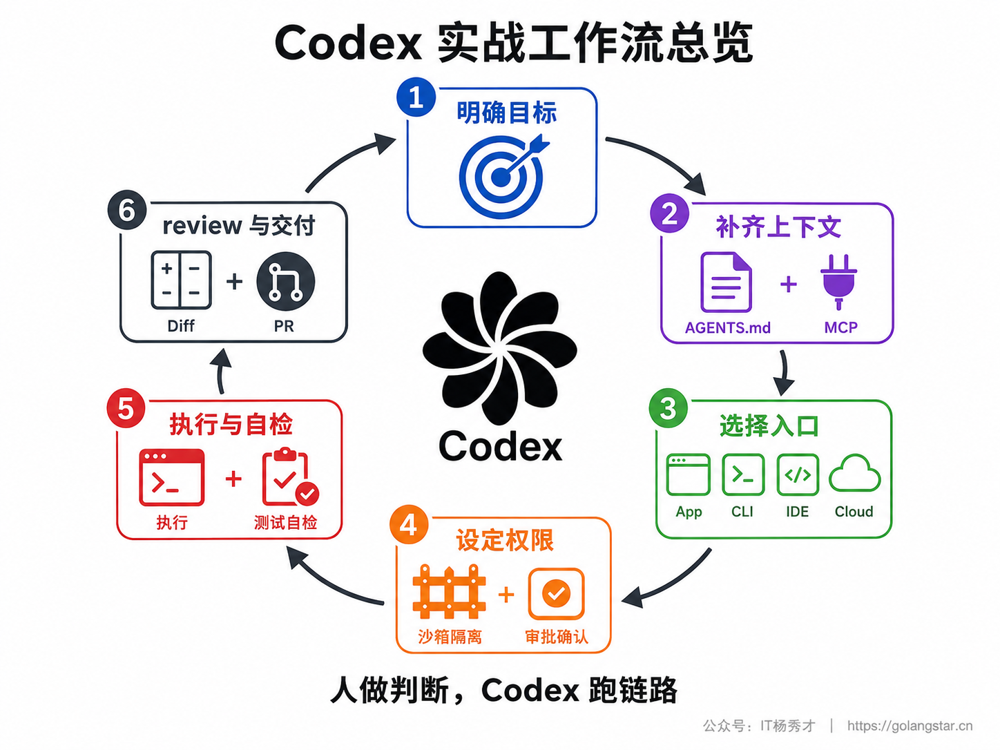
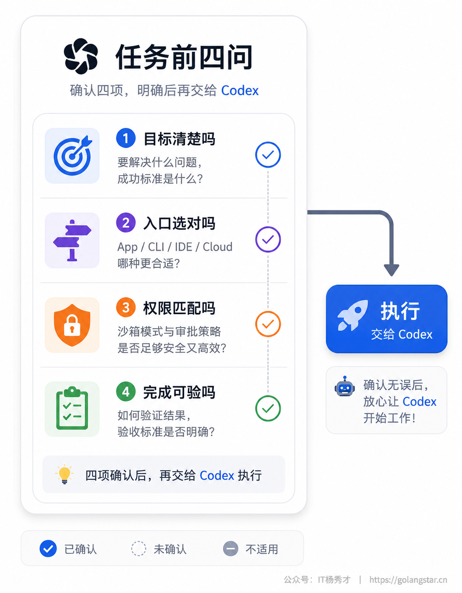
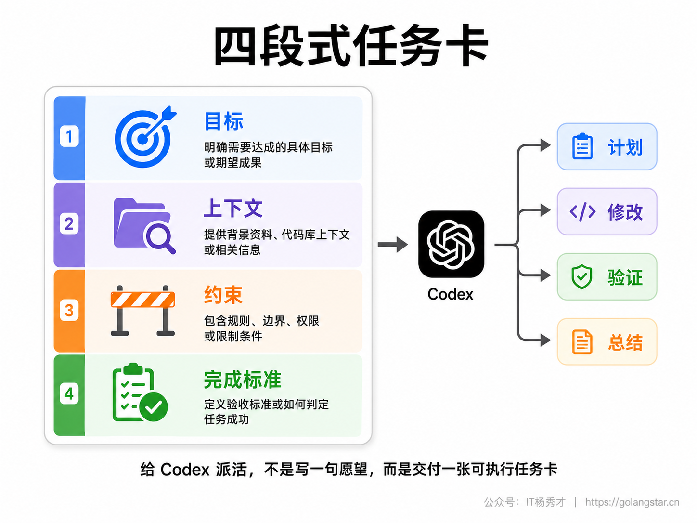
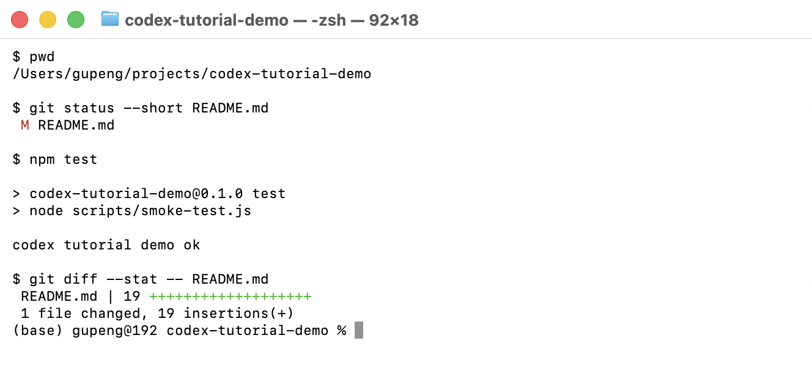
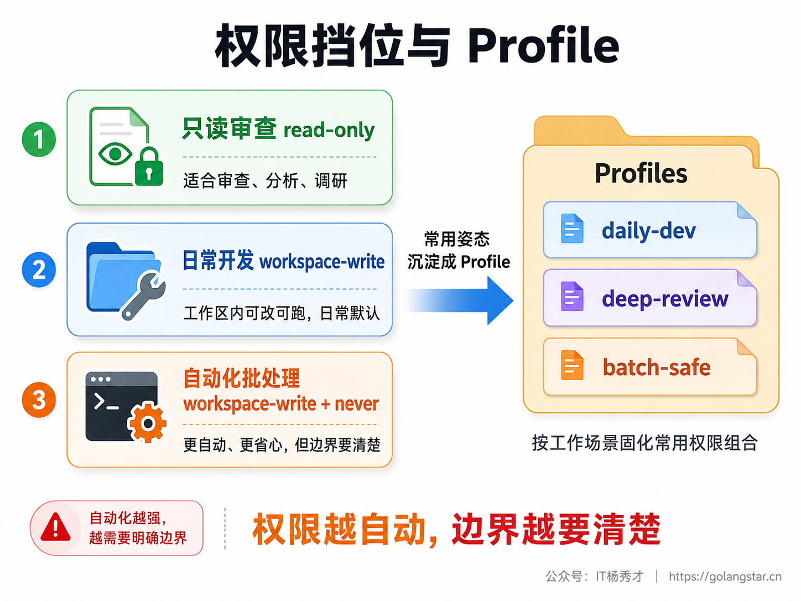
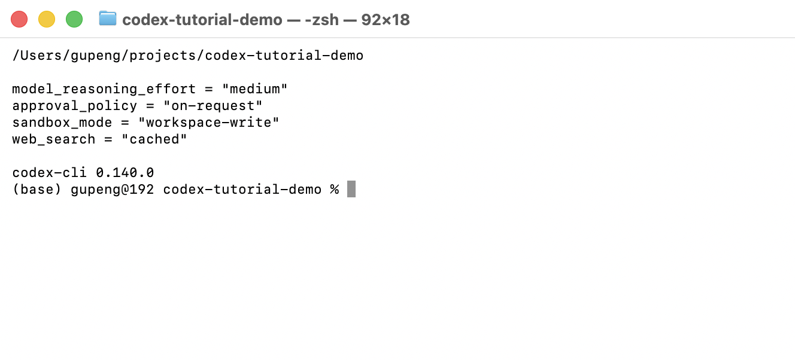
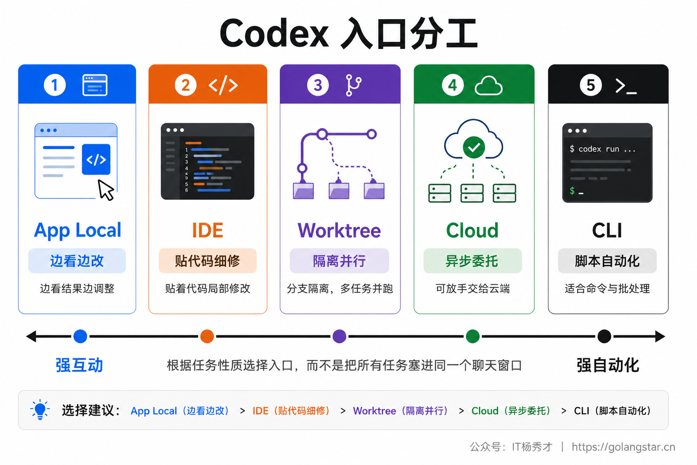
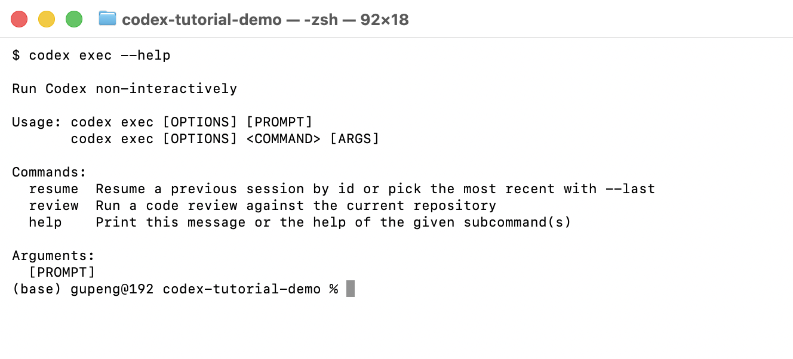
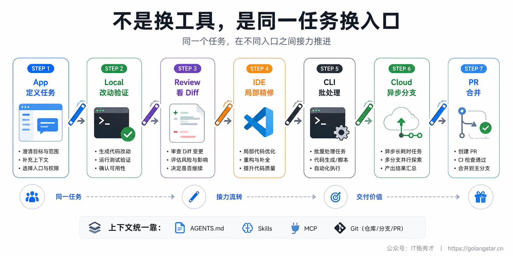
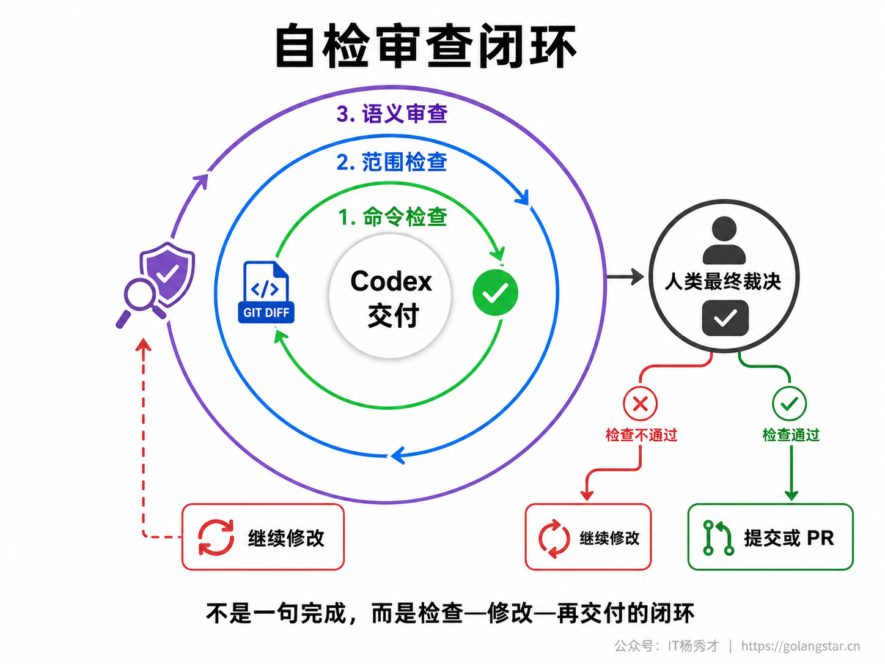

Codex 真正拉开差距的地方，不是某一个按钮，而是能不能把 App、CLI、IDE、Cloud、AGENTS.md、Skills、MCP、沙箱审批和 review 串成一套稳定节奏。

这套节奏的核心很简单：**你负责目标、约束和判断，Codex 负责读代码、改文件、跑命令、自检和交付差异。**

如果只把 Codex 当成聊天框，它只能回答问题；如果把它当成一个带工作区、终端、Git、文档连接和云端执行能力的工程搭档，它就能把一个真实任务从需求推进到可验证结果。

## **1. 工作流全景**

一个顺手的 Codex 工作流，通常不是从写代码开始，而是从四件事开始。

第一，确认任务在哪里跑。是在本机 Local 模式里贴着项目改，还是用 Worktree 隔离一条分支，还是丢给 Cloud 异步跑。

第二，确认它能动到哪里。日常开发用 `workspace-write` 配 `on-request` 最均衡；只读分析用 `read-only`；自动化批处理再考虑更严格的脚本化配置。

第三，确认上下文来自哪里。项目规则放进 `AGENTS.md`，外部资料走 MCP，反复流程沉淀成 Skill，临时要求写进这次任务。

第四，确认怎样算完成。不要只说帮我改一下，而要说清楚跑哪些检查、输出哪些结果、哪些文件不能碰、最后怎么交付。



工作流篇不需要再把 Codex App 的基础区域讲一遍。真正要养成的习惯，是每次派活前先过一遍任务检查卡：目标是否明确，运行入口是否选对，权限是否匹配风险，完成标准是否能验证。界面只是承载这些动作的入口，工作流本身才是重点。



## **2. 任务输入**

Codex 能自主执行多步任务，但它不是读心术。你给的任务越像工程工单，它越容易一次走对。

一个稳定的任务输入，可以拆成四段：目标、上下文、约束、完成标准。

```text
目标：
把用户资料页的加载失败状态补完整，避免空白页。

上下文：
相关代码在 src/pages/profile 和 src/api/user。
先阅读现有 loading / error 组件，不要新造一套风格。

约束：
只改前端展示逻辑，不改接口协议。
不要引入新依赖。
保持现有测试命名风格。

完成标准：
补充必要测试。
运行 npm test。
最后总结改了哪些文件、验证结果和仍需我确认的点。
```

这四段里，最容易被忽略的是完成标准。只说做完，很容易变成它认为做完；写清楚要跑什么命令、看什么结果、输出什么总结，才会变成你认可的做完。



复杂任务可以先让 Codex 规划，不急着改文件。

```text
先不要改代码。
请阅读相关文件，列出你准备修改的文件、原因、风险点和验证命令。
等我确认后再开始实现。
```

不确定需求时，用这种方式让它先暴露思路。需求已经清楚时，就可以直接让它执行，并把验证要求写进去。

## **3. 本地闭环**

日常开发最稳的姿势，是先在 Codex App 的 Local 模式里跑小步闭环。

小步闭环不是让它一次改完整个世界，而是围绕一个明确目标完成一小段：读代码、改文件、跑测试、看 diff、总结结果。每一轮都能验证，每一轮都能回退，每一轮都能接下一步。

你可以把自检要求写进任务本身。

```text
改完后请执行：
1. npm test
2. git diff --stat
3. 自查是否改动了任务范围外的文件

最后按「改动摘要 / 验证结果 / 待确认问题」三段输出。
```

终端里最值得看的不是花哨命令，而是三类证据：当前项目路径、Git 改动范围、测试结果。



这类验证动作要形成习惯。Codex 可以自己跑命令，但你要让它知道哪些命令才算有效验证。前端可能是 `npm test`、`npm run lint`、`npm run build`；Go 项目可能是 `go test ./...`；文档任务可能是链接检查、格式检查或本地预览。

如果项目有固定检查命令，最好的位置不是每次都手打，而是写进 `AGENTS.md`。

```markdown
## Commands

- Install: npm install
- Test: npm test
- Build: npm run build
- Lint: npm run lint

## Done

- Run the smallest relevant test first.
- Summarize changed files and validation results.
- Mention any command that could not be run.
```

这样 Codex 进入项目时就知道什么叫完成，而不是每次重新猜。

## **4. 权限配置**

工作流要跑得顺，权限不能每次靠临场感觉。

本地交互任务的推荐起点，是 `workspace-write` 加 `on-request`。这表示 Codex 可以在工作区里连贯读写和跑常规命令，遇到越界或高风险动作再问你。它既不会被每一步都打断，也不会完全放开边界。

项目级 `.codex/config.toml` 适合保存这个仓库的默认姿态。比如一个练习项目可以这样设置：

```toml
model_reasoning_effort = "medium"
approval_policy = "on-request"
sandbox_mode = "workspace-write"
web_search = "cached"
```





这里的关键不是背配置项，而是分清三层东西。

`model_reasoning_effort` 决定它愿意花多少推理预算。普通改动用 `medium` 起步，复杂分析再调高。

`approval_policy` 决定什么时候问你。交互式开发优先用 `on-request`，非交互脚本再考虑 `never`，但要用更强沙箱兜底。

`sandbox_mode` 决定它能碰到哪里。日常用 `workspace-write`，只读审查用 `read-only`，完全放开只适合外层已经隔离的环境。

如果你有几套固定姿势，可以做成 Profile。

```toml
# ~/.codex/deep-review.config.toml
model = "gpt-5.5"
model_reasoning_effort = "xhigh"
approval_policy = "on-request"
sandbox_mode = "read-only"
web_search = "cached"
```

使用时：

```bash
codex --profile deep-review
```

Profile 的价值，是让你把常用工作姿态固定下来：日常开发一套、深度审查一套、低成本小修一套、自动化批处理一套。越是频繁使用 Codex，越不要靠每次手调。

## **5. 入口分工**

Codex 的多个入口不是彼此替代，而是负责不同工作半径。

Local 适合贴着当前项目边看边改。你要频繁审结果、给反馈、看 Git 变化，就留在本地。

Worktree 适合隔离分支。你想并行试一个功能，又不想污染当前工作区，就用 Worktree。它本质上是给 Codex 一块独立工作区，让任务之间互不踩脚。

Cloud 适合边界清楚的异步任务。比如补测试、修一类 lint、改一批文档、做一个不依赖本机私有环境的功能。你给清楚目标和验证方式，让它在云端跑，回来检查 diff 或 PR。

CLI 适合脚本化和远程环境。尤其是 `codex exec`，可以在非交互场景里让 Codex 执行一次任务，适合批处理、CI 辅助、仓库巡检和自动化摘要。

IDE 适合贴着编辑器上下文做细修。你已经打开某个文件、选中某段代码，就让 Codex 围绕当前编辑上下文处理局部问题。



一个简单判断法：需要你边看边拍板，用 App 或 IDE；需要隔离并行，用 Worktree；边界清楚可以等结果，用 Cloud；需要接入脚本或远程终端，用 CLI。

## **6. CLI 自动化**

CLI 的价值不是替代 App，而是把 Codex 放进命令行工作流。

交互式 CLI 适合远程机器、纯终端环境和脚本旁路操作；`codex exec` 适合非交互任务。它会读取 prompt，执行一次任务，然后把最终结果输出到 stdout。默认要把权限收紧，尤其在自动化场景里，不要为了省事直接放开。



一个偏稳的批处理模板可以这样写：

```bash
codex exec \
  --sandbox read-only \
  --ask-for-approval never \
  "阅读当前仓库，列出最可能影响启动速度的 5 个文件，不要修改任何文件。"
```

需要落文件时，把沙箱明确改成工作区可写，并把输出位置说清楚。

```bash
codex exec \
  --sandbox workspace-write \
  --ask-for-approval never \
  -o reports/dependency-audit.md \
  "检查 package.json 和 lockfile，生成依赖风险摘要，不要安装新依赖。"
```

更工程化的做法，是让输出变成结构化结果。比如用 `--json` 记录事件流，用 `-o` 保存最终报告，用 `--output-schema` 限定 JSON 形状。这样 Codex 不只是会说话，而是能接入脚本、流水线和内部工具。

但要记住一条：自动化越强，权限越要清楚。`never` 只是表示不打断你，不表示更安全。安全来自沙箱、临时工作区、只读模式、明确输出路径和可丢弃环境。

## **7. 跨入口接力**

真实项目里，一个任务很少只停留在一个入口。

更常见的节奏是：你在 App 里让 Codex 读项目、拆任务、做第一版；它改完后跑测试并总结 diff；你在 Review 面板里看差异，发现某处需要局部精修；再切到 IDE 围绕当前文件补一轮；如果任务变成一批重复修改，就用 CLI 批处理；如果边界清楚但耗时，把后续分支丢给 Cloud。



接力的关键是让上下文稳定。

项目规范放 `AGENTS.md`，这样不同入口都知道这个仓库的规矩。重复流程做成 Skill，这样它知道某类任务该怎么走。外部系统通过 MCP 接入，这样它不用靠你复制粘贴一堆资料。Git 负责承接差异，这样每个入口的结果都能落回可审查的改动。

这就是为什么 AGENTS.md、Skills、MCP 看起来像配置细节，实际却是工作流骨架。

## **8. 自检审查**

Codex 可以帮你执行，但不能替你承担最终质量责任。

高效工作流里，交付前至少有三道检查。

第一道是命令检查。让它跑最小相关测试、lint、build 或文档检查。跑不了就必须说清原因，不要用一句环境问题糊过去。

第二道是范围检查。让它列出改了哪些文件，确认没有碰任务范围外的东西。必要时用 `git diff --stat` 或 Review 面板看一眼。

第三道是语义检查。用 `/review`、App 的 review 能力或 GitHub PR review，让 Codex 再站在审查者角度挑问题。它自己刚写完时容易顺着实现思路走，换一个审查姿态能发现另一类问题。



我的习惯是让 Codex 最后按固定格式收尾：

```text
请按下面格式总结：

1. 改动摘要
2. 验证结果
3. 未运行或失败的命令
4. 需要我确认的风险点
```

这个格式看似普通，但非常有用。它能逼 Codex 把结果从聊天语气拉回工程交付语气，也方便你快速决定是继续追问、让它返工，还是进入提交。

## **9. 实战模板**

把上面的内容收拢成一套可直接复用的模板，日常任务可以这样派给 Codex：

```text
目标：
请修复订单列表筛选条件切换后分页没有重置的问题。

上下文：
先阅读订单列表页面、筛选组件和分页组件。
复用现有状态管理方式，不要重写页面结构。

约束：
只处理这个问题。
不要改接口协议。
不要新增依赖。
如果发现更大的重构点，只在最后列为建议。

执行要求：
先说明计划，再修改文件。
改完运行最小相关测试。
再用 git diff --stat 检查改动范围。

交付格式：
改动摘要 / 验证结果 / 风险点 / 建议后续。
```

如果它第一轮没有完全做对，不要急着骂它笨，直接基于 diff 继续收紧。

```text
只继续处理刚才 diff 里的问题。
保留已通过的测试。
不要扩大改动范围。
重点检查筛选项变化时 page 是否回到 1。
改完重新运行同一组验证命令。
```

这就是 Codex 工作流最重要的心法：**不要把一次对话当成唯一机会，把它当成一轮可验证迭代。**

你给目标，它读代码；它给计划，你判断；它改文件，它跑测试；它总结结果，你 review；不对就继续缩小范围再跑一轮。这样的节奏跑顺后，Codex 就不是偶尔灵光的问答工具，而是能稳定进入工程闭环的执行者。

## **10. 小结**

Codex 的高效来自一整套组合拳。

用 App 做默认工作台，用四段式任务输入说清目标和完成标准，用 `AGENTS.md` 沉淀项目规矩，用 `workspace-write` 加 `on-request` 作为日常权限基线，用 Terminal 和 Git 结果做验证证据，用 Worktree 和 Cloud 承接隔离并行任务，用 CLI 把它接入自动化，用 Skills 和 MCP 复用流程与上下文，最后用自检和 review 把质量关住。

这套流程一旦固定下来，你和 Codex 的关系就会从简单问答变成工程协作：你不需要盯着每一行代码怎么敲，但你必须掌握任务边界、验证方式和最终裁决。AI 负责跑链路，人负责判断方向，这就是 Vibe Coding 真正能落地的分工。

<div style="background-color: #f0f9eb; padding: 10px 15px; border-radius: 4px; border-left: 5px solid #67c23a; margin: 20px 0; color:rgb(64, 147, 255);">

<h2><span style="color: #006400;"><strong>关注秀才公众号：</strong></span><span style="color: red;"><strong>IT杨秀才</strong></span><span style="color: #006400;"><strong>，回复：</strong></span><span style="color: red;"><strong>面试</strong></span></h2>

<div style="text-align: center;"><span style="color: #006400; font-size: 28px;"><strong>领取后端/AI面试题库PDF</strong></span></div>


<div style="text-align: center; margin-top: 22px; padding-top: 20px; border-top: 1px solid #c2e7b0;">
<div style="color: #006400; font-size: 20px; font-weight: bold;">🔥 配套实战项目，拆得开、跑得起、能写进简历</div>
<div style="color: red; font-size: 16px; font-weight: bold; margin-top: 8px;">多 Agent 编排 + RAG 混合检索 · 31 篇深度教程 + 50+ 面试题</div>
<a href="/projects/dev-support.html" style="display: inline-block; margin-top: 14px; background: #ff7a18; color: #fff; font-size: 18px; font-weight: bold; padding: 10px 28px; border-radius: 24px; text-decoration: none;">点击查看 DevSupport AI 实战项目 →</a>
</div>
</div>
