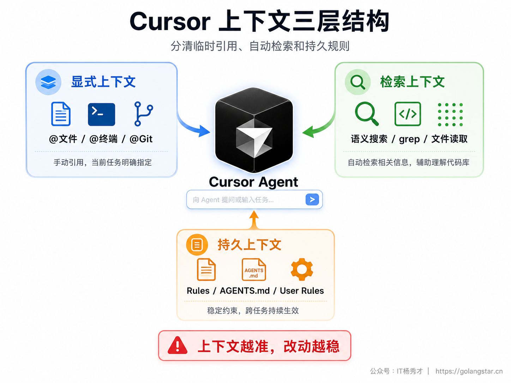
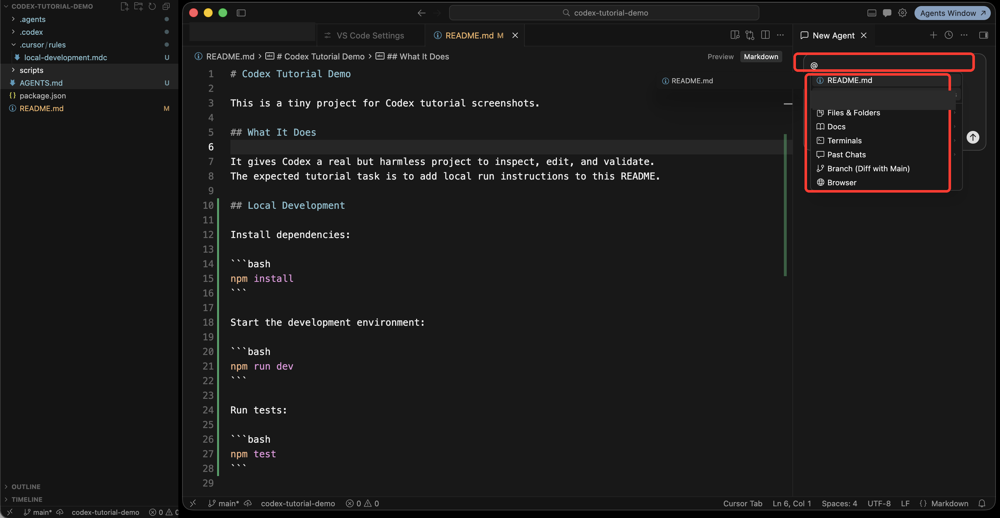
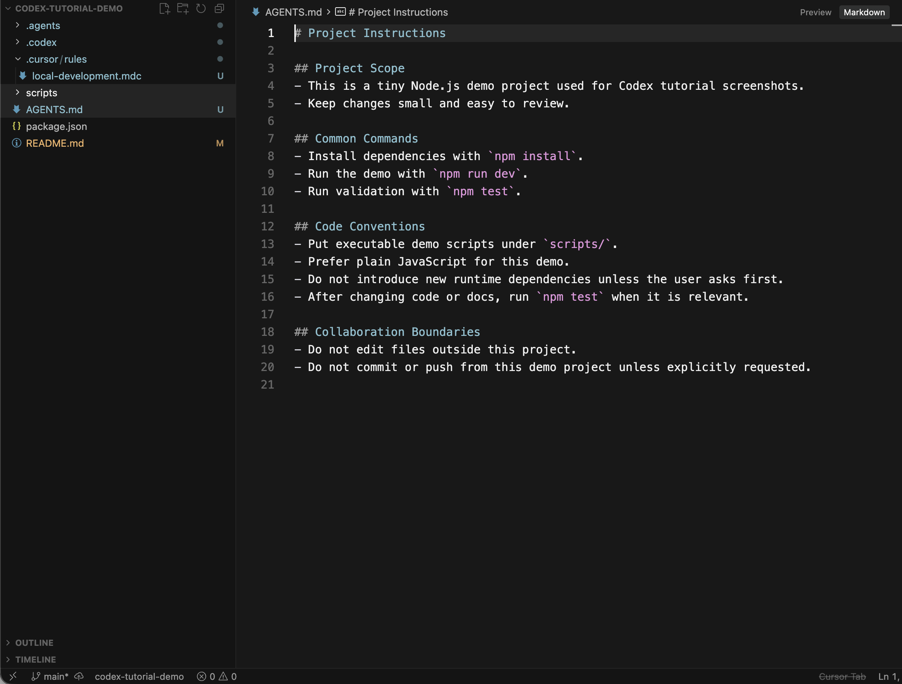
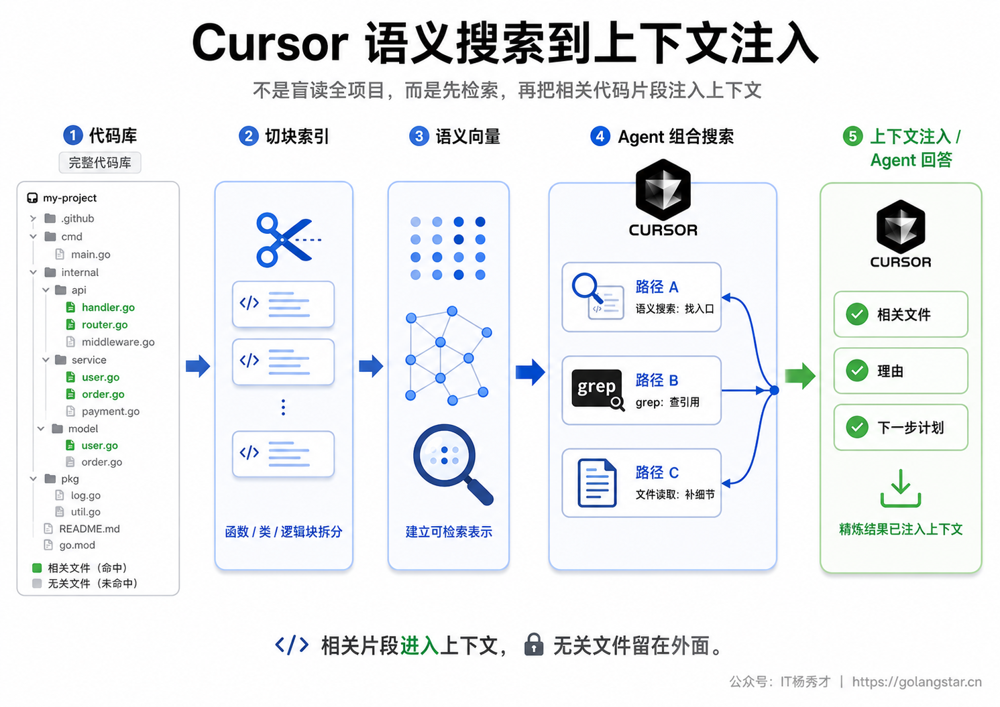
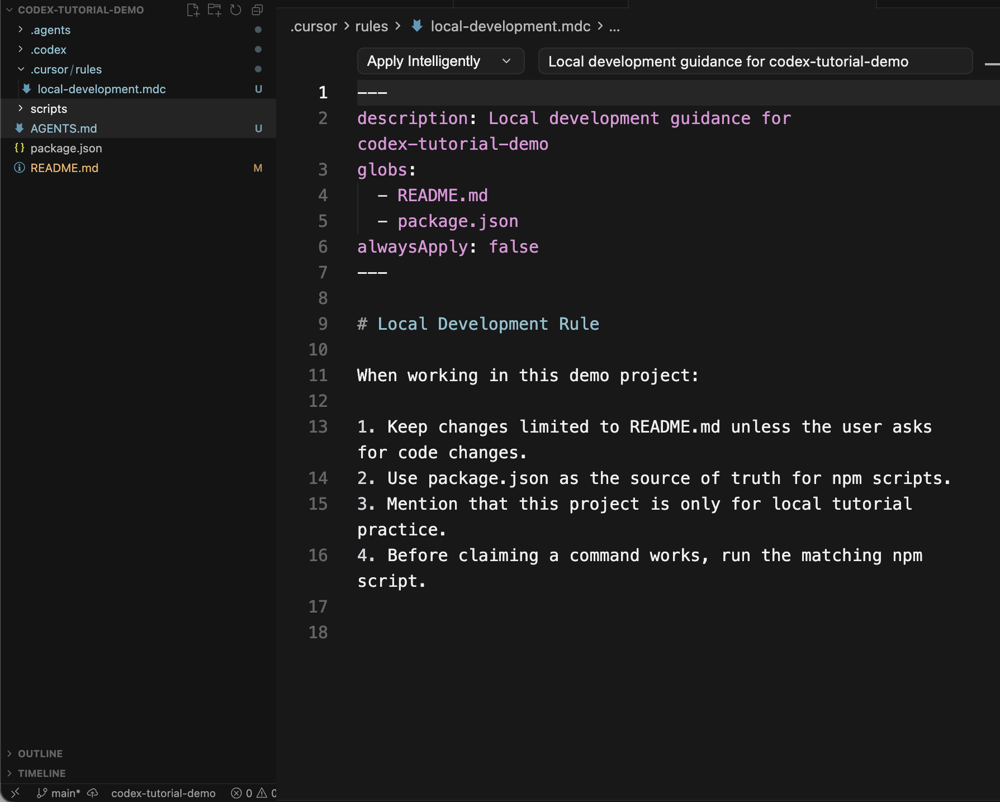
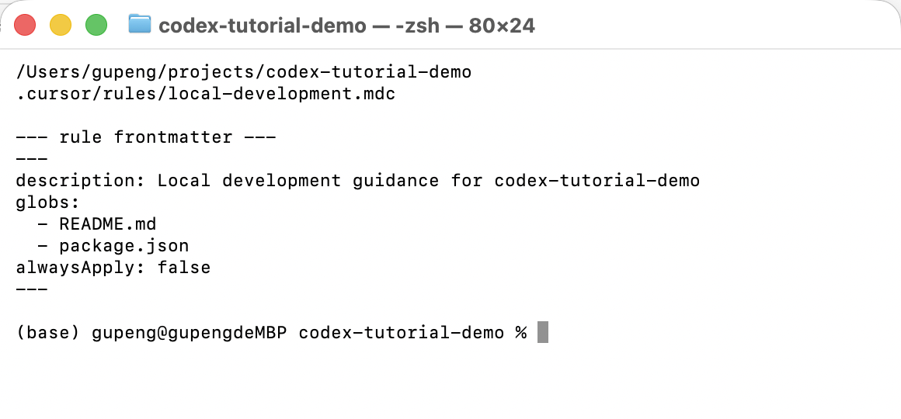
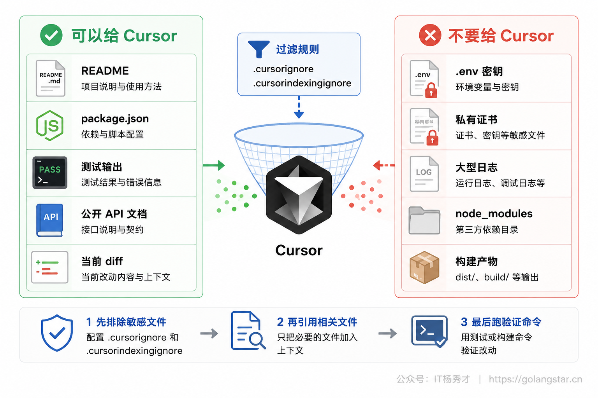
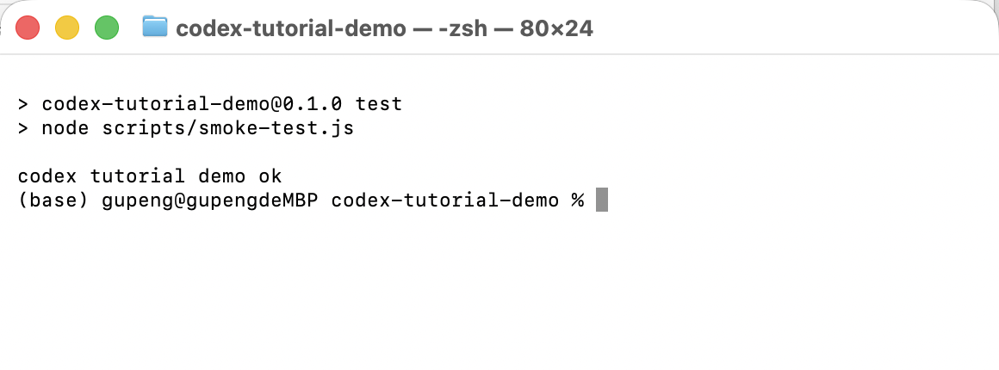

很多人用 Cursor 时会遇到同一个问题：明明 Prompt 写得不短，AI 回答还是泛泛而谈；让它改一个小功能，它先改错文件，再补一堆无关代码。问题常常不在模型，而在上下文。你没有告诉它该看哪些文件、哪些输出、哪些规则、哪些文档，它只能从这次对话和有限的自动检索里猜。

Cursor 的上下文能力可以分成三类：当前这次对话临时带进去的上下文，比如 `@README.md`、`@Terminals`、`@Branch`；代码库检索出来的上下文，比如语义搜索和文件读取；长期复用的持久上下文，比如 `.cursor/rules`、`AGENTS.md`、User Rules。把这三类用清楚，Cursor 才会从会聊天的编辑器，变成能稳定参与项目开发的 AI 编程工具。

## **1. 上下文三层**

上下文不是一句抽象概念，它就是模型这次回答前能看到的信息集合。你写进去的 Prompt、你 `@` 进来的文件、Cursor 自动检索出的代码片段、终端输出、历史对话摘要、项目规则，都会消耗上下文窗口。Cursor 官方的 Context 课程把它解释为对话里的工作记忆：输入和输出会一轮轮累积，窗口越来越满，后续回答会受到前面信息影响。

这也是为什么同一个任务在不同对话里表现差很多。一个干净的新对话里，你只给它 `README.md`、`package.json` 和当前报错，它很容易聚焦；一个聊了两个小时的旧对话里，前面讨论过的需求、旧方案、废弃结论都还在上下文里，模型可能把过时信息一起带进判断。Cursor 会在上下文接近上限时压缩旧内容，但压缩不是万能清理，它会保留摘要，仍然可能带来干扰。

Cursor 的输入区旁边会显示上下文使用情况。官方 Prompting 文档把它称为 context ring，你可以点开查看 token 消耗分类。这个入口对新手很有价值：当你发现上下文已经很满，继续往旧对话里塞文件，效果通常不会变好。更合理的做法是新开对话，把本轮真正需要的文件、终端输出、规则重新带进去。很多时候，清掉旧上下文比换一个更贵的模型更有效。

上下文预算还决定了你该给原文还是给摘要。配置文件、短脚本、当前 diff 这类内容可以直接 `@`；几千行日志、几十个文件的大目录，最好先让 Cursor 搜索、筛选、总结，再把关键片段放进主对话。你要管理的不是 token 数字本身，而是让窗口里留下对当前任务最有判断价值的信息。

对新手最实用的理解方式是把上下文分成三层。

第一层是显式上下文，也就是你主动指定的内容。你知道问题和 `README.md`、`package.json` 有关，就直接把它们 `@` 进去；你要它根据刚才的测试失败修复，就引用终端输出；你要它解释这次改动，就引用当前 Git diff。显式上下文最可控，也是写 Prompt 时最该优先处理的部分。

第二层是检索上下文，也就是 Cursor 自己从代码库里找出来的内容。你不知道入口文件在哪里，就让 Agent 搜索代码库；它会结合语义搜索、grep、文件读取等工具，把相关片段放进回答。检索上下文适合探索陌生项目，但你仍然要给它清晰目标，否则它搜出来的范围可能太宽。

第三层是持久上下文，也就是长期复用的项目约定。比如这个项目只用纯 JavaScript、不要新增依赖、改文档后要跑 `npm test`。这类信息不适合每次都手写在 Prompt 里，应该放进 `.cursor/rules`、`AGENTS.md` 或 User Rules，让 Cursor 在相关任务里自动带上。


## **2. @ 引用入口**

Cursor 的 Agent 输入框里，`@` 是最重要的上下文入口。官方 Prompting 文档里列出的常用引用包括 Files & Folders、Docs、Terminals、Past Chats、Git diffs 等。你不需要背所有名字，但要知道每类解决什么问题。

最常用的是文件和目录引用。比如你要改 README 的本地运行说明，就别只写帮我改 README，而是写成：

**Prompt：**
```text
请只阅读 @README.md 和 @package.json，帮我判断 README 里的本地运行说明是否和 package.json scripts 一致。
只给检查结论和需要修改的小节，不要直接改文件。
```

这个 Prompt 有三个好处。第一，它限制了 Cursor 的阅读范围，避免它在整个项目里乱找。第二，它明确告诉 Cursor 以 `package.json` 为准，这比让它猜命令可靠。第三，它要求只读分析，不直接改文件，适合第一次检查。



图里展示的是在 `codex-tutorial-demo` 项目中，Agent 输入框打出 `@` 后出现的菜单。你能看到 `README.md`、Files & Folders、Docs、Terminals、Past Chats、Branch 等入口，也能确认这些入口都来自当前 Cursor 项目窗口，而不是单独的一段文字示意。

`@` 引用不要贪多。很多人一上来把整个项目、好几个目录、几十个文件都塞进去，以为这样更全面，结果反而让模型在无关信息里分心。更稳的做法是先引用入口文件和直接依赖，让 Cursor 解释它还需要看哪些文件，再按它给出的理由补充。这样你能控制范围，也能看出它的搜索思路是否靠谱。

如果你确实不知道相关文件在哪，就不要硬猜文件名。直接把任务描述清楚，让 Agent 通过代码库搜索找入口。官方搜索文档提到，Agent 会按任务需要组合语义搜索、grep、文件读取等工具。你要做的是把目标讲清，不是强行指定错误文件。

## **3. 精准引用练习**

下面用 `codex-tutorial-demo` 做一个小练习。目标不是让 Cursor 大改项目，而是训练你给上下文的方式：让它检查项目说明、命令和持久规则是否一致。

先打开项目根目录下的 `AGENTS.md`。它不是 Cursor 独有格式，但 Cursor 官方 Rules 文档明确支持在项目根目录和子目录放 `AGENTS.md`，用于提供简单可读的 Agent instructions。对小项目来说，这比一开始就写复杂 `.cursor/rules` 更容易维护。



图里左侧目录树来自 `codex-tutorial-demo`，能看到 `.cursor/rules`、`scripts`、`AGENTS.md`、`package.json`、`README.md` 等关键文件。右侧编辑区打开的是 `AGENTS.md`，里面写着项目范围、常用命令、代码约定和协作边界。读者可以把文件位置、项目结构和规则内容对上，知道这段上下文来自真实项目。

对这个项目，可以给 Cursor 一个只读检查 Prompt：

**Prompt：**
```text
请基于 @AGENTS.md @README.md @package.json 检查三件事：
1. README 里的本地运行命令是否和 package.json scripts 一致；
2. AGENTS.md 的项目约定是否覆盖了 README 维护场景；
3. 如果信息有冲突，只列出冲突点，不要修改文件。
```

这类 Prompt 适合新手练习上下文引用。它没有要求 Cursor 直接写代码，也没有让它改文件，只让它读三个明确文件并输出检查结论。如果回答里提到某个命令存在，你还能回到 `package.json` 自己核对；如果它说没有冲突，你可以要求它列出依据来自哪几行。这样练习几次，你会逐渐形成一个习惯：先让 Cursor 读真实上下文，再让它判断，最后才让它动手。

如果要进入执行阶段，可以把 Prompt 改成更小的任务：

**Prompt：**
```text
请只修改 @README.md 的 Local Development 小节，让它和 @package.json 里的 scripts 保持一致。
不要改其他文件。改完后说明你改了哪几行，以及需要运行哪个验证命令。
```

这里仍然没有把范围交给模型猜。文件、依据、边界、验收命令都写清了。Cursor 擅长跨文件理解，但你不能把跨文件理解当成范围控制的替代品。范围越明确，diff 越容易审查。

## **4. 外部资料引用**

文件引用解决的是项目内部上下文，`@Docs` 解决的是外部文档上下文。官方 Prompting 文档里提到，可以用 `@Docs` 搜索已索引文档，也可以通过 `@Docs > Add new doc` 添加自己的文档。这个能力最适合处理框架版本变化快、API 容易过时的场景。

比如你让 Cursor 写一个 Next.js 的 loader 或 React Router 的数据加载逻辑，如果只靠模型记忆，它可能混用不同版本 API。更稳的写法是先把官方文档加进 Docs，再在 Prompt 里明确：

**Prompt：**
```text
请参考 @Docs 中的 React Router 官方文档，检查当前项目是否适合使用 loader。
只读取文档和当前项目文件，不要修改代码。
输出时分成三部分：适用条件、当前项目缺失项、推荐迁移路径。
```

这比直接问能不能用 loader 更好，因为它指定了知识来源，也限制了输出结构。小白最容易踩的坑是把 AI 当成最新文档搜索器，但不告诉它用哪份文档。`@Docs` 的价值就在这里：让回答基于你添加或选择的资料，而不是混杂的训练记忆。

`@Terminals` 适合把命令输出带进对话。比如 `npm test` 报错、TypeScript 报错、构建失败日志，都不要手动复制一大段再担心漏行，直接引用终端上下文，让 Cursor 基于真实输出分析。`@Past Chats` 适合引用之前一次讨论的结论，但要谨慎使用。如果那次对话里有过时方案，引用它会把旧信息也带进来。`@Branch` 或 `@Commit` 这类 Git diff 引用适合做改动说明、代码审查和回归排查。

图片也可以成为上下文。官方 Prompting 文档提到可以把图片附到 Prompt 中，这对 UI 还原、视觉 bug、设计稿实现很有用。需要注意的是，图片上下文适合表达视觉状态，不适合替代可复制的文本。终端报错能用 `@Terminals` 就不要只发截图；代码能用文件引用就不要只发图片；页面样式错位、按钮遮挡、图表显示异常这类问题，截图才是更合适的上下文。

外部资料还要注意版本。你添加 `@Docs` 时，尽量选择官方文档主页或稳定的版本页，不要随便引用一篇过期博客。框架迁移、API 用法、配置项名称这些内容最容易过时，资料来源比 Prompt 文采更重要。你可以直接要求 Cursor 在回答里标注依据来自哪份文档、哪个小节，这样后续人工核对更方便。

一个实用规则是：能由文件表达的上下文，用文件；能由命令输出表达的上下文，用终端；能由版本差异表达的上下文，用 Git diff；只有真的需要跨会话结论时，才引用历史对话。上下文不是越多越好，关键是表达形式要和问题匹配。

## **5. 代码库搜索**

当你不知道相关代码在哪，Cursor 的自动搜索就比手动 `@` 更合适。官方 Semantic & Agentic Search 文档里说明，Cursor 会把代码拆成函数、类、逻辑块这类有意义的片段，再做语义索引；打开 workspace 后会自动开始索引，语义搜索在索引达到一定进度后可用，并会定期同步变化。

对小项目来说，你可能感受不明显；对几万行代码的项目来说，这决定了 Agent 能不能从自然语言问题找到正确入口。比如你问登录失败重试在哪里加，如果项目里没有清晰的 `login.ts`，Cursor 可以先语义搜索登录请求相关代码，再用 grep 找引用，再读取文件补全上下文。你不用告诉它工具顺序，只要描述目标足够具体。


搜索能力强，不等于可以把目标写得含糊。下面两个 Prompt 的差别很大。

**不推荐的写法：**
```text
帮我看看项目哪里有问题。
```

**推荐的写法：**
```text
项目运行 npm test 失败时，请先搜索和 smoke-test、package scripts、README 本地运行说明相关的文件。
不要修改文件。请列出你读取了哪些文件、每个文件为什么相关，以及你判断的失败原因。
```

推荐写法给了三个关键信号：问题来自测试失败，检索范围围绕 smoke-test/package scripts/README，输出要列出读取文件和理由。Cursor 可以搜索，但它需要一个方向。方向越清楚，搜索出来的上下文越干净。

官方文档还提到 Explore subagent。它适合大范围探索，因为它能把大量搜索结果总结后交回主对话，减少主上下文被原始文件内容塞满。你可以直接要求：

**Prompt：**
```text
Explore before changing.
请先用搜索梳理本项目的运行入口、测试入口和文档入口。
只输出文件清单、关系说明和建议改动范围，不要修改文件。
```

这类写法适合陌生项目第一轮阅读。先探索，再执行，比上来就让 Agent 改代码安全得多。

## **6. 持久记忆**

这里说的持久记忆，不是让模型神秘地长期记住一切。Cursor 官方 Rules 文档讲得很清楚：大语言模型本身不会在一次次完成之间保留记忆，Rules 提供的是提示词层面的持久、可复用上下文。也就是说，你要把稳定约定写到可检查、可管理的位置里，而不是指望 AI 自己永远记得。

Cursor 当前最稳定的持久上下文有三类。

第一类是 Project Rules，放在 `.cursor/rules` 下，适合团队共享的项目级规则。它可以按 glob 匹配文件，也可以总是应用。比如只在修改 `README.md` 和 `package.json` 时加载本地开发规则，就比把所有约定塞进一个全局规则更精准。



截图里的 `.cursor/rules/local-development.mdc` 使用了 `globs`，只匹配 `README.md` 和 `package.json`。这就是项目规则比普通长 Prompt 更可靠的地方：它不是靠你每次想起来再写，而是随项目文件一起存在，范围也能被明确限定。

第二类是 `AGENTS.md`。官方文档把它定位为简单 Markdown 指令文件，适合不需要复杂 metadata 的项目。它可以放在项目根目录，也可以放在子目录，让不同目录有不同的指令。对小白来说，先写一份根目录 `AGENTS.md` 通常比马上学 `.mdc` frontmatter 更顺手。

第三类是 User Rules。它是你个人跨项目的偏好，比如回答风格、默认语言、代码说明习惯。它适合放个人偏好，不适合放某个项目的业务规则。项目规则要跟项目走，User Rules 要跟人走，这个边界不要混。

为了避免规则写错，最好用终端验证项目里真实存在的规则文件和 frontmatter。下面这张终端图显示的是在 `codex-tutorial-demo` 目录里读取 `.cursor/rules/local-development.mdc` 的结果。



规则写完后，可以让 Cursor 做一次只读解释：

**Prompt：**
```text
请读取 @.cursor/rules/local-development.mdc 和 @AGENTS.md，解释它们分别会影响哪些任务。
不要修改文件。输出时区分：项目级规则、通用项目说明、可能重复的内容。
```

这个练习能帮你发现两类问题。第一，规则太宽，比如 `alwaysApply: true` 写了很多只适用于 README 的内容，导致所有任务都带上无关上下文。第二，规则重复，比如 `AGENTS.md` 和 `.cursor/rules` 里写了两套互相冲突的命令。持久上下文的价值是稳定，不是越多越好。

如果你的 Cursor 版本里出现单独的 Memories 或类似个人记忆入口，也要按同一原则处理：个人偏好可以放那里，团队规则不要只放那里。能进入仓库、能被审查、能随项目同步的内容，才适合承载项目级约定。

## **7. 上下文边界**

上下文管理不只关心给什么，也关心不给什么。正式项目里通常有 `.env`、密钥、私有证书、构建产物、日志、大文件。让 AI 读取这些内容不仅浪费上下文，还可能带来安全和合规问题。

Cursor 官方 Ignore File 文档里提到两类文件：`.cursorignore` 和 `.cursorindexingignore`。简单理解，`.cursorignore` 用来控制 Cursor 能访问哪些文件，`.cursorindexingignore` 用来控制语义索引排除哪些文件。你不需要一上来记住全部细节，但要养成一个习惯：正式项目接入 Cursor 前，先检查哪些内容不应该进入 AI 上下文。


可以从下面这个最小模板开始：

```gitignore
# .cursorignore
.env
.env.*
*.pem
*.key
node_modules/
dist/
build/
coverage/
```

再根据项目补充业务敏感目录。比如数据导出、客户上传文件、内部日志、生产配置。不要把 `.cursorignore` 当成形式主义，它和规则文件一样，是 AI 编程的基础设施。没有边界的上下文，既不安全，也不高效。

这里还有一个容易忽略的点：被忽略的文件不要再手动复制进 Prompt。很多人一边写 `.cursorignore` 排除 `.env`，一边在聊天里复制错误日志时把密钥一起贴进去，这等于绕过了自己的边界。上下文管理是工作习惯，不只是配置文件。

## **8. 验收截图**

上下文给得再好，最后都要回到验收。Cursor 可以读文件、改文件、跑命令，但你不能只看它的文字总结。它说测试通过，你要看真实命令输出；它说只改 README，你要看 Git diff；它说遵守规则，你要检查规则和改动是否一致。

在 `codex-tutorial-demo` 里，最小验证就是运行 `npm test`。终端真实输出如下：



这张图不是聊天框里的文字，也不是手写结果，而是在项目目录里执行命令后的终端画面。对教程读者来说，它回答了一个很关键的问题：执行之后到底应该看到什么。很多工具教程只讲 Prompt，不给真实结果，读者照做时就不知道自己是否跑通。凡是正文里说某个操作完成了、命令通过了、页面生效了，就应该给出对应的真实结果。

如果你让 Cursor 完成一次文档修改，验收可以固定成四步。

第一步，让它列出读取过的上下文。比如读取了 `README.md`、`package.json`、`AGENTS.md` 和本地规则文件。第二步，看 diff，确认只改了你允许的文件。第三步，运行验证命令，比如 `npm test`。第四步，把最终结论写成可检查的短报告：改了什么、为什么改、跑了什么命令、命令结果是什么、还有没有未验证项。

Git diff 是这里最容易被忽略的一环。很多新手只看 Cursor 右侧的完成总结，不看实际文件改动，于是小任务被顺手改成大范围重构也没发现。对 Cursor 来说，完成任务和改对范围是两回事。你可以在改动后让它基于 `@Branch` 或当前工作区 diff 做一次自查：

**Prompt：**
```text
请只基于当前 Git diff 做审查：
1. 哪些文件被修改；
2. 哪些改动和本次任务直接相关；
3. 是否出现超出范围的改动；
4. 如果要回退，建议回退哪些文件或哪些小块。
不要继续修改文件。
```

这段 Prompt 不让它继续动手，只让它解释 diff。你再对照真实 diff 看它的判断是否成立。这样做的目的不是把审查外包给 AI，而是让 AI 先帮你整理改动清单，再由你做最后判断。

可以直接把下面这个 Prompt 当成收尾模板：

**Prompt：**
```text
请基于本轮实际改动做一次验收总结：
1. 列出你读取过的上下文来源；
2. 列出实际修改的文件；
3. 说明每个修改为什么必要；
4. 写出已经运行的验证命令和真实结果；
5. 如果还有没验证的地方，明确列出来。
不要新增修改。
```

这段 Prompt 的重点是防止 Cursor 用一句完成了糊弄过去。你要求它把上下文来源、改动范围、验证命令都列出来，它的回答就更容易被你审查。审查不是不信任 AI，而是把 AI 编程纳入正常工程流程。

## **9. 常见问题**

**Q：我每次都要手动 @ 文件吗？**

不用。你明确知道相关文件时，手动 `@` 最稳；你不知道入口在哪里时，让 Agent 搜索代码库更合适。区别在于：已知范围靠 `@`，未知范围靠搜索。

**Q：为什么我 @ 了很多文件，回答反而变差？**

上下文太宽会稀释重点。一次任务只放直接相关文件，其他文件让 Cursor 说明需要的理由后再补。特别长的目录、日志、大文件，不要一次性塞进对话。

**Q：Rules 和 AGENTS.md 应该选哪个？**

简单项目先用 `AGENTS.md`，因为它是普通 Markdown，易读易改。需要按文件类型、目录、任务范围自动应用时，再用 `.cursor/rules`。团队规则优先放项目里，个人偏好放 User Rules。

**Q：Cursor 的持久记忆能不能代替项目规则？**

不能。项目规则要可审查、可版本管理、可团队共享。个人记忆或用户偏好适合记录个人习惯，但不适合承载项目规范。稳定项目约定应放在 `.cursor/rules` 或 `AGENTS.md`。

**Q：什么时候需要新开对话？**

任务目标变了、旧方案废弃了、对话太长了、上下文开始混乱了，都应该新开。新对话再把当前任务需要的文件和规则 `@` 进去，比在旧对话里继续解释更省时间。


## **10. 小结**

Cursor 的上下文能力不是一个单独按钮，而是一套工作方式。临时上下文靠 `@` 把文件、文档、终端、历史对话和 Git diff 精准带进来；检索上下文靠语义搜索、grep、文件读取帮你从陌生代码库里找入口；持久上下文靠 `.cursor/rules`、`AGENTS.md` 和 User Rules 把稳定约定沉淀下来。

真正高效的 Cursor 使用者，不是每次都写很长 Prompt，而是知道什么信息该临时引用，什么信息该让 Agent 搜索，什么信息该写成项目规则，什么信息必须排除在上下文之外。上下文越干净，Cursor 的回答越容易验证；边界越明确，改动越容易审查。这就是 AI 编程从试试看走向可复用流程的关键。

<div style="background-color: #f0f9eb; padding: 10px 15px; border-radius: 4px; border-left: 5px solid #67c23a; margin: 20px 0; color:rgb(64, 147, 255);">

<h2><span style="color: #006400;"><strong>关注秀才公众号：</strong></span><span style="color: red;"><strong>IT杨秀才</strong></span><span style="color: #006400;"><strong>，回复：</strong></span><span style="color: red;"><strong>面试</strong></span></h2>

<div style="text-align: center;"><span style="color: #006400; font-size: 28px;"><strong>领取后端/AI面试题库PDF</strong></span></div>


<div style="text-align: center; margin-top: 22px; padding-top: 20px; border-top: 1px solid #c2e7b0;">
<div style="color: #006400; font-size: 20px; font-weight: bold;">🔥 配套实战项目，拆得开、跑得起、能写进简历</div>
<div style="color: red; font-size: 16px; font-weight: bold; margin-top: 8px;">多 Agent 编排 + RAG 混合检索 · 31 篇深度教程 + 50+ 面试题</div>
<a href="/projects/dev-support.html" style="display: inline-block; margin-top: 14px; background: #ff7a18; color: #fff; font-size: 18px; font-weight: bold; padding: 10px 28px; border-radius: 24px; text-decoration: none;">点击查看 DevSupport AI 实战项目 →</a>
</div>
</div>
