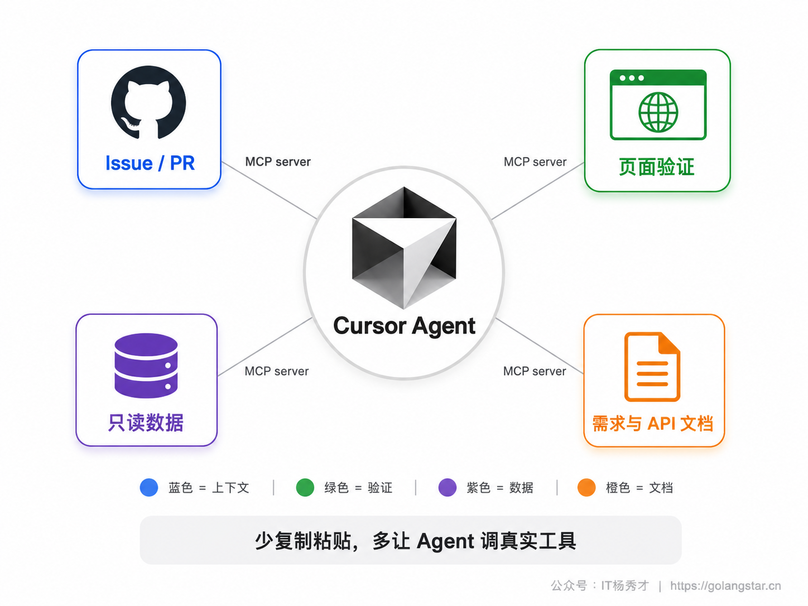
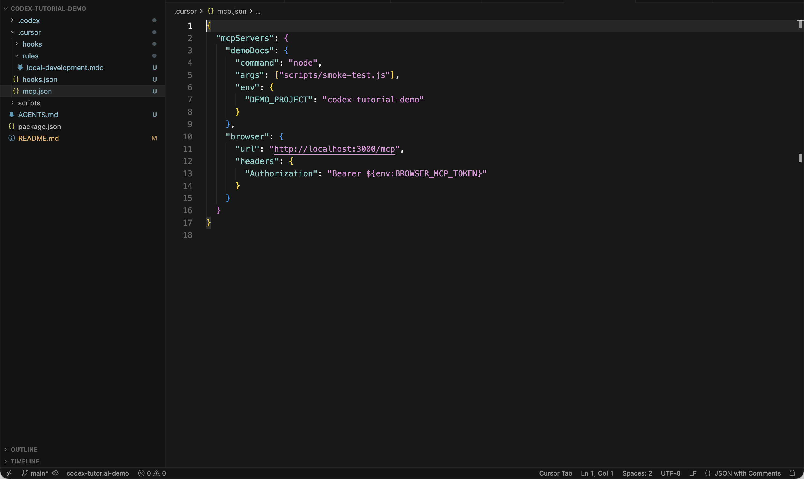
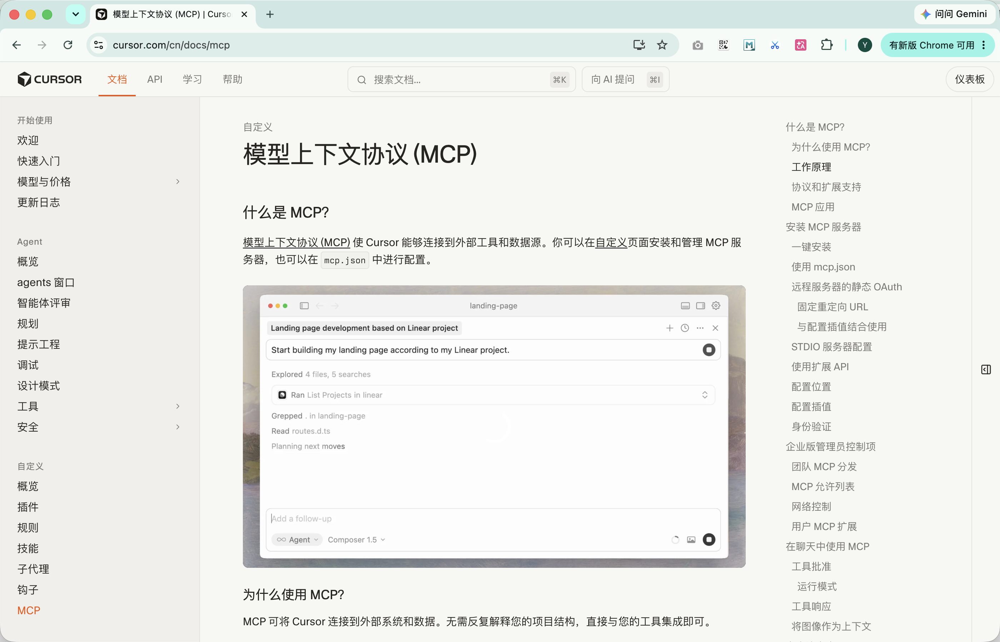
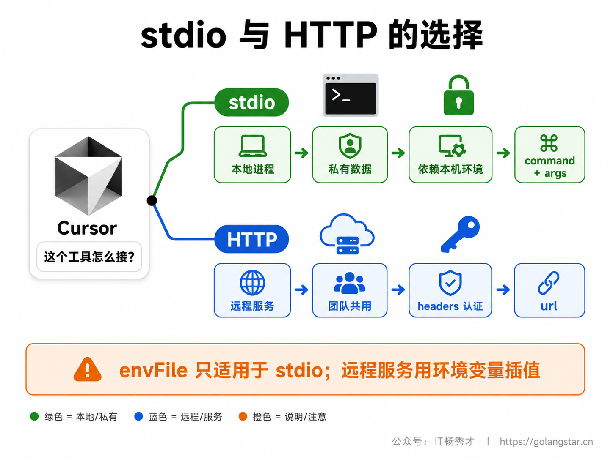
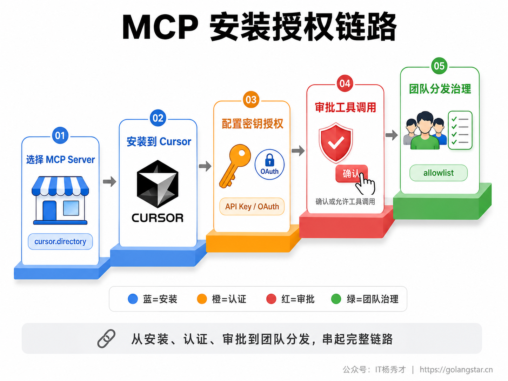
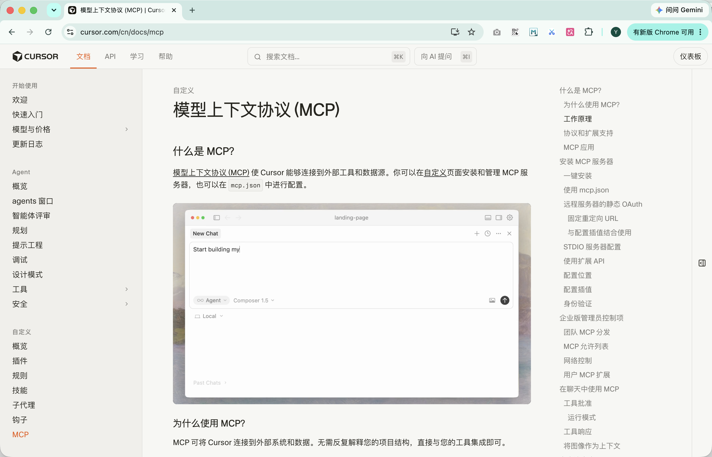
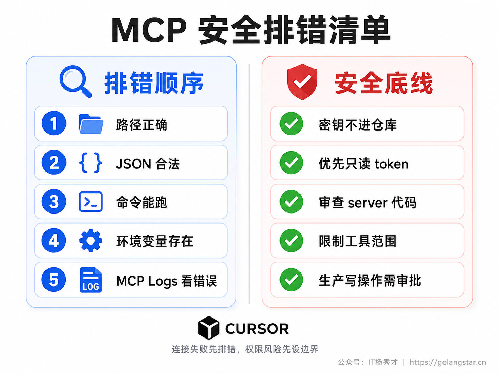
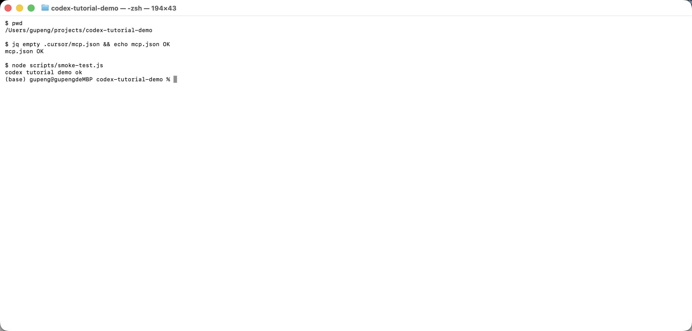
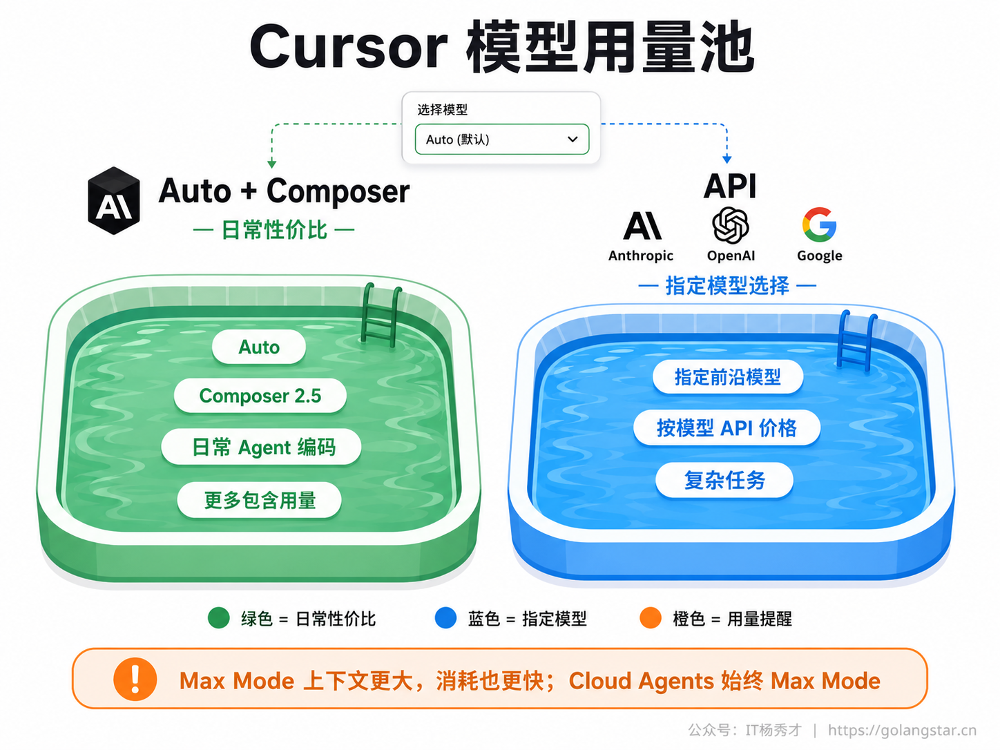
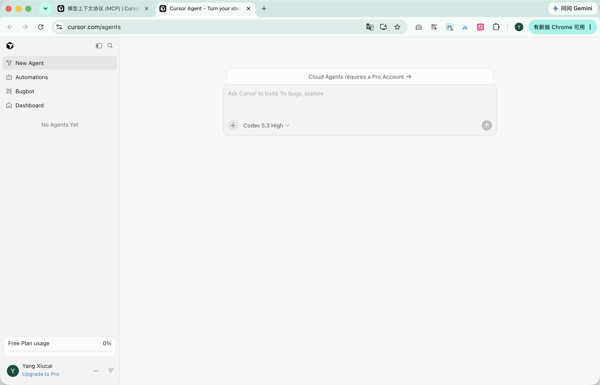

Cursor 的 Agent 不应该只会读你打开的几个文件。真实项目里，需求在 GitHub Issue 或 Linear，接口文档在 Notion 或内部文档站，运行状态在数据库和日志系统，页面效果要靠浏览器验证。你每次手工复制这些信息给 AI，它就会变成一个很聪明但信息很窄的助手。

MCP（Model Context Protocol）解决的正是这个问题。它把外部工具变成 Cursor Agent 可以调用的工具，让 Agent 能按需读取数据、执行动作、拿到真实反馈。多模型能力解决的是另一件事：同一个任务不一定都该用最强模型，也不一定都该用最便宜模型。Cursor 把 MCP 和模型选择放在一个编辑器里，真正好用的关键不是功能很多，而是你知道什么时候接工具、什么时候换模型、什么时候要求审批。

## **1. MCP 的定位**

MCP 是一套开放协议，用来把 AI 应用和外部工具连接起来。在 Cursor 里，一个 MCP server 可以提供一组工具，例如读取 GitHub Issue、查询数据库、打开浏览器、搜索文档、调用内部 API。Cursor Agent 在执行任务时，会把这些工具纳入可用工具池；当它判断需要外部信息时，就可以发起工具调用。

这和把一段文档粘进对话框完全不同。粘贴上下文是一次性的，容易过期；MCP server 是活的接口，Cursor 可以在任务过程中反复读取最新状态。比如让 Agent 修一个登录 bug，普通对话只能靠你描述现象；接了 GitHub、浏览器和日志 MCP 后，它可以读 issue、打开本地页面、复现错误、查看日志，再回到代码里改。这个闭环越短，AI 编程越接近真实开发。

但 MCP 不是越多越好。每接一个 server，就等于把一部分工具权限交给 Agent。新手应该优先接三类：第一类是协作上下文，例如 GitHub、Linear、Notion；第二类是验证工具，例如浏览器自动化、测试服务；第三类是只读数据源，例如文档站、只读数据库。涉及生产写权限、财务系统、用户隐私数据的 server，要等你把审批、最小权限和日志审计都配置好再接。


## **2. 配置文件**

Cursor 的 MCP 配置主要有两个位置。项目级配置放在项目根目录的 `.cursor/mcp.json`，只对当前项目生效，适合写进仓库，让团队共享同一套开发工具。全局配置放在 `~/.cursor/mcp.json`，对你本机所有 Cursor 项目生效，适合放个人常用工具，例如你自己的文档搜索、个人知识库、通用浏览器工具。

项目级配置更适合教程和团队协作，因为它能让读者打开同一个项目就看到同一套 MCP 配置。以 `codex-tutorial-demo` 为例，可以在项目里建这样一份 `.cursor/mcp.json`：

```json
{
  "mcpServers": {
    "demoDocs": {
      "command": "node",
      "args": ["scripts/smoke-test.js"],
      "env": {
        "DEMO_PROJECT": "codex-tutorial-demo"
      }
    },
    "browser": {
      "url": "http://localhost:3000/mcp",
      "headers": {
        "Authorization": "Bearer ${env:BROWSER_MCP_TOKEN}"
      }
    }
  }
}
```

这份配置里有两个 server。`demoDocs` 是本地 stdio server，用 `command` 启动一个本地进程；`browser` 是远程 HTTP server，用 `url` 指向一个服务地址。真实项目里不要把 token 明文写进文件，使用 `${env:变量名}` 从系统环境变量读取。Cursor 官方文档也明确支持这种配置插值写法，它可以出现在 `command`、`args`、`env`、`url`、`headers` 等字段中。



配置写好后，还要去 Cursor 的 Customize 或 MCP 管理界面确认 server 是否加载成功。这里能看到 server 状态、工具列表、启用开关和错误提示。界面入口会随着 Cursor 版本调整，最稳的找法是打开 Cursor 设置搜索 MCP 或在 Customize 页面找 MCP / Tools 区域。

如果你当前版本的设置页入口和文档页面略有差异，以官方 MCP 文档里的最新路径为准。Cursor 同时支持在界面里安装管理 MCP server，也支持直接在 `mcp.json` 中配置。



## **3. 连接方式**

MCP server 在 Cursor 里最常见的是 stdio 和 HTTP 两类。stdio 是本地进程模式，Cursor 通过标准输入输出和它通信；HTTP 是远程服务模式，Cursor 通过 URL 调用它。还有一些历史或兼容场景会看到 SSE，具体能不能用要以当前官方文档和云端代理限制为准。

本地 stdio 适合敏感、私有、依赖本机环境的工具。比如读取你本地代码索引、访问本机数据库、调用内部 CLI，这些都可以用 `command` + `args` 启动。它的优点是数据不必先放到公开服务，缺点是依赖本机环境，团队成员要保证命令和依赖都装好。

远程 HTTP 适合已经服务化的工具。比如公司内部文档搜索、统一数据库网关、浏览器自动化服务、观测平台 API。它的优点是配置轻，大家只要有 URL 和权限就能用；缺点是认证和网络安全要认真处理。Cursor 官方文档特别提醒，`envFile` 只适用于 stdio server，远程 HTTP / SSE server 不支持 `envFile`，远程 server 应该通过环境变量插值放入 headers 或 URL。

```json
{
  "mcpServers": {
    "localDocs": {
      "command": "python",
      "args": ["${workspaceFolder}/tools/mcp_server.py"],
      "env": {
        "API_KEY": "${env:DOCS_API_KEY}"
      }
    },
    "remoteSearch": {
      "url": "https://docs.example.com/mcp",
      "headers": {
        "Authorization": "Bearer ${env:DOCS_TOKEN}"
      }
    }
  }
}
```

这里的 `${workspaceFolder}` 让配置能跟着项目移动，`${env:DOCS_TOKEN}` 避免把密钥写死到仓库里。团队共享 `.cursor/mcp.json` 时，仓库里只放结构和变量名，不放真实密钥；每个人在本机或 Cursor Dashboard 里配置自己的环境变量。


## **4. 安装与授权**

Cursor 现在不只支持手写 `mcp.json`，还提供更接近插件市场的安装方式。官方文档提到，Cursor Marketplace 和社区目录 `cursor.directory` 里有很多现成 MCP server，能通过 Add to Cursor 一键安装。对小白来说，这比从零复制配置友好得多；对团队来说，则可以在 Dashboard 里管理 Team MCP server，再通过团队市场分发给成员。

认证是 MCP 最容易踩坑的部分。简单 server 用环境变量就够了，例如 `GITHUB_TOKEN`、`DATABASE_URL`。远程 server 如果需要 OAuth，Cursor 支持 OAuth 流程，也支持静态 OAuth 配置。官方文档给出的关键点是：桌面端和云端代理的回调地址不同，Web / Cursor Agents 使用 `https://www.cursor.com/agents/mcp/oauth/callback`，桌面 App 使用 `cursor://anysphere.cursor-mcp/oauth/callback`。如果你在自建 OAuth server，回调地址必须按使用场景注册完整，否则授权会卡在回跳阶段。

企业团队还会遇到分发和权限问题。一个 server 可以被加入团队 Marketplace，但这不等于它自动对每个人启用。管理员仍要配置 Marketplace Access、插件安装模式、MCP allowlist、网络访问策略。对个人开发者来说，这些听起来有点远；但只要项目开始接生产系统，就应该按企业思路处理：谁能装、谁能调用、哪些工具允许自动运行、出了问题去哪看日志。


## **5. 工具审批**

MCP 的价值是让 Agent 能调用外部工具，风险也在这里。Cursor 默认会在使用 MCP 工具前请求你的批准。你会看到它准备调用哪个工具、传入什么参数、这个动作可能产生什么影响，然后选择允许或拒绝。

这个审批不是形式主义。GitHub server 读取 issue 和创建评论是两种风险，数据库 server 读数据和写数据也是两种风险。新手最安全的做法是先把高风险 server 配成只读，等你确认它稳定、知道它会做什么，再逐步开放写权限。

Cursor 的 MCP 审批会跟随它的 Run Modes。官方文档说明，在 Auto-review 模式里，被 allowlist 明确允许的 MCP 工具可以直接运行，其他工具会交给分类器判断是否需要审批。企业可以按命令、URL、具体工具名配置 allowlist。个人项目里也可以采用同样思路：低风险只读工具放宽，高风险写操作必须手动确认。

如果你还没有接入会真实触发工具调用的 MCP server，不一定会马上看到审批弹窗。官方 MCP 文档里可以看到「工具批准」和「运行模式」这些入口；实际项目里，要等 Agent 准备调用具体工具时，再根据弹窗内容判断是否放行。



## **6. 调试与安全**

MCP 配置失败时，先不要怀疑模型。排错顺序很固定：配置文件路径是否正确，JSON 是否合法，启动命令能否在终端单独跑通，环境变量是否存在，远程 URL 是否能访问，认证是否过期，server 有没有在启动后崩掉。

Cursor 提供 MCP Logs。官方文档的路径是打开 Output 面板（macOS 上常用 `Cmd+Shift+U`），在下拉里选择 MCP Logs。这里能看到 server 初始化、工具调用和错误信息。如果某个 server 崩溃或超时，Cursor 会把失败隔离，不会让整个对话都坏掉，但这个 server 不会再提供正常工具调用。面板日志之外，最基础的排错动作是先在终端里验证 JSON 和本地启动命令是否真的能跑通。

安全上有几条硬规则。密钥放环境变量，不要提交到仓库；连接敏感系统时优先用只读 token；server 代码要看来源，别随便跑陌生仓库里的本地 stdio server；能限制工具范围就限制工具范围；涉及生产写操作必须保留人工审批。MCP 是给 Agent 增加手脚，手脚越长，护栏越要清楚。




## **7. 多模型体系**

Cursor 的模型体系不能再按一个模型名称去死记。官方文档把个人计划的用量大致分成两类池子：`Auto + Composer` 和 `API`。Auto 或 Composer 2.5 这类选择会消耗 Auto + Composer 池，适合日常 agentic coding；你手动选择某个第三方前沿模型时，通常按该模型 API 价格计入 API 池。不同套餐给的额度不同，具体额度和价格要以 Cursor 当前账号页为准。

这套体系的实用意义很直接：日常任务用 Auto 或 Composer 这类性价比路径，复杂任务再切到更强模型。Auto 的价值是由 Cursor 帮你在能力、成本和可用性之间做动态选择；Composer 2.5 是 Cursor 自研的 agentic coding 模型，适合大量常规改代码任务；Anthropic、OpenAI、Google 等模型适合在更复杂的推理、长上下文、方案对比场景里使用。

还有一个容易忽略的开关是 Max Mode。Max Mode 会使用模型支持的更大上下文，适合复杂代码库理解、长链路排查、大范围重构，但会更快消耗用量。Cursor 官方文档还说明 Cloud Agents 总是使用 Max Mode，不能关闭。也就是说，云端代理适合值得花额度的明确任务，不适合拿来做大量随手小改。


下面是已登录的 Cursor Web Agent 页面，可以看到输入区下方的模型选择器和当前用量状态。不同账号可选模型会不一样，教程里不要死记某个模型列表，应该学会看模型选择器和账号用量页。



## **8. 选择策略**

实际使用时，不要把模型选择搞成玄学。第一步按任务难度分层。改文案、补类型、生成测试、局部重构，用 Auto 或 Composer 这类低成本路线；跨模块设计、疑难 bug、性能问题、安全审查，切到你账号里可用的更强模型；需要看大范围上下文时再开 Max Mode。第二步按反馈升级。先用便宜模型跑，结果不满意再切强模型，而不是一开始就把所有任务交给最贵模型。

第三步是保留模型对比。遇到架构争议、迁移方案、难以判断的 bug，可以让两个不同模型分别给方案，再让其中一个模型做评审。不同模型的偏好会暴露出盲点。这里的关键不是相信某个模型永远正确，而是把多模型当成多角度评审工具。

配合 MCP 时也要分层。简单只读 MCP 调用可以交给日常模型；涉及生产系统、写操作、复杂链路分析时，优先使用更强模型并开启审批。模型能力、工具权限和任务风险要匹配。一个便宜模型配高权限工具，风险不一定比强模型低；一个强模型如果没有真实上下文，也照样可能猜错。

## **9. 常用组合**

Cursor 的 MCP 不应该一上来接十几个 server。新手最稳的方式是从一条真实工作流倒推需要哪些工具。比如你主要做前端页面，就先接浏览器自动化和文档搜索；你主要修后端 bug，就先接 GitHub、只读数据库和日志查询；你主要做项目管理，就先接 GitHub / Linear / Notion 这类协作工具。工具要围绕任务闭环，而不是围绕新鲜感。

前端开发的最小组合是文档 + 浏览器。文档 server 提供组件库、接口协议、设计规范；浏览器 server 负责打开页面、点击交互、截图和验证结果。这样 Agent 不只是写代码，还能用真实页面反馈修代码。它发现按钮错位、报错弹窗、控制台异常时，可以回到代码里继续修。没有浏览器验证的前端 AI 编程，很容易停在看起来能编译的阶段。

后端开发的最小组合是 GitHub + 只读数据库 + 日志。GitHub 让 Agent 读取 issue、PR 和历史讨论，只读数据库让它核对真实数据结构，日志让它看到错误栈和请求路径。注意数据库最好从只读账号开始，且限制库表范围。让 Agent 随便写生产库是非常危险的，即使模型本身很强，也不应该把这种权限直接交出去。

团队协作的最小组合是 GitHub / GitLab + Linear / Jira + 文档库。这样 Agent 能从任务系统读需求，从文档库读规范，从代码托管平台读相关 PR。它做计划时会更像团队成员，而不是只盯着本地代码的孤岛工具。这里的关键是统一命名：issue 标题、分支名、PR 描述、文档标题最好能互相对应，否则 Agent 找上下文会变难。

可以按下面这张表选起步组合：

| 场景 | 推荐 MCP 组合 | 权限建议 |
|------|---------------|----------|
| 前端页面开发 | 文档搜索 + 浏览器自动化 | 文档只读，浏览器只操作本地地址 |
| 后端 bug 修复 | GitHub + 只读数据库 + 日志 | 数据库只读，日志脱敏 |
| PR 修复 | GitHub + CI 日志 | 允许读 PR，写评论需审批 |
| 需求实现 | Linear / Jira + 文档库 + GitHub | 任务系统只读，代码托管写操作审批 |
| 内部工具开发 | 文档库 + API 网关 | API token 最小权限 |

这张表也说明了一个原则：MCP server 的权限不要按工具最大能力给，而要按当前场景最小需要给。GitHub server 能做很多事，但你可能只需要读 issue；数据库 server 能查询和写入，但教程阶段只应该读 schema 和样例数据；浏览器自动化能访问公网，也可以限制它只访问 `localhost`。

## **10. 权限分级**

把 MCP 工具接进 Cursor 后，最好给自己定一套权限分级。第一级是低风险只读，比如读取文档、读取 issue、读取本地文件索引。这类工具可以放宽审批，但仍然要保留日志。第二级是中风险读写，比如给 PR 留评论、创建 issue、在测试环境写入数据。这类工具可以使用，但每次写操作都要让 Cursor 显示参数并人工确认。第三级是高风险操作，比如删除数据、修改生产配置、强制推送、访问用户隐私数据。这类工具不建议直接接给日常 Agent，即使要接，也要通过单独 server、单独 token、单独审批链路处理。

权限分级不是纸面流程，它会影响配置方式。低风险 server 可以放在项目级 `.cursor/mcp.json` 里让团队共享；中风险 server 的 token 应该由个人环境变量提供，不放仓库；高风险 server 最好不要出现在普通项目配置里，而是放在受控环境中，由更严格的工具或流程调用。这样即便项目配置被复制，也不会把关键权限一起复制出去。

对中国用户还要多考虑网络可用性。很多官方或社区 MCP server 会依赖 `npx` 拉包、访问 GitHub、连接海外 API。如果你的网络环境不稳定，优先选择能本地安装、能固定版本、能通过国内镜像下载依赖的 server。团队项目里不要让每个人第一次打开项目都现场 `npx -y` 拉未知版本，最好把 server 版本、安装命令、环境变量要求写进 README 或内部文档。

## **11. 团队落地**

团队使用 MCP 时，最怕每个人配置一套，最后同一个任务在不同机器上结果不同。项目级 `.cursor/mcp.json` 的价值就是把工具入口标准化。仓库里可以提交 server 名称、启动命令、参数结构、环境变量名称；真实 token 由每个人本机或团队 Dashboard 提供。这样新成员打开项目后，至少知道这个项目期望连接哪些外部系统。

更进一步，可以给每个 server 写一段使用说明。比如 `github` server 允许读 issue 和 PR，但创建评论要审批；`browser` server 只允许访问 `http://localhost:3000`；`docs` server 用来查内部接口文档，不要让它读取用户数据。这些说明可以放在 `AGENTS.md` 或 README 里，让 Cursor Agent 和团队成员都能看到。

团队还需要定期清理 MCP server。项目早期接了很多临时工具，后面如果不清理，Agent 的工具池会变得混乱。工具越多，选择错误工具的概率越高，审批弹窗也会变多。每隔一段时间检查一次：哪些 server 还在用，哪些 token 该轮换，哪些工具应该从项目级移到个人全局，哪些高风险动作应该关闭。

还有一个很容易被忽略的点是版本固定。很多教程会写 `npx -y xxx@latest`，演示时省事，但团队项目里不稳。server 一升级，工具 schema、参数名、认证方式都有可能变，Cursor 端看到的工具列表也会变化。更稳妥的做法是固定版本号，或者把 server 封装成项目里的脚本，例如 `npm run mcp:docs`。这样 Cursor 配置只调用稳定脚本，真正的依赖版本由 `package-lock.json` 或 `pnpm-lock.yaml` 管住。

MCP 配置也应该进入 code review。新增一个 server，不只是新增一个开发便利工具，也是在改变 Agent 能访问的外部边界。PR 描述里最好写清楚 server 用途、权限范围、需要的环境变量、是否有写权限、失败时怎么排查。这样团队成员 review 的不是一段 JSON，而是一条新的 AI 工具链路。

## **12. 实战模板**

下面这套 Prompt 可以直接用来让 Cursor 结合 MCP 和多模型做一次稳妥的任务规划。它不要求 Agent 立刻动手，而是先盘点需要哪些工具、哪些动作要审批、模型是否需要升级。

**Prompt：**

```text
请在 codex-tutorial-demo 项目里先做一次任务规划，不要直接改文件。

任务：为当前 demo 项目补一个基础健康检查页面，并保证本地测试能通过。

请按以下格式回复：
1. 需要读取哪些文件
2. 是否需要调用 MCP 工具，如需要说明工具名和目的
3. 哪些操作需要我审批
4. 建议使用当前模型还是切换更强模型，并说明理由
5. 给出分 3 到 5 步的执行计划
```

这个 Prompt 的重点是把工具调用和模型选择显式化。小白最容易犯的错是直接说帮我改，结果 Agent 一上来读很多文件、跑很多命令，你不知道它为什么做。先让它列计划，就能看清它是否需要 MCP、是否要更强模型、是否有高风险动作。确认计划后，再让它按步骤执行。

如果任务涉及真实外部系统，可以加上更严格的限制：

```text
执行前请遵守这些限制：
- 只允许读取 GitHub issue 和本地代码
- 不允许写数据库，不允许推送分支
- 所有 MCP 写操作必须先询问我
- 如果需要密钥或生产数据，停止并说明缺少什么
```

这类限制不是给 AI 看的客气话，而是给工具权限套边界。Cursor 的审批机制能挡住一部分动作，Prompt 里的约束能减少它走错方向，两者一起用才稳。

## **13. 常见问题**

**Q：项目级 `.cursor/mcp.json` 要不要提交仓库？**

可以提交结构和 server 名称，不要提交真实密钥。团队共享项目级配置的好处是每个人打开项目都知道该接哪些工具，但密钥、token、个人路径要用环境变量或个人配置解决。

**Q：MCP server 显示失败应该先查哪里？**

先看 JSON 是否合法，再看启动命令能否在终端单独跑通，然后看环境变量，最后打开 MCP Logs。大多数失败不是模型问题，而是命令不存在、token 为空、URL 不通或 OAuth 回调地址没配对。

**Q：什么时候必须手动审批 MCP 工具？**

只要涉及写外部系统、删除数据、修改 PR、调用生产环境、访问敏感数据，都应该手动审批。低风险只读工具可以逐步放宽，高风险写操作不要交给自动模式。

**Q：Auto、Composer 和手动选模型怎么取舍？**

日常常规编码优先 Auto 或 Composer；复杂推理、架构判断、跨文件难题再手动切更强模型；大上下文任务考虑 Max Mode，但要接受更高用量消耗。Cloud Agents 始终 Max Mode，更适合边界明确、值得放手的任务。

## **14. 小结**

Cursor 的 MCP 和多模型不是两个孤立功能。MCP 决定 Agent 能接触多少真实世界，多模型决定它用什么能力和成本处理任务。把它们合在一起看，真正的工作方式是：用 `.cursor/mcp.json` 把必要工具接进项目，用环境变量和 OAuth 管住密钥，用审批和 allowlist 管住风险，用 MCP Logs 排查问题，再根据任务难度在 Auto、Composer、前沿模型和 Max Mode 之间换挡。

这套组合用顺之后，Cursor 就不只是一个会补全代码的编辑器，而是一个能接工具、能验结果、能按任务选择算力的开发控制台。小任务快跑，复杂任务升档，高风险动作审批，才是 MCP 和多模型真正该服务的开发节奏。

<div style="background-color: #f0f9eb; padding: 10px 15px; border-radius: 4px; border-left: 5px solid #67c23a; margin: 20px 0; color:rgb(64, 147, 255);">

<h2><span style="color: #006400;"><strong>关注秀才公众号：</strong></span><span style="color: red;"><strong>IT杨秀才</strong></span><span style="color: #006400;"><strong>，回复：</strong></span><span style="color: red;"><strong>面试</strong></span></h2>

<div style="text-align: center;"><span style="color: #006400; font-size: 28px;"><strong>领取后端/AI面试题库PDF</strong></span></div>


<div style="text-align: center; margin-top: 22px; padding-top: 20px; border-top: 1px solid #c2e7b0;">
<div style="color: #006400; font-size: 20px; font-weight: bold;">🔥 配套实战项目，拆得开、跑得起、能写进简历</div>
<div style="color: red; font-size: 16px; font-weight: bold; margin-top: 8px;">多 Agent 编排 + RAG 混合检索 · 31 篇深度教程 + 50+ 面试题</div>
<a href="/projects/dev-support.html" style="display: inline-block; margin-top: 14px; background: #ff7a18; color: #fff; font-size: 18px; font-weight: bold; padding: 10px 28px; border-radius: 24px; text-decoration: none;">点击查看 DevSupport AI 实战项目 →</a>
</div>
</div>
