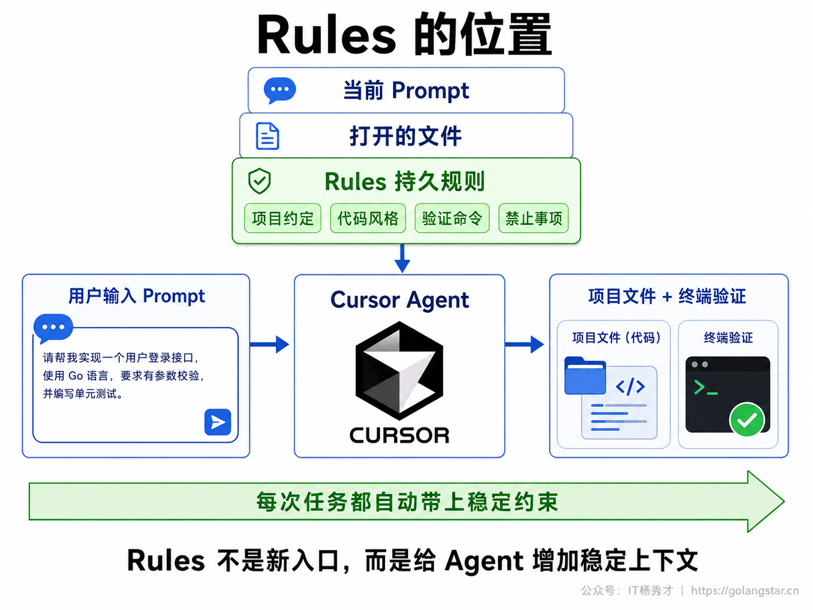
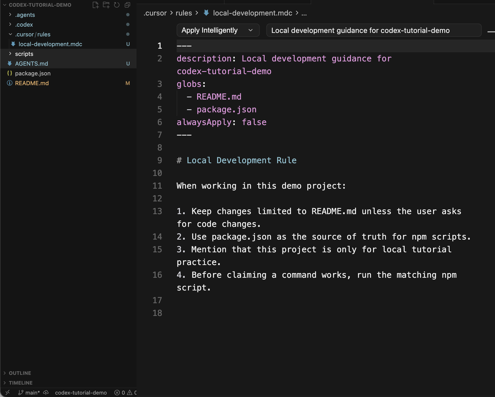
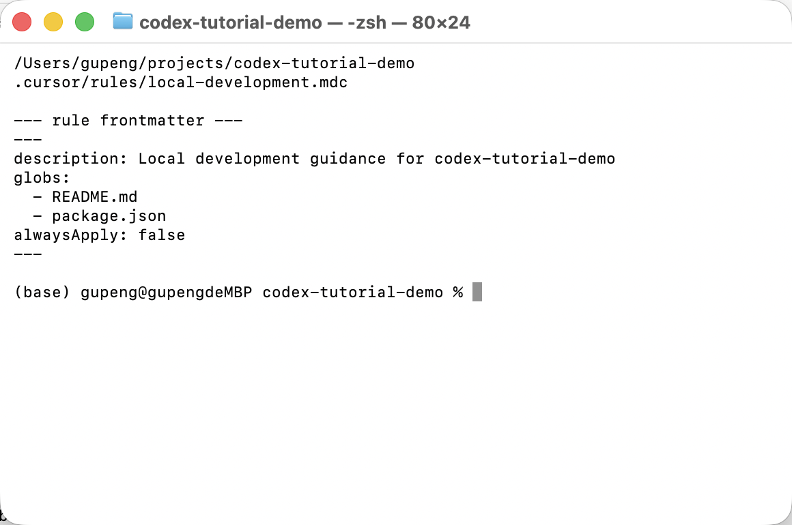
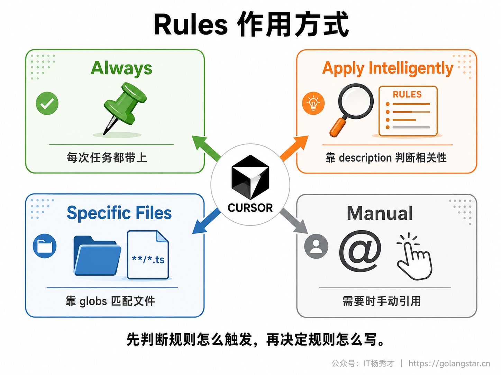
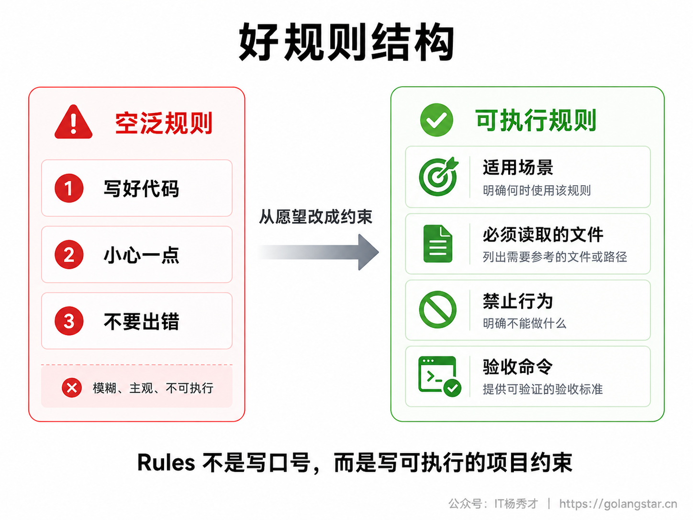
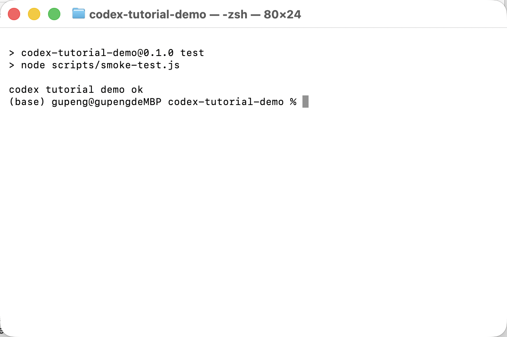
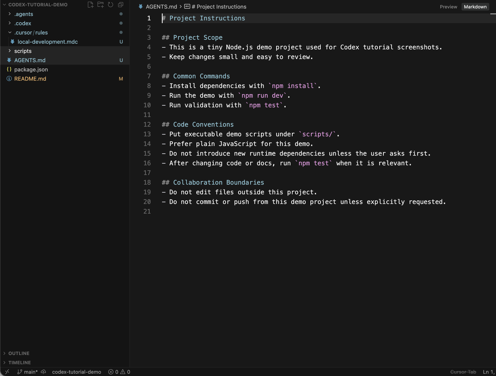
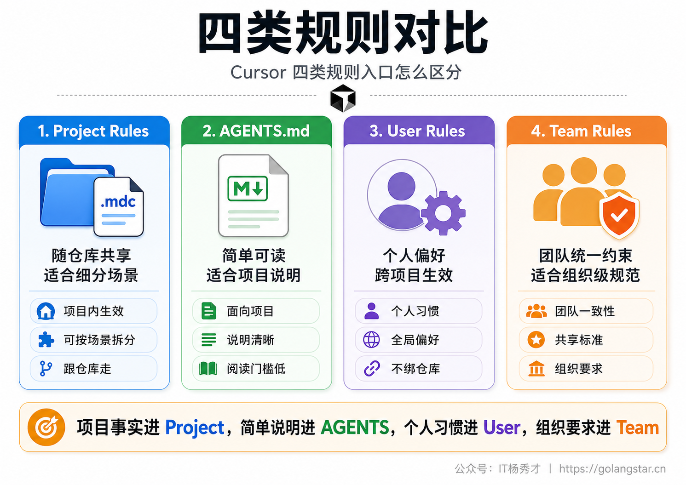
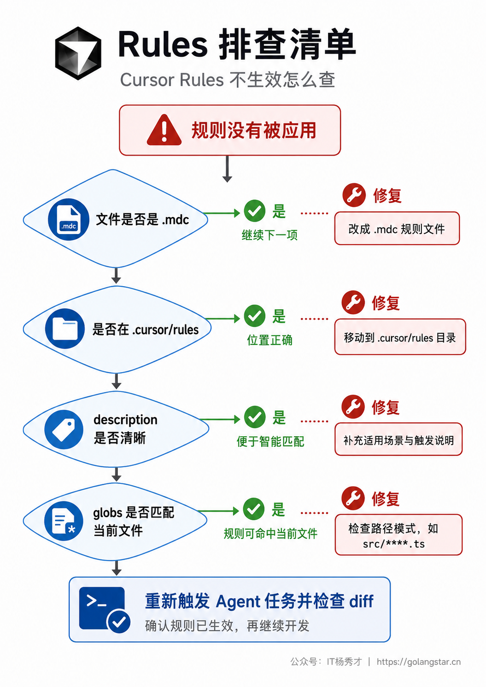

Cursor 用久以后，你会遇到一个很具体的问题：同一个项目里，你每次都要重复告诉 AI 项目怎么跑、代码风格是什么、哪些文件不能乱改、改完要跑什么命令。短对话里重复一两次还能忍，项目一大、对话一多，这些说明就会变成低效和风险来源。

Rules 就是为了解决这个问题。它不是让 Cursor 变聪明的魔法，而是把项目长期不变的工作约定写成持久上下文，让 Agent 在处理任务时更容易沿着项目习惯走。官方文档把 Rules 定位为持久指令，可以在 Prompt 层面为模型提供可复用上下文；当规则被应用时，规则内容会进入模型上下文，影响它读代码、生成代码和处理工作流的方式。

## **1. Rules 的作用**

Rules 最适合存放反复出现、稳定不变、和项目工作方式强相关的信息。比如项目只能改 README，不要新增运行时依赖；比如所有脚本都要以 `package.json` 为准；比如前端组件必须使用某个目录结构；比如修改文档后要运行某个验证命令。这些内容如果每次都写进 Prompt，不仅烦，而且容易漏。

新手很容易把 Rules 写成愿望清单。比如让 AI 写得更好、不要犯错、保持高质量，这些说法太空，落到实际任务里约束力很弱。好的规则应该像项目说明书，能回答三个问题：这个项目有什么固定事实，做事时必须遵守哪些边界，完成后用什么方式验证。


Rules 也不能替代 Prompt。Prompt 负责本轮任务，Rules 负责长期约定。比如本轮要修改 README，这个目标仍然要写在 Prompt 里；Rules 只负责补充 README 修改时应该遵守的项目约束。把这两个层次分清，写出来的规则才不会又长又乱。

判断一条内容要不要放进 Rules，可以用一个很简单的标准：它是不是每隔几次任务就会重复出现。如果只是一次临时要求，比如今天把按钮改成绿色，写在本轮 Prompt 里就够了。如果是稳定要求，比如所有页面都要用项目已有组件库，所有数据库变更都要写迁移脚本，所有 README 命令都必须来自 `package.json`，这就值得沉淀成规则。

Rules 还有一个隐性价值：它能降低小白和 AI 协作时的表达压力。很多新手不是不会提需求，而是不知道每次还要补哪些边界。把项目常识、命令、禁止事项写成规则以后，本轮 Prompt 就可以更专注描述当前任务。这样 Prompt 变短了，但上下文并没有变少，因为稳定约束已经由 Rules 提供。

不过，Rules 写多以后也会变成负担。每条规则最终都可能进入上下文，规则之间还可能互相冲突。比如一条规则要求所有文档都写得详细，另一条规则要求回复保持极简；一条规则要求每次都跑测试，另一条规则禁止运行耗时命令。写规则时要避免这种互相拉扯，尤其不要把个人表达偏好和项目执行约束混在一起。

## **2. Project Rules**

Cursor 的 Project Rules 存放在项目里的 `.cursor/rules` 目录，每条规则是一个 `.mdc` 文件。官方文档强调，Project Rules 是版本控制的一部分，可以跟随项目提交到仓库里，适合团队共享。它们可以通过路径模式限定范围，也可以手动调用，或者根据相关性自动进入上下文。

这一点和很多人的直觉相反。Rules 不是只存在个人设置里的偏好，也可以成为项目资产。只要项目里有一套稳定规则，新成员打开项目时就能看到同样的约定，Agent 处理任务时也能获得同样的项目背景。对 Vibe Coding 来说，这非常关键，因为 AI 写代码越多，越需要用项目级规则收住边界。

在演示项目 `codex-tutorial-demo` 里，我创建了一个真实规则文件：

```text
.cursor/rules/local-development.mdc
```

这个文件不是文章里想象出来的示意文件，而是真放进了本地演示项目，并在 Cursor 里打开截图。



这张图里能看到几个关键信息。左侧是 `codex-tutorial-demo` 的项目目录树，`.cursor/rules` 目录下有 `local-development.mdc`。编辑区上方显示 `Apply Intelligently`，说明这条规则不是每次都强制应用，而是根据规则描述和当前任务判断相关性。规则正文里写了四条项目约定：限制改动范围、以 `package.json` 为脚本来源、说明这是本地练习项目、声明命令可用前要运行对应 npm script。

Project Rules 适合写项目事实，不适合写个人偏好。比如项目使用 `pnpm` 还是 `npm`、测试命令是什么、源码目录在哪里、哪些目录不能动，这些都应该进项目规则。至于你个人喜欢中文回复、回答简短、少用表格，这类应该放在 User Rules。

Project Rules 也适合按目录拆分。一个中大型前端项目，可以把组件规则、接口规则、样式规则、测试规则拆成多条 `.mdc` 文件，而不是写成一个巨大的 `project.mdc`。比如 `react-components.mdc` 只负责组件结构和 props 约定，`api-client.mdc` 只负责接口封装和错误处理，`docs.mdc` 只负责 README、CHANGELOG、部署文档。拆开以后，每条规则的触发范围更清楚，后续维护也更容易。

拆分时不要按作者思路拆，而要按 Agent 的任务场景拆。Agent 收到任务时，关心的是这轮要改什么文件、做什么动作、需要遵守什么边界。规则文件名、description 和正文都应该围绕这个场景组织。比如 `frontend.mdc` 这个名字太宽，`react-component-patterns.mdc` 更具体；`docs.mdc` 也偏宽，`local-run-docs.mdc` 更容易触发到 README 本地运行说明这类任务。

如果项目里已经有 `README.md`、`CONTRIBUTING.md`、架构文档，不要把它们全文复制进规则。Rules 应该提炼 Agent 执行任务时必须遵守的部分，而不是变成文档备份。规则里可以引用关键文件，或者写清楚需要先阅读哪些文件；真正详细的解释仍然留在项目文档里。这样既能减少上下文占用，也能避免同一条规则在多个地方重复维护。

## **3. 规则文件结构**

`.mdc` 文件由两部分组成：顶部 frontmatter 元数据和下面的 Markdown 规则正文。frontmatter 用来控制规则怎么应用，正文才是具体规则内容。官方文档提到，Project Rules 必须使用 `.mdc` 扩展名；如果你把普通 `.md` 文件放在 `.cursor/rules` 里，因为没有 `description`、`globs`、`alwaysApply` 这些 frontmatter 信息，规则系统不会按 Project Rule 识别它。

演示文件的结构如下：

```markdown
---
description: Local development guidance for codex-tutorial-demo
globs:
  - README.md
  - package.json
alwaysApply: false
---

# Local Development Rule

When working in this demo project:

1. Keep changes limited to README.md unless the user asks for code changes.
2. Use package.json as the source of truth for npm scripts.
3. Mention that this project is only for local tutorial practice.
4. Before claiming a command works, run the matching npm script.
```

这里的 `description` 很重要。Apply Intelligently 类型的规则需要靠描述判断什么时候相关。如果描述写得太泛，比如 `project rule`、`coding guide`，Agent 很难判断何时应该加载。更好的描述要包含触发场景，比如本地运行说明、README 修改、API 校验、React 组件规范。

`globs` 用来限制规则适用的文件范围。比如这条规则只关心 `README.md` 和 `package.json`，就不应该扩大到所有文件。范围越准，规则越不容易污染无关任务。`alwaysApply` 控制是否每次聊天都应用。只有非常基础、全项目都必须遵守的规则才适合设成 `true`，否则会把上下文撑大，也会让不相关任务背上多余约束。

为了让读者看到规则确实落在项目里，我在终端里真实检查了 `.cursor/rules` 目录，并打印了这条规则的 frontmatter。



这类验证图的价值不是炫命令，而是避免教程空口说已经创建。你能看到当前路径是 `codex-tutorial-demo`，规则文件路径是 `.cursor/rules/local-development.mdc`，frontmatter 里确实包含 `description`、`globs` 和 `alwaysApply`。如果你自己照着做，也应该用这种方式确认文件是否真的建在项目目录下。

frontmatter 三个字段各有分工。`description` 面向智能触发，写给 Cursor 判断相关性；`globs` 面向文件范围，写给规则系统匹配路径；`alwaysApply` 面向全局应用，决定是否每轮都带上。正文则写给 Agent 执行任务时参考。很多规则不好用，是因为把这些职责混在一起：description 写成正文长段落，globs 写得过宽，正文又没有具体动作。

`globs` 不要一开始就写成 `**/*`。这会让规则覆盖所有文件，后面很难判断它到底有没有帮上忙。更好的方式是从具体文件开始，例如 `README.md`、`package.json`、`src/components/**/*.tsx`、`docs/**/*.md`。如果后续发现范围不够，再逐步扩大。范围从小到大，比一开始全覆盖更安全。

正文里的命令也要真实存在。比如你写修改代码后运行 `npm run lint`，但 `package.json` 里没有这个脚本，Agent 可能会照着错误规则去执行一个不存在的命令。规则不是愿望，它应该反映项目当前事实。项目脚本变了，规则也要跟着改。

## **4. 作用方式**

Project Rules 的作用方式可以理解成四类：总是应用、智能应用、按文件应用、手动应用。Cursor 界面里的类型选择会改变 frontmatter 里的字段组合。总是应用依赖 `alwaysApply: true`，智能应用依赖清晰的 `description`，按文件应用依赖 `globs`，手动应用则适合那些不该自动触发、但偶尔需要的规范。


新手最容易滥用 Always。看到规则有用，就想让它每次都生效。问题是所有规则都 Always 以后，Agent 每轮都会读一堆无关指令。比如 README 规则不应该影响源码重构，数据库命名规则不应该影响 CSS 调整，前端组件规则不应该影响脚本说明。规则越多，越要靠 `description` 和 `globs` 把范围切细。

一个简单判断是：如果这条规则无论做什么任务都必须遵守，比如不要提交密钥、不要改生成文件、所有命令以项目脚本为准，可以考虑 Always。如果只在某类任务相关，比如修改 README、写 React 组件、调整数据库迁移，就用智能应用或文件匹配。如果只是临时流程，比如发布前检查清单，手动引用更稳。

实际选择时，可以先从 Apply Intelligently 开始。它对新手最友好，因为你只需要写好 description 和正文，不必一开始就设计复杂路径模式。等你发现某条规则只应该作用于固定目录，再加 `globs`。等你确认某条规则是所有任务都必须遵守的底线，再考虑 Always。

手动应用也不是低级用法。某些规则很有用，但不该自动触发，比如发布流程、数据库迁移检查、线上故障复盘模板。这类规则平时不进入上下文，需要时在聊天里 @mention 规则即可。它的好处是不会污染普通任务，同时能在关键流程里提供完整清单。

Always 规则要特别短。它适合写底线，不适合写长教程。比如不要提交密钥、不要自动 push、不要修改生成文件、未经确认不要安装新依赖，这类规则适合 Always。把几十条项目细节都设成 Always，会让每次对话都背着沉重上下文，反而降低 Agent 的判断质量。

## **5. 编写实战**

写规则前先不要急着建文件，先把规则来源想清楚。真正值得进入 Rules 的内容，通常来自反复出现的问题。比如 Agent 总是忘记跑测试，规则就写完成后运行 `npm test`；Agent 总是新增不存在的命令，规则就写脚本必须以 `package.json` 为准；Agent 总是改太多文件，规则就写默认只修改用户指定文件。

不推荐的写法是这样：

```markdown
# Project Rule

Please write high quality code. Be careful. Do not make mistakes.
```

这类规则看起来正确，但没有可执行约束。Agent 不知道高质量具体指什么，也不知道小心要检查什么。更好的写法应该像下面这样：

```markdown
# Local Development Rule

When editing README.md:

1. Read package.json before mentioning npm scripts.
2. Do not invent commands that are not present in package.json.
3. Keep the instructions usable for a first-time local run.
4. After changing docs that mention commands, run the matching npm script when possible.
```

这段规则有清晰对象、具体行为和验证要求。它没有试图覆盖整个项目，而是专注 README 和本地运行说明。这样的规则既容易被 Agent 理解，也容易被人审查。


官方最佳实践里有一个很实用的原则：好规则应该聚焦、可执行、有范围。规则不要无限增长，官方建议保持在 500 行以内，过大的规则应该拆成多个可组合规则。这个建议很实际，因为 Rules 最终会进入上下文，规则越长，任务上下文越重，模型越容易抓不到重点。

在演示项目里，规则要求声明命令可用前要跑对应 npm script，所以我真实运行了 `npm test`。这个命令来自 `package.json`，输出来自本地脚本，不是手写结果。



这张图就是效果截图。它证明规则里提到的验证动作可以在项目里真实执行，也证明 README 或 Agent 回复里出现 `npm test` 时，不是凭空写的命令。对于教程文章来说，这种终端输出比一句已经验证更可信。

写规则时还要注意语气。Rules 不是和人聊天，不需要客套，也不需要解释太多原因。用短句和动词开头更有效，比如 `Read package.json before mentioning npm scripts`、`Do not edit generated files`、`Run npm test after changing executable code`。中文项目也可以写中文规则，但命令、路径、文件名必须准确。

如果一条规则里同时出现多个场景，就应该考虑拆分。比如一条规则既讲 README 写法，又讲 React 组件，又讲数据库迁移，就会变成大杂烩。Agent 面对 README 任务时读到数据库规则，面对组件任务时读到文档规则，都会增加噪音。每条规则只服务一个高频场景，才更容易命中。

规则还应该能被人审查。项目里的 `.cursor/rules` 和代码一样，应该在 PR 里被 review。新增规则时，评审重点不是文采，而是三件事：是否描述了真实项目约束，是否会影响无关任务，是否有明确验证办法。规则本身也是工程资产，不应该随手堆。

## **6. AGENTS.md**

Cursor 官方文档也把 `AGENTS.md` 列为规则体系的一部分。它是放在项目根目录或子目录里的普通 Markdown 文件，用来定义 Agent 指令。和 Project Rules 相比，`AGENTS.md` 没有 frontmatter，也没有复杂的应用配置，更适合简单、可读、全项目通用的说明。

演示项目里也有一个真实的 `AGENTS.md`。它记录了项目范围、常用命令、代码约定和协作边界。截图里可以看到，它比 `.mdc` 更像普通项目说明文档。



`AGENTS.md` 和 `.cursor/rules` 不是谁替代谁的问题，而是复杂度不同。简单项目可以先用 `AGENTS.md`，把项目范围、命令和注意事项写清楚。项目变复杂后，再把不同场景拆成 `.cursor/rules/*.mdc`，比如 `react-components.mdc`、`api-guidelines.mdc`、`docs-local-run.mdc`。

官方文档还提到，Cursor 支持根目录和子目录里的 `AGENTS.md`。这意味着你可以在项目根目录写全局规则，也可以在 `frontend/`、`backend/` 等子目录里写更具体的说明。子目录说明会和父目录说明组合，更具体的位置优先级更高。对大型项目来说，这比把所有说明塞进一个巨大的根文件更清晰。

选 `AGENTS.md` 还是 Project Rules，可以看两个维度。第一，是否需要触发条件。如果只是全项目都要知道的说明，`AGENTS.md` 足够；如果需要按文件、目录、任务类型触发，用 `.mdc`。第二，是否需要结构化管理。如果规则只有十几行，`AGENTS.md` 更轻；如果已经有多条规则，`.cursor/rules` 更容易拆分和维护。

很多项目可以组合使用。根目录 `AGENTS.md` 写项目总览、常用命令和协作边界；`.cursor/rules` 写具体场景规则；User Rules 写个人回答偏好。这样每一层都很轻，不会出现一个文件什么都管、什么都说不清的情况。

## **7. User Rules**

User Rules 是全局个人偏好，入口在 `Customize` 的 `Rules` 区域。它们跨项目生效，适合写你的个人沟通和编码偏好。比如回复要简洁、默认使用中文解释、不要过度重复、代码示例优先给完整片段。它们不适合写某个项目的脚本、目录结构和业务约束。

官方 FAQ 里有两个限制一定要知道。第一，Rules 不影响 Cursor Tab 或其他 AI 功能。第二，User Rules 不应用于 Inline Edit，也就是 `Cmd+K` 这类局部编辑，它们只用于 Agent Chat。这个点很重要，因为很多人以为写了 User Rules 后，所有 Cursor AI 行为都会改变，实际不是。

可以这样写 User Rules：

```markdown
Please reply in concise Chinese.

When explaining code changes:
1. Say which files are changed.
2. Say how to verify the result.
3. Avoid unnecessary repetition.
```

这类规则适合个人使用，但不应该提交到项目仓库。团队项目里，如果所有人都需要遵守某条规则，就放 Project Rules 或 Team Rules；如果只是你个人的回答偏好，就放 User Rules。把个人偏好和项目约定分开，是 Rules 管理的基本卫生习惯。

User Rules 也要克制。不要把所有写作偏好、代码偏好、沟通偏好塞进去，否则每个项目都会被你的个人规则影响。特别是同时写前端、后端、文档、数据脚本时，过宽的 User Rules 可能在某些项目里变成负担。个人规则最好只放跨项目稳定成立的要求，比如回复语言、说明结构、是否展示验证步骤。

如果你发现某条 User Rule 只在某个项目里有用，就把它迁移到项目规则里。如果你发现某条 Project Rule 其实只是你个人喜欢的回复方式，就把它移到 User Rules。规则归位，是后续维护成本最低的做法。

## **8. Team Rules**

Team Rules 是团队维度的规则，由团队或企业空间管理。官方文档说明它们适用于 Team 和 Enterprise 计划。它们适合写全团队都必须遵守的安全、合规、代码审查和架构约定，比如不要处理生产密钥、不要绕过测试、所有数据库变更必须带迁移说明。


个人开发者一开始不一定用得到 Team Rules，但要知道它存在。等你在团队里推广 AI 编程时，Rules 就不是个人效率工具，而是协作治理工具。大家都用 Agent 改代码，如果没有统一约束，最后每个人的 AI 输出风格都不一样，审查成本会越来越高。

Team Rules 也不应该写太碎。团队层只放全局底线和共同标准，项目细节仍然放在具体仓库里。比如禁止提交密钥适合 Team Rules，某个项目的 `npm test` 命令适合 Project Rules。层级越清楚，规则越不会互相冲突。

团队落地时，建议先从少数高风险规则开始，而不是一口气写几十条。比如安全边界、依赖安装、提交推送、生产数据访问，这些是 AI 编程最容易造成事故的地方。等团队确认这些规则确实降低了风险，再逐步把代码风格、测试策略、文档规范沉淀进去。

Team Rules 还需要有人维护。工具规则如果没人负责，很快就会过期：脚本改了，目录改了，团队流程改了，规则却还停留在旧版本。过期规则比没有规则更危险，因为它会给 Agent 错误上下文。团队可以把 Rules review 放进工程规范里，至少在项目结构或脚本变化时同步检查。

## **9. 验收排查**

Rules 写完以后，不能只看文件存在就结束。至少要做三层检查。第一，检查文件位置和扩展名，Project Rules 必须放在 `.cursor/rules`，文件后缀必须是 `.mdc`。第二，检查 frontmatter，智能应用要有清晰 `description`，按文件应用要有正确 `globs`，全局应用才设置 `alwaysApply: true`。第三，检查规则内容是否能被执行，有没有具体文件、命令、边界和验收方式。

如果规则没有生效，先不要怀疑 Cursor。官方 FAQ 给了两个排查方向：Apply Intelligently 要确认 `description` 是否存在；Apply to Specific Files 要确认文件模式是否匹配被引用的文件。实际使用时，还要确认当前任务是否真的触发了这条规则。规则不是越多越好，能精确命中才有价值。


还有一个重要习惯：Rules 要跟随项目演进。第一次写规则不可能完美，真正有效的规则往往来自复盘。Agent 连续两次漏跑测试，就把验证要求写进去；Agent 连续两次改错目录，就把目录边界写进去；Agent 连续两次写不存在的命令，就把脚本来源写进去。Rules 不是一次性配置，而是项目协作经验的沉淀。

排查规则时，不要只问它有没有生效，还要问它是否应该生效。比如你正在修改 README，README 规则被加载是合理的；如果你在改测试文件，README 规则还在影响回复，那就是范围过宽。很多规则问题不是失效，而是过度生效。过度生效同样会造成误导。

还有一种常见问题是规则内容太抽象，Agent 看到了也不知道怎么执行。比如保持项目风格，不如写读取同目录相邻文件并保持命名和导出方式一致；注意错误处理，不如写 API 调用必须处理 loading、error、empty 三种状态。越具体，越容易验证。

最后要把规则变更纳入版本控制。新增、修改、删除规则都应该能从 Git diff 里看到。这样当 Agent 行为突然变化时，你能追到是不是某条规则改了。Vibe Coding 项目越依赖 AI，越要把影响 AI 行为的配置当作代码的一部分管理。

## **10. 常见问题**

**Q：只用 AGENTS.md 可以吗？**

可以。简单项目完全可以先用 `AGENTS.md`。如果只是写项目范围、常用命令、基本约定，普通 Markdown 更清楚。等规则变多、需要按文件或场景触发时，再拆到 `.cursor/rules/*.mdc`。

**Q：Project Rules 要不要提交到 Git？**

通常应该提交。它们描述的是项目约定，团队成员和 AI 都应该共享。个人偏好不要放进去，应该写到 User Rules。

**Q：所有规则都设成 Always 会不会更稳？**

不建议。Always 会让规则每轮都进入上下文，规则一多就会拖慢理解，也可能影响无关任务。只有全项目底线规则适合 Always。

**Q：User Rules 会影响 Cmd+K 吗？**

不会。官方 FAQ 明确说明 User Rules 不应用于 Inline Edit，只用于 Agent Chat。局部编辑仍然要在本轮 Prompt 里写清楚要求。

**Q：Rules 会影响 Cursor Tab 吗？**

不会。官方 FAQ 也说明 Rules 不影响 Cursor Tab 或其他 AI 功能。Tab 主要看当前编辑上下文，不要指望 Rules 统一所有补全行为。

**Q：规则里能引用其他文件吗？**

可以。官方 FAQ 提到可以用 `@filename.ts` 把文件加入规则上下文，也可以在聊天里 @mention 规则手动应用。引用文件时要克制，只放真正稳定、必要的上下文。

## **11. 小结**

Cursor Rules 的价值，不是多一个配置文件，而是把项目协作里反复强调的部分固定下来。Prompt 解决本轮任务，Rules 固化长期约定，`AGENTS.md` 提供简单说明，User Rules 管个人偏好，Team Rules 管组织底线。层级分清以后，Agent 才更像在你的项目里工作，而不是每次都从零开始猜。

真正好用的 Rules，都是从实际错误里长出来的。不要一开始就写一大堆宏大原则，先从最常见的三件事写起：脚本来源、改动边界、验证命令。规则能被读懂、能被触发、能被验证，才算真正进入了项目工作流。

<div style="background-color: #f0f9eb; padding: 10px 15px; border-radius: 4px; border-left: 5px solid #67c23a; margin: 20px 0; color:rgb(64, 147, 255);">

<h2><span style="color: #006400;"><strong>关注秀才公众号：</strong></span><span style="color: red;"><strong>IT杨秀才</strong></span><span style="color: #006400;"><strong>，回复：</strong></span><span style="color: red;"><strong>面试</strong></span></h2>

<div style="text-align: center;"><span style="color: #006400; font-size: 28px;"><strong>领取后端/AI面试题库PDF</strong></span></div>


<div style="text-align: center; margin-top: 22px; padding-top: 20px; border-top: 1px solid #c2e7b0;">
<div style="color: #006400; font-size: 20px; font-weight: bold;">🔥 配套实战项目，拆得开、跑得起、能写进简历</div>
<div style="color: red; font-size: 16px; font-weight: bold; margin-top: 8px;">多 Agent 编排 + RAG 混合检索 · 31 篇深度教程 + 50+ 面试题</div>
<a href="/projects/dev-support.html" style="display: inline-block; margin-top: 14px; background: #ff7a18; color: #fff; font-size: 18px; font-weight: bold; padding: 10px 28px; border-radius: 24px; text-decoration: none;">点击查看 DevSupport AI 实战项目 →</a>
</div>
</div>
