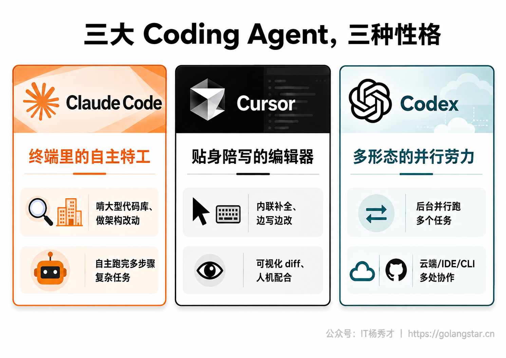
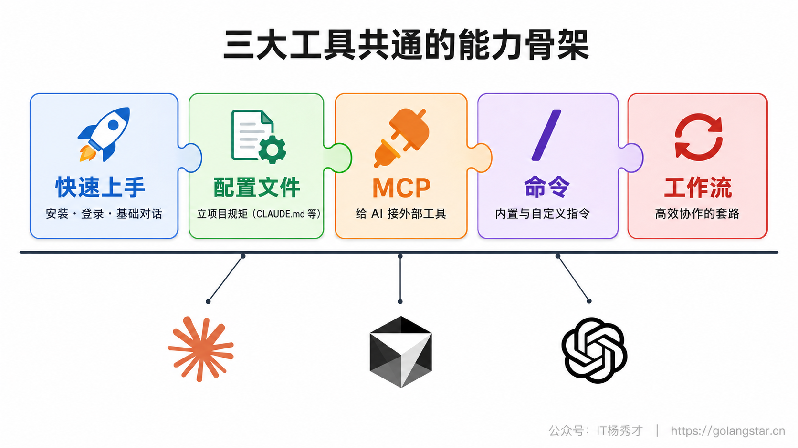
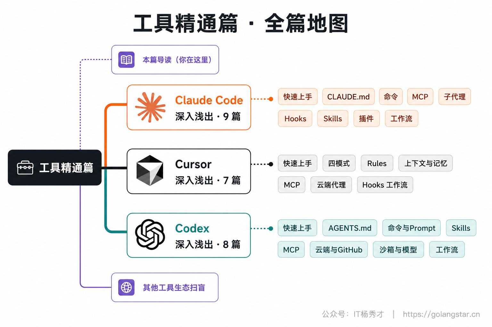

走到这里，你已经把 Vibe Coding 最核心的内功——写 Prompt——练得差不多了。接下来的工具精通篇，是整个系列篇幅最大的一块，我们要把 Claude Code、Cursor、Codex 这三大主流 Coding Agent 的高级能力一个个吃透，让你从"会用"真正进阶到"用得好"。

这一篇是工具精通篇的导读，不讲具体操作，只帮你先建立全局观：这三个工具各自是什么定位、分别擅长什么、它们之间有哪些共通的能力骨架、又各有什么独门绝活，以及这一大篇该怎么学、三个子系列怎么导航。花几分钟读完它，你后面的学习会顺很多，也不会在"我到底该重点学哪个"上纠结。

## **1. 三大 Coding Agent 的定位**

虽然都叫 Coding Agent，但这三个工具其实是三种不同形态的产品，定位差别很大。一句话先把它们的"性格"说清楚。

**Claude Code 是"终端里的自主特工"。** 它活在命令行里，最大的本事是自主——你给个任务，它能自己规划、读遍整个项目、跑命令、调试，把多步骤的复杂活儿从头办到尾。它对大型代码库的理解和架构级改动尤其强，适合"放手交给它干一整件大事"的场景。

**Cursor 是"贴身陪写的编辑器"。** 它是一个完整的图形界面编辑器，AI 揉进了你写代码的每个动作里——边打字边补全、选中就能改、可视化地看每一处改动。它最适合那种"我自己也在写、AI 在旁边帮一把"的日常编码，是上手最平缓、最适合当"日常主力"的一个。

**Codex 是"多形态的并行劳力"。** 它最大的特点是"形态多、能并行"——终端、桌面应用、IDE 插件、云端样样都有，尤其擅长把多个任务丢到云端后台同时跑，是几个工具里"最能脱离你独立干活"的一个。如果你有 ChatGPT 订阅，它几乎是顺手就能用上的强力补充。

理解了这三种性格，你就明白为什么很多人是**混着用**的：日常贴身写代码用 Cursor，遇到要啃的大活儿交给 Claude Code，需要后台批量跑的任务丢给 Codex。它们不是非此即彼的单选题。

## **2. 共通的能力骨架**

三个工具虽然形态各异，但作为同一代 Coding Agent，它们在能力上有一套**共通的骨架**。先把这套骨架认清楚，你学任何一个工具都会发现"原来都是这几样"，触类旁通，学起来快得多。

这套骨架大致是五块。**快速上手**——怎么装、怎么登录、怎么开始基础对话，这是入门。**配置文件**——前面提过的 `CLAUDE.md`、`.cursor/rules`、`AGENTS.md`，给项目立长期规矩。**MCP**——一种让 AI 能连上外部工具和数据（比如数据库、浏览器、GitHub）的机制，相当于给 AI 装上各种"外挂"。**命令**——以斜杠 `/` 开头的内置指令，以及你能自定义的命令。**工作流**——把这些能力组合起来高效干活的套路和技巧。

三个工具都覆盖这套骨架，只是各自的叫法和细节略有不同。所以本篇的三个子系列，都会沿着"快速上手 → 配置 → MCP → 命令 → 工作流"这条主线来讲，你学完一个工具，再看另一个会有强烈的既视感。

## **3. 各自的独门绝活**

共通骨架之外，每个工具都有自己最拿得出手的特色能力，这也是它们各自子系列里会重点展开的部分。

**Claude Code 的特色，在于把"自主"做到了极致。** 它有 **Subagents（子代理）**——可以派出多个各管一摊的"分身"并行干活；有 **Skills（技能）**——把一套可复用的工作流封装成技能随时调用；有 **Hooks（钩子）**——在特定时机自动触发动作（比如保存时自动格式化）；还能把这些打包成 **Plugins（插件）**分享给团队。这些让它能胜任非常复杂、需要自动化的工程场景。

**Cursor 的特色，在于把"人机配合"打磨得最顺手。** 它的 **Tab 智能补全**润物细无声，**Ask/Agent/Plan/Edit 四种模式**让你在"自己写"和"让 AI 写"之间自由切换，还有 **Memories（自动记忆）**、**云端代理**、自动审查 PR 的 **BugBot** 等，把日常编码体验做到了极致流畅。

**Codex 的特色，在于"多形态 + 能并行"。** 同一个 Codex，你能在终端、桌面应用、编辑器插件、云端之间无缝切换，尤其是云端能把任务丢到后台并行跑、还能深度集成 GitHub 自动提 PR，特别适合"把活儿批量交出去、自己腾出手"的工作方式。

不用现在就记住这些名词，列在这里只是让你对"每个工具值得深挖什么"有个预期。具体怎么用，子系列里都会手把手讲。

## **4. 这一篇该怎么学**

工具精通篇内容很多（三个子系列加起来二十多篇），但你**完全不需要全部啃完、也不需要按顺序读**。给你几条务实的学习建议。

**先深挖你的主力工具，其余了解即可。** 前面认知篇和环境搭建篇应该已经帮你选定了一个主力工具（怕终端的多半选了 Cursor，想要极致自动化的选了 Claude Code，有 ChatGPT 的可能选了 Codex）。就先把你主力工具的那个子系列学透，把它用成肌肉记忆。另外两个工具的子系列，可以先粗略浏览、知道它们能干什么，等真的要用了再回来细看。

**按需查阅，而不是从头背诵。** 这一篇本质上更像一本"工具手册"，适合"我现在想搞定某个具体功能，去翻对应那篇"。比如你想给 AI 配个数据库连接，就去看对应工具的 MCP 那篇；想让 AI 自动遵守项目规范，就去看配置文件那篇。带着真实需求去学，比空读效率高得多。

**重在动手，别只看不练。** 每学一个功能，立刻在自己的项目里试一遍。Vibe Coding 的所有能力都是"用出来"的，看十遍不如亲手跑一遍。

## **5. 三个子系列导航**

最后给你一张地图，看清这一篇的整体结构，方便你按图索骥。工具精通篇分成三个"深入浅出"子系列，外加这篇导读和一篇收尾的生态扫盲。

三个子系列的脉络是这样的：

**Claude Code 深入浅出（9 篇）**，从快速上手开始，依次讲 `CLAUDE.md` 配置与记忆、Slash Commands 命令、MCP 集成、Subagents 子代理、Hooks 自动化、Skills 技能、Plugins 插件，最后是实战工作流与高效技巧。这是本系列的主线工具，讲得最全最深。

**Cursor 深入浅出（7 篇）**，从快速上手开始，讲 Ask/Agent/Plan/Edit 四大模式、Rules 规则、上下文与 Memories 记忆、MCP 与多模型、云端代理与 BugBot，最后是 Hooks 自动化与实战工作流。

**Codex 深入浅出（8 篇）**，从快速上手开始，讲 `AGENTS.md` 与配置、命令与自定义 Prompt、Skills、MCP、云端任务与 GitHub 自动化、沙箱审批与模型选择，最后是实战工作流。

三个子系列学完之后，还有一篇《其他实用工具》做生态扫盲，带你认识 Copilot、Windsurf、v0、bolt.new 等其他工具，让你对整个 AI 编程生态有个完整全貌。

## **6. 小结**

工具精通篇是一座内容不小的山，但你不必一口气登顶。记住这一篇给你的全局观就够了：**三个工具是三种性格——Claude Code 自主、Cursor 陪写、Codex 多形态并行；它们共享一套"上手→配置→MCP→命令→工作流"的能力骨架，又各有独门绝活。** 抓住这条主线，先把你的主力工具学透，其余按需查阅，带着真实需求边学边练，你很快就能从"会用工具"走到"用工具如臂使指"。

从下一篇开始，我们就正式进入第一个子系列——Claude Code 深入浅出，从快速上手把它彻底打通。

<h2><strong>关注秀才公众号：</strong><strong>IT杨秀才</strong><strong>，回复：</strong><strong>面试</strong></h2>

<strong>领取后端/AI面试题库PDF</strong>

🔥 配套实战项目，拆得开、跑得起、能写进简历

多 Agent 编排 + RAG 混合检索 · 31 篇深度教程 + 50+ 面试题

<a href="/projects/dev-support.html" style="display: inline-block; margin-top: 14px; background: #ff7a18; color: #fff; font-size: 18px; font-weight: bold; padding: 10px 28px; border-radius: 24px; text-decoration: none;">点击查看 DevSupport AI 实战项目 →</a>

