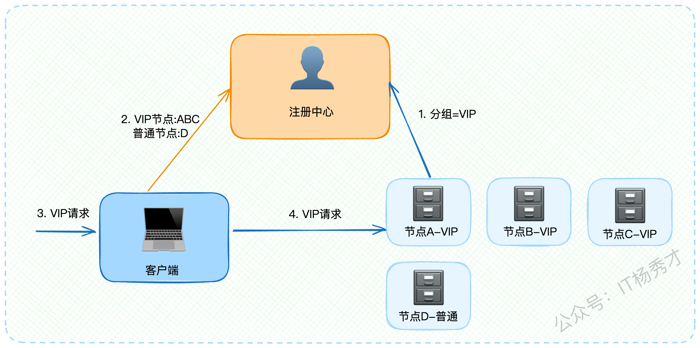
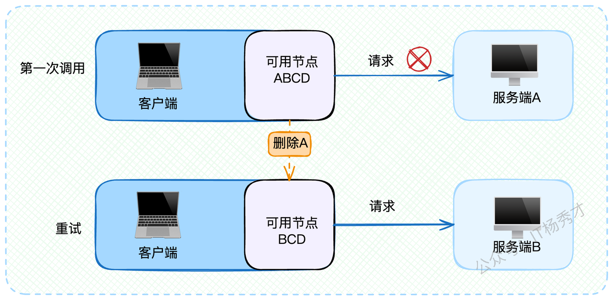

---
tags:
  - 场景题
  - 面试题
  - 服务注册与发现
  - AP
  - CP
---

# 微服务架构核心：服务注册与发现的AP与CP抉择

今天咱们来聊聊微服务架构中的一个核心话题——服务注册与发现。

说起这个话题，相信做后端开发的同学都不陌生。毕竟现在微服务架构满天飞，面试时多少都能说出几句。但是呢，正因为大家都懂一些皮毛，想要在面试中脱颖而出就更需要深度了解其中的精髓。

今天秀才就带大家深挖服务注册与发现的底层原理，从基础模型开始，重点分析服务端故障检测、客户端容灾处理和注册中心技术选型这三个维度，帮你在面试中展现出真正的技术功底。

## 1. 基础概念解析

### 1.1 为什么需要服务注册与发现？

假设，你开发的应用火了，用户量暴增，你把一个服务（比如"用户服务"）部署到了好几台机器上，每台机器的IP和端口都不一样。现在，另一个服务（比如"订单服务"）想要调用"用户服务"，问题来了：它怎么知道该去找哪台机器？


这就好比一个非常类似的生活场景。假设你到了一个陌生城市出差，晚上想吃火锅，还得是正宗的重庆火锅。这时候你会怎么办？

肯定是打开手机APP搜一下对吧！那么问题来了，APP怎么知道这个城市哪里有重庆火锅店呢？答案很简单——因为火锅店老板提前在平台上注册过店铺信息了。

这个过程就是服务注册与发现的经典模型：

* 你 = 客户端

* 火锅店 = 服务端

* APP平台 = 注册中心

明白了这个类比，我们就能轻松理解服务注册与发现的核心思想了。

### 1.2 核心运行机制详解

记住下面这张图，它描绘了整个服务注册与发现的核心流程。


整个服务与发现的流程可以分为以下几个关键步骤，这个流程图一定要烂熟于心：

#### 1.2.1 服务上线流程：

* **服务注册**：服务端启动时，主动向注册中心注册自己的基本信息，主要包括IP地址、端口号等定位数据

* **健康检查**：注册成功后，注册中心与服务端建立定期心跳机制，确保服务状态正常

* **服务发现**：客户端首次调用某服务前，先从注册中心拉取所有可用节点列表，并在本地缓存

* **数据同步**：客户端与注册中心保持长连接，实时接收服务节点变更通知，更新本地缓存

* **请求发送**：客户端基于负载均衡策略选择目标服务节点发送请求

* **响应返回**：服务端处理完毕后返回响应结果

#### 1.2.2 服务下线流程：

还用刚才火锅店的例子，如果店铺要关门歇业了，肯定要提前通知平台下架，这样顾客就不会再搜到它了。

1. **下线通知**：服务端主动通知注册中心准备下线

2. **客户端通知**：注册中心立即通知所有客户端该服务即将不可用

3. **流量切换**：客户端收到通知后，新请求不再路由到该服务节点

4. **优雅下线**：服务端等待一段时间确保所有请求处理完毕后正式下线


> **注意**：这里的等待时间非常关键，必须考虑通知传播的延迟，确保客户端完全停止发送请求后再下线。

#### 1.2.3 架构模型记忆技巧

如果觉得这些步骤太复杂不好记，教你一个小窍门：把整个系统想象成一个三角形，三个顶点分别是客户端、注册中心、服务端。三条边代表它们之间的交互关系。

后面我们讨论的高可用方案，本质上就是分析这个三角形的任何一个顶点或者任何一条边出现故障时的应对策略。


## 2. 面试准备指南

### 2.1 项目经验整理

如果你们公司确实使用了注册中心，面试前务必整理清楚这些关键数据：

* **技术选型理由**：使用了什么注册中心组件及其优缺点对比

* **集群规模数据**：注册中心的集群节点数量

* **性能指标统计**：读写QPS、响应延迟等关键指标

* **硬件配置信息**：CPU、内存规格等资源配置

* **故障处理案例**：最好准备一个注册中心故障排查和优化的真实案例

如果公司没采用微服务架构也不用慌，可以选择ZooKeeper、Nacos或etcd中的一个深入学习，了解其核心特性和使用场景，面试时用它们来阐述注册中心的工作原理。

### 2.2 话题引导技巧

面试中可以通过这些角度主动引出服务注册与发现话题：

* **中间件切入**：如果面试官问到ZooKeeper等可作为注册中心的组件，主动提及你的使用经验

* **高可用讨论**：当谈到微服务高可用时，将服务注册与发现作为重要保障环节来阐述

## 3. 基础问题回答思路

当面试官问"你了解服务注册与发现吗？"时，可以按照以下思路回答：

首先简要介绍上面提到的服务上线和下线流程，然后结合公司实际情况介绍注册中心的具体配置和性能数据。接下来可以深入一个细节点来展现技术深度，关键词是**注册数据结构**。

前面提到服务端注册时"主要是定位信息"，既然用了"主要"这个词，说明还有其他非核心数据。这些扩展数据通常取决于微服务框架的功能特性。比如很多微服务框架支持**服务分组**功能，那么服务端注册时就需要同时上报分组信息。



举个例子：

```json
{
  "serviceName": "user-service",
  "ip": "192.168.1.100", 
  "port": 8080,
  "group": "VIP",  // 分组信息
  "metadata": {
    "version": "1.0.0",
    "region": "beijing"  // 其他元数据
  }
}
```

当客户端收到VIP用户请求时，就会根据分组信息将请求路由到VIP节点，实现差异化服务。说到这里可以适当总结一下，为后续话题做铺垫：

"服务注册与发现的基本模型相对简单，但要在生产环境中实现真正的高可用就很有挑战性了。"，等面试官追问具体有什么挑战时，就可以引出我们的核心亮点——高可用架构设计。

## 4. 高可用架构设计

有了前面的铺垫，面试官很可能会继续问："那你们是如何保证服务注册与发现的高可用性呢？"

这时候就可以回答：高可用的服务注册与发现需要从**服务端故障检测、客户端容灾处理、注册中心技术选型**三个维度来保障。

### 4.1 服务端故障检测机制

#### 4.1.1 问题场景分析

在正常情况下，服务下线都会主动通知注册中心。但如果服务端突然宕机呢？比如运维同事不小心踢到了服务器电源线，服务器直接断电。

这种情况下，服务端根本来不及通知注册中心，注册中心也就无法通知客户端。结果就是客户端继续向已宕机的服务发送请求，导致大量调用失败。


因此，为了提升系统可用性，注册中心必须能够快速发现服务端异常状态，并及时通知客户端。关键问题是：注册中心如何判断服务端已经崩溃？

#### 4.1.2 心跳检测策略

最直观的想法是利用心跳机制：如果注册中心与服务端的心跳中断了，就认为服务端已经崩溃。

但这种简单判断存在问题。如果只是网络偶发性抖动导致心跳失败，而服务端实际上还正常运行，那么就会误判。


你可能想到可以多重试几次心跳，但这又带来新的问题：重试次数越多、间隔越长，注册中心确认服务端崩溃的时间就越长。在这段时间内，会有大量请求发送到实际已崩溃的服务端，造成调用失败。

这就陷入了两难境地：要么误判服务端崩溃，要么延迟发现真正的崩溃。

#### 4.1.3 优化解决方案

比较好的策略是采用**分阶段检测机制**：

**第一阶段：快速响应**

* 注册中心与服务端心跳失败时，立即通知客户端该服务端不可用

* 客户端收到通知后停止向该节点发送新请求


```java
// 心跳检测伪代码
public class HeartbeatDetector {
    
    private void onHeartbeatFailed(ServiceInstance instance) {
        // 立即标记为不可用，通知客户端
        instance.setStatus(ServiceStatus.UNAVAILABLE);
        notifyClients(instance, ServiceStatus.UNAVAILABLE);
        
        // 继续尝试心跳检测
        scheduleRetryHeartbeat(instance);
    }
    
    private void scheduleRetryHeartbeat(ServiceInstance instance) {
        // 立即重试几次
        for (int i = 0; i < IMMEDIATE_RETRY_COUNT; i++) {
            if (sendHeartbeat(instance)) {
                // 心跳恢复，通知客户端服务可用
                instance.setStatus(ServiceStatus.AVAILABLE);
                notifyClients(instance, ServiceStatus.AVAILABLE);
                return;
            }
        }
        
        // 间隔重试
        scheduleDelayedRetry(instance);
    }
}
```

**第二阶段：持续监控**

* 注册中心继续向该服务端发送心跳检测

* 如果是偶发性故障，后续心跳会恢复成功，注册中心再次通知客户端服务可用

* 如果连续多次心跳都失败，则确认服务端彻底不可用，停止进一步检测

这种策略的核心思想是：**宁可误判也要快速响应，同时保持持续监控来纠正误判**。


#### 4.1.4 深层技术思考

实际上，在所有基于心跳机制的分布式系统中，节点故障检测都是一个经典难题。需要考虑的参数包括：

* 心跳频率：过高增加网络开销，过低延迟发现故障

* 重试次数：平衡误判率和检测延迟

* 重试间隔：需要考虑网络抖动的恢复时间

如果采用无间隔连续重试，很难避开偶发性网络故障。比如注册中心与服务端之间网络抖动，第一次心跳失败后立即重试，多半还是会失败，因为网络可能仍然不稳定。

因此，比较理想的策略是：**立即重试几次 + 间隔延迟重试**，在业务可接受的范围内最大化重试成功率。

但无论如何优化，从服务端崩溃到客户端感知，中间总是存在时间窗口。这就需要客户端自身具备容灾能力。

### 4.2 客户端容灾处理

客户端容灾是指在注册中心或服务端节点出现问题时，客户端仍能尽可能保证请求正确路由到可用节点。

#### 4.2.1 节点故障切换机制

前面分析过，从服务端崩溃到客户端收到通知存在延迟窗口。在这个窗口内，客户端发送给崩溃节点的请求都会失败。


关键方案是**节点切换**，也就是常说的failover机制：

```java
// 客户端容错处理示例
public class ServiceClient {
    
    private List<ServiceInstance> availableInstances;
    private Set<ServiceInstance> blacklistedInstances = new HashSet<>();
    
    public Response callService(Request request) {
        List<ServiceInstance> candidates = getHealthyInstances();
        
        for (ServiceInstance instance : candidates) {
            try {
                Response response = doCall(instance, request);
                // 调用成功，可能需要将节点从黑名单移除
                removeFromBlacklist(instance);
                return response;
            } catch (Exception e) {
                // 调用失败，将节点加入黑名单
                addToBlacklist(instance);
                continue;
            }
        }
        
        throw new ServiceUnavailableException("所有服务节点都不可用");
    }
    
    private void addToBlacklist(ServiceInstance instance) {
        blacklistedInstances.add(instance);
        // 启动后台任务定期检测节点是否恢复
        scheduleHealthCheck(instance);
    }
}
```

客户端容灾的核心策略：

1. **快速切换**：发现调用失败后立即尝试其他可用节点

2. **智能黑名单**：将故障节点临时移出可用列表，避免重复失败

3. **自动恢复**：定期检测黑名单中的节点是否恢复正常



#### 4.2.2 延迟时间计算

这里补充两个技术细节：

* **第一个是延迟时间的精确计算**： 最坏情况下的感知延迟 = 心跳间隔时间 + 通知传播时间。由于注册中心通知客户端通常在毫秒级，所以可以近似认为延迟时间就等于心跳间隔。

* **第二个是节点恢复时机**： 什么时候将故障节点重新加入可用列表呢？

1. 情况1：如果注册中心最终确认服务端崩溃并通知客户端，那么客户端无需主动恢复，等注册中心通知服务恢复即可。


* 情况2：如果是客户端与服务端之间的网络问题（服务端正常，注册中心也正常），客户端需要主动检测：

```java
// 主动健康检查
private void scheduleHealthCheck(ServiceInstance instance) {
    ScheduledExecutorService executor = Executors.newScheduledThreadPool(1);
    
    executor.scheduleWithFixedDelay(() -> {
        try {
            // 发送简单的健康检查请求
            if (sendHealthCheck(instance)) {
                // 节点恢复，移出黑名单
                removeFromBlacklist(instance);
                executor.shutdown();
            }
        } catch (Exception e) {
            // 继续检查
        }
    }, 10, 10, TimeUnit.SECONDS);
}
```


#### 4.2.3 注册中心故障处理

同样的分析逻辑也适用于客户端与注册中心之间的连接故障。当客户端无法连接注册中心时：

1. **使用本地缓存**：继续使用已缓存的服务节点列表

2. **节点探活**：对调用失败的节点执行相同的容错逻辑

3. **降级处理**：如果长期无法连接注册中心，客户端可能需要考虑整体降级或退出

### 4.3 注册中心技术选型

注册中心选型和其他中间件选型类似，需要综合考虑成熟度、社区活跃度、性能等因素。但对于注册中心来说，最关键的选择是在CAP理论中选择CP还是AP模式。

#### 4.3.1 CAP理论回顾

先简单回顾一下CAP理论：

* **C (Consistency)**：数据一致性，所有节点在同一时刻看到的数据完全一致

* **A (Availability)**：服务可用性，系统在任何时候都能响应请求

* **P (Partition-tolerance)**：分区容错性，系统在网络分区故障时仍能继续运行

CAP理论告诉我们，分布式系统最多只能同时满足其中两个特性。在实际应用中，网络分区是不可避免的，所以P通常是必选项，问题就变成了在C和A之间做选择。

#### 4.3.2 注册中心的选择分析

对于注册中心来说，**可用性比一致性更重要**，应该选择AP模式。原因如下：

**选择AP的优势**：

* 即使注册中心集群发生网络分区，各个分区仍能独立提供服务

* 客户端总是能够获取到服务列表（尽管可能不是最新的）

* 配合客户端容错机制，能够很好地处理数据不一致问题

**选择CP的劣势**：

* 发生网络分区时，少数派节点会拒绝服务，影响整体可用性

* 在注册数据更新时可能出现服务不可用的情况

```java
// AP模式下的容错处理示例
public class APRegistryClient {
    
    public List<ServiceInstance> getServiceInstances(String serviceName) {
        try {
            // 尝试从注册中心获取最新数据
            return registryClient.getInstances(serviceName);
        } catch (Exception e) {
            // 注册中心不可用，使用本地缓存
            List<ServiceInstance> cached = localCache.get(serviceName);
            if (cached != null) {
                return cached;
            }
            throw new ServiceDiscoveryException("无法获取服务实例列表");
        }
    }
}
```

因此，推荐选择AP模式的注册中心，比如：

* **Eureka**：Netflix开源，原生支持AP模式

* **Nacos**：阿里开源，可配置为AP模式

* **Consul**：HashiCorp开源，默认CP但可配置为AP

关键词是**客户端容错**，正是因为有了强大的客户端容错能力，我们才能容忍注册中心数据的暂时不一致。

#### 4.3.3 特殊情况说明

如果公司使用了CP模式的注册中心（比如ZooKeeper），可以这样回答：

"我们公司选择ZooKeeper主要是因为**业务体量相对较小**，集群规模不大，ZooKeeper虽然是CP模式，但在我们的使用场景下也基本够用。不过我也在推动团队考虑迁移到Nacos的AP模式，以获得更好的可用性保障。"

关键词是**体量小**，说明你理解不同规模下的技术选择差异。

## 5. 核心要点总结

这次我们深度剖析了服务注册与发现的核心机制，主要围绕基础模型和高可用保障两个方面展开。

**基础模型**包括服务上线、下线的完整流程，以及注册数据结构的扩展设计。

**高可用保障**从三个维度进行：

1. **服务端故障检测**：基于心跳机制的分阶段检测策略

2. **客户端容灾处理**：节点切换和自动恢复机制

3. **注册中心选型**：优先选择AP模式保证可用性

记住这几个关键词：**注册数据、服务分组、心跳检测、节点切换、客户端容错、业务体量**。面试时可以围绕这些关键词，结合自己的项目经验来组织回答。


最后再强调一下那个记忆技巧：把整个系统想象成三角形，高可用方案的核心就是考虑三角形任何一条边出问题时的应对策略。建议你亲手画一画这个三角形，梳理一下各种容错场景。

