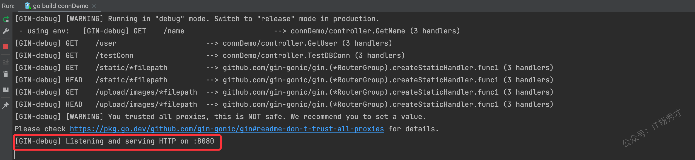
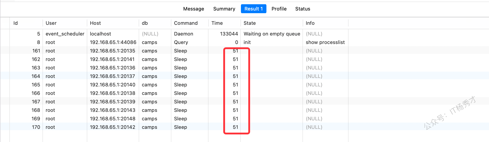
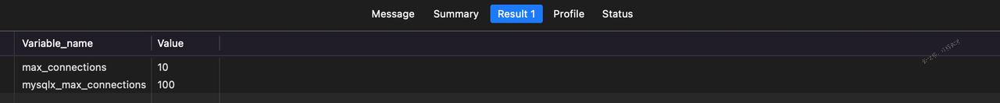

---
tags:
  - Go
  - golang
  - 数据库
  - 连接池
  - 性能调优
---

# Go程序数据库连接池耗尽如何排查

## 1. 什么是连接池
现如今在做程序开发的时候，尤其是涉及到数据库的时候，都会用连接池来管理数据库连接。其中Go语言里面常用的Gorm框架也会自带连接池管理。数据库连接池，其实就是存储数据库连接的池子，本质是一种资源复用技术
## 2. 为什么要使用连接池
使用连接池的核心目的是提升应用程序的性能和效率。建立和关闭数据库连接的过程通常是非常消耗资源的，尤其是在高并发环境或频繁访问数据库的场景中，这开销会对应用性能造成显著的负面影响。  
通过连接池，应用程序可以重复利用已有的数据库连接，减少了每次连接建立和销毁的开销，从而加快系统的响应速度和提高了系统的吞吐能力。同时，连接池还能对连接数量进行有效管理，防止因连接过多而导致数据库过载或性能下降的问题，从而保证系统运行的稳定性和资源的合理利用
## 3. Gorm连接池常见参数
| 字段名    |  解释   |
| --- | --- |
|   MaxIdleConns  | 指定最大空闲连接数。MaxIdleConns 参数用于指定数据库连接池中最大的空闲连接数，即连接池中最多可以保留多少个空闲连接。    |
|   MaxOpenConns  | 指定最大打开连接数。MaxOpenConns 参数用于指定连接池中最大的连接数量，即连接池中最多可以打开多少个连接，如果超过maxOpenConn这个阈值，就会出现too many connections的提示。具体来说，如果应用程序的最大并发数为N，可以将MaxOpenConns设置为N+10~50左右的值，这取决于应用程序的实际情况和数据库的性能。在实际使用中，可以通过压力测试和性能监控等手段，来确定合适的MaxOpenConns值    |
|   ConnMaxLifetime  | 指定连接最大存活时间。ConnMaxLifetime参数用于指定连接在连接池中最长的存活时间，即连接在连接池中的最长存活时间，超过这个时间连接将会被关闭并重新创建。对所有连接生效    |
|   ConnMaxIdleTime  | 设置连接在连接池中的最大空闲时间。如果一个连接在连接池中闲置的时间超过该值，会被关闭并移除，仅对空闲连接生效    |

## 4. 连接池爆满排查路径
连接池的使用虽然可以带来很大程度上性能的优化，但是在使用 MySQL 数据库时，尤其是在高并发的场景下，数据库连接数过多会导致连接池耗尽，进而影响应用程序的正常运行。所以对于数据库连接池爆满问题的排查，也相当重要，在排查这类问题的时候可以按照下图的总体思路来进行

## 5. 案例分析
### 5.1 数据模拟
现有一张用户表`t_user`，要对这张表的数据做一些查询操作，表结构如下：
```sql
CREATE TABLE `t_user` (
    `id` bigint(20) UNSIGNED NOT NULL AUTO_INCREMENT COMMENT '主键自增',
    `name` varchar(32) NOT NULL DEFAULT '' COMMENT '姓名',
    `create_time` varchar(32) NOT NULL DEFAULT '' COMMENT '创建日期,yyyy-MM-dd HH:mm:ss',
    `age` int(4) NOT NULL DEFAULT 0 COMMENT '年龄',
    PRIMARY KEY (`id`)
) ENGINE = InnoDB CHARSET = utf8;
```
插入两条记录

```sql
insert into t_user (name,age,create_time) values ("zhangsan",18,"2024-11-20 12:07:46");
insert into t_user (name,age,create_time) values ("zlisi",20,"2024-11-20 12:07:46");
```
结果如下：


### 5.2 工程模拟
用gin + gorm框架搭建一个简单的线上web工程connDemo，并且提供一个查询用户姓名的接口，整个项目的配置文件如下：
```yaml
app:
  app_name: "user_system" # 应用名称
  version: "v1.0.1" # 版本
  port: 8080    # 服务启用端口
  run_mode: release # 可选dev、release模式

db:
  host: "0.0.0.0"     # host
  port: 8086          # port
  user: "root"        # user
  password: "123456"  # password
  dbname: "camps"     # dbname
  max_idle_conn: 30   # 最大空闲连接数
  max_open_conn: 30   # 最大连接数
  max_idle_time: 300  # 最大空闲时间
```
gorm配置的mysql最大连接数为30，注意这里是mysql客户端的连接数。程序启动后，监听的http端口为`8080`。

1. 为了模拟连接被耗尽的情况，在mysql服务端的连接数要设置的小一些，首先在mysql端运行以下命令查看下mysql服务端的最大连接数
```sql
show variables like '%max_connections%';
```
执行之后可以看到mysql默认的最大连接数是`151`


接下来，我们将这个这个最大连接数设置的小一些，执行以下命令，将它设置为`10`
```sql
SET GLOBAL max_connections = 10;
```
设置完成之后，再次查看一下，已经成功修改


### 5.3 模拟mysql连接被占满情况
在`dao`层提供一个`TestGormConn`方法来模拟占满mysql连接的情况，`TestGormConn`代码如下：
```go
func TestGormConn() map[int]string {
    wg := sync.WaitGroup{}
    wg.Add(20)
    nameMap := make(map[int]string)
    // 故意在高并发下不释放连接，超出最大连接数限制
    for i := 0; i < 20; i++ { // 创建超过最大连接数的连接
       go func(index int) {
          defer wg.Done()
          var conn *gorm.DB
          conn = utils.GetDB().Session(&gorm.Session{NewDB: true}) // 获取新的连接

          // 模拟业务操作

          sql := ` select sleep(120) as sleep_time,name from t_user where id = ? limit 1;`
          // 声明一个接收对象，这里接受多条时也可以使用数组进行
          nameInfo := &model.NameInfo{}
          err := conn.Raw(sql, 1).Scan(nameInfo).Error
          if err != nil {
             fmt.Printf("TestGormConn %d |record not found\n", index)
          }
          fmt.Printf("TestGormConn %d |used\n", index)
          nameMap[index] = nameInfo.Name
       }(i)
    }
    wg.Wait()
    return nameMap
}
```
这个方法开启了`20`个`goroutine`去查询用户的`name`信息，注意这里每次查询用到的连接都是新建的，所以这里就会新建`20`个连接。注意这里的查询语句
```sql
select sleep(120) as sleep_time,name from t_user where id = ? limit 1
```
这个查询`name`的`sql`会延迟`120s`再执行，这里就会导致每个新建的连接被占用`120s`不能释放

### 5.4 请求测试
1. 启动服务，服务启动成功，控制台如下：



可以看到服务正在监听`8080`端口

2. 模拟请求

在浏览器访问[http://localhost:8080/testConn](http://localhost:8080/testConn)这个地址，测试数据库的连接情况


可以看到这个页面一直处于等待转圈等待的情况。而在大概3分钟之后，页面返回了结果


说明这个接口响应严重超时，需要排查

### 5.5 连接池爆满现象识别
在页面一直处于转圈等待的同时，看后台程序，可以看到控制台报错如下：


**mysql报错：Too many connections**，连接太多，可以初步断定问题为连接池满了，获取不到连接所致

### 5.6 根因分析
进一步分析`sql`情况，查看当前数据库连接的`session`情况，数据库执行以命令：
```sql
show processlist;
```


可以看到有`10`个mysql的连接都已经执行了`51s`了。这里的连接被占用了很长时间不能释放，可能是sql本身出现了问题，需要进一步排查，而且只显示了10个连接，一直被占用，结合代码去分析，`TestGormConn`方法开启了20个`goroutine`去查询，每个查询都会新建一个连接，并且每个连接会被长期占用`120s`，这里只显示了`10`个连接被长期占用，可以确定存在数据库连接被占满了，接下来我们查看一下数据库的最大连接数设置。

1. 首先一下mysql客户端gorm的最大连接数设置


项目中gorm数据库连接池最大连接数配置的是`30`，大于`TestGormConn`方法里新建的连接数量，问题不是在这里

2. 查看一下mysql服务端的最大连接设置

```sql
show variables like '%max_connections%';
```


可以看到mysql服务端设置的最大连接数为`10`，这个值设置的太小了。小于了`TestGormConn`方法里新建的连接数，所以在这个请求发起的时候，肯定会有连接建立不上，报出**Too many connections**的错误，而等到`120s`之后，这个`10`个连接所在的查询结束后，就会返回结果了

### 5.7 方案优化
从上面的分析我们就知道了报错的根本原因就是，连接池连接耗尽导致的。而且mysql服务端连接池的的最大连接数配置的是`10`，很小，这样优化起来就很好做了，我们增大连接池的连接配置，将其恢复为mysql默认的最大连接数`151`
```sql
SET GLOBAL max_connections = 151;
```
然后重启服务再次测试，访问[http://localhost:8080/testConn](http://localhost:8080/testConn)，发现前端页面依然是一直在转圈等待


直到`120s`过后，前端返回了结果


这次结果不同于上次，上次是指返回了`10`条数据，而这次返回了`20`条数据，可见修改完mysql连接池的最大连接数配置后，新建的`20`个连接都生效了，只是查询依然会延迟。前端返回结果后，同样的再到程序后台看一下日志情况


这次后台也没有再报**Too many connections**错误，看来连接池被耗尽的错误已经解决，但是却发现了sql的日志上有`SLOW SQL >= 200ms`的情况，这就可以肯定我们的`sql`存在问题了，所以才导致前端的返回延迟了很久。接着分析具体的`sql`
```sql
select sleep(120) as sleep_time,name from t_user where id = 1 limit 1;
```
这条`sql`中有一个`sleep(120)`，会睡眠`120s`后再执行具体的查询操作所以，会有延迟，优化的话，我们直接删掉这个数据就ok了。删减完之后`TestGormConn`方法如下：
```go
func TestGormConn() map[int]string {
    wg := sync.WaitGroup{}
    wg.Add(20)
    nameMap := make(map[int]string)
    // 故意在高并发下不释放连接，超出最大连接数限制
    for i := 0; i < 20; i++ { // 创建超过最大连接数的连接
       go func(index int) {
          defer wg.Done()
          var conn *gorm.DB
          conn = utils.GetDB().Session(&gorm.Session{NewDB: true}) // 获取新的连接

          // 模拟业务操作

          sql := ` select name from t_user where id = ? limit 1;`
          // 声明一个接收对象，这里接受多条时也可以使用数组进行
          nameInfo := &model.NameInfo{}
          err := conn.Raw(sql, 1).Scan(nameInfo).Error
          if err != nil {
             fmt.Printf("TestGormConn %d |record not found\n", index)
          }
          fmt.Printf("TestGormConn %d |used\n", index)
          nameMap[index] = nameInfo.Name
       }(i)
    }
    wg.Wait()
    return nameMap
}
```
同时`NameInfo`结构也要做对应的修改，删掉`SleepTime`字段，修改后如下：
```go
type NameInfo struct {
    Name string `gorm:"column:name"`
}
```
修改完之后，再次重启服务，访问[http://localhost:8080/testConn](http://localhost:8080/testConn)，马上得到如下结果返回，成功返回20条数据


这样一来，通过问题的现象识别，发现了连接池被占满的问题现象，然后调大mysql服务端的连接池的最大连接数，之后再优化了查询sql，问题成功解决

## 6. 小结
数据连接池是现在后端开发中必然会使用的一项池化技术，主要是通过对数据库的连接进行管理和服用，以此来减少频繁的连接创建，从而较少不必要的性能消耗。但是随着并发量的提高，连接池在使用上也很容易出现一些问题，最常见的就是连接耗尽，导致请求获取不到连接而报错。所以掌握好数据库连接池问题的排查是非常有必要的，同时我们还应当做好数据库的一些性能监控，这样对于连接的使用情况就能比较清晰的看到，再要出现问题的时候也会发出告警，从而可以进行及时干预，避免出现线上问题

## 学习交流
> 如果您觉得文章有帮助，点个关注哦。可以关注公众号：**IT杨秀才**，秀才后面会在公众号分享**线上问题排查**的系列知识。也会持续更新更多硬核文章，一起聊聊互联网那些事儿!


-----------------------------**历史好文**-------------------------------  
[《Java线上死锁问题如何排查》](https://mp.weixin.qq.com/s/S7FShnuDL5b-Se8lkJU80Q)    
[《线上慢SQL问题如何排查》](https://mp.weixin.qq.com/s/vYGwzEZjtubXzcrcdZmvJA)  
[《线上CPU飙高如何排查》](https://mp.weixin.qq.com/s/JGEGj3kIBwEBfOJCUO4lsA)   
[《线上OOM问题如何排查》](https://mp.weixin.qq.com/s/8mmXy2hY_it35xLOrjfvWA)   
[《频繁FullGC问题如何排查》](https://mp.weixin.qq.com/s/9mBfPWUGyCJOEHyeYnT-IA)   
[《2024年必备的Go语言学习路线（建议收藏🔥）》](https://mp.weixin.qq.com/s?__biz=Mzk0MTYxNDgyNA==&mid=2247484357&idx=1&sn=d49f8ac58b19dee9ffc1e07b7a4e451e&chksm=c2cef042f5b97954f397f5428666a9d773d13e555cb1cbca0f97d9a21361fcf0d162752c4f53&token=983111685&lang=zh_CN#rd) 